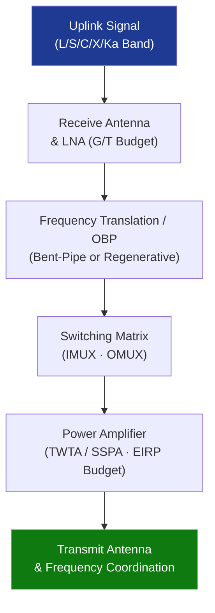

# STA 160-169 · 160-040 — Communication Payloads and Relay Functions

## 1. Purpose

Establishes design and performance requirements for communication payloads and relay functions on Q+ATLANTIDE STA-band spacecraft, covering transponder architectures, frequency allocation, link budget parameters, on-board processing, interference mitigation, and redundancy design.

## 2. Scope

- **Transponder architectures** — bent-pipe (frequency-translating) transponders and regenerative (on-board processing) transponders; selection criteria include throughput requirements, latency budget, power consumption, and mass constraints; regenerative payloads may employ on-board baseband processing and routing.
- **Frequency allocation and band planning** — frequency bands (L, S, C, X, Ku, Ka) assigned per ITU Radio Regulations and mission coordination filings; uplink and downlink frequency plans shall be declared in the payload ICD and coordinated with the ITU/IFRB filing authority.
- **Link budget parameters** — Effective Isotropic Radiated Power (EIRP), receive figure of merit (G/T), carrier-to-noise ratio (C/N₀), bit energy-to-noise density (Eb/N₀), and rain fade margin shall be calculated per CCSDS 131.0-B and ECSS-E-ST-50C; budgets shall close under worst-case geometry and propagation conditions.
- **Payload data handling and on-board processing** — channel capacity, multiplexing schemes (TDM, FDM, CDMA), forward error correction (FEC) coding, and switching matrix configurations shall be specified; regenerative payloads shall declare on-board processor performance in MIPS and memory capacity.
- **Interference mitigation and frequency coordination** — adjacent satellite interference, intermodulation products, and spurious emission levels shall comply with ITU Radio Regulations Article 22; frequency coordination records shall be maintained as lifecycle evidence.
- **Redundancy and switching matrix design** — input multiplexer (IMUX), output multiplexer (OMUX), travelling wave tube amplifiers (TWTA) or solid-state power amplifiers (SSPA), and switching matrices shall declare redundancy ratios and switchover times; failure modes shall be documented in FMEA.

## 3. Diagram — Communication Payload Architecture

## 4. Footprint

| Metric | Value |
|---|---|
| Architecture | `STA` — Space Technology Architecture |
| Master range | `100–199` |
| Code range | `160-169` |
| Section | `06` — Sensores y Carga Útil Espacial |
| Subsection | `160` — Cargas Útiles |
| Subsubject | `004` — Communication Payloads and Relay Functions |
| Primary Q-Division | Q-SPACE[^qdiv] |
| ORB support | ORB-PMO, ORB-MKTG |
| Governance class | `baseline`[^gov] |
| Document | `160-040-Communication-Payloads-and-Relay-Functions.md` (this file) |
| Parent subsection | [`README.md`](./README.md) · [`160-000-General.md`](./160-000-General.md) |

## 5. References & Citations

[^qdiv]: **Q-Division authority** — See [`organization/Q+ATLANTIDE.md` §4](../../../../organization/Q+ATLANTIDE.md#4-notes).

[^gov]: **Governance class** — `baseline`.

### Applicable industry standards

| Standard | Title | Applicability |
|---|---|---|
| ECSS-E-ST-50C | Space engineering — Communications | Communication payload design and verification |
| CCSDS 131.0-B | TM Synchronization and Channel Coding | Channel coding, FEC, link budget methodology |
| ITU Radio Regulations | International Telecommunication Union Radio Regulations | Frequency allocation, coordination, interference |
