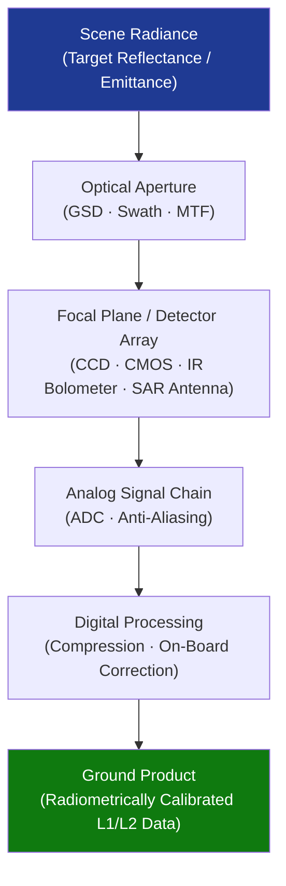

# STA 160-169 · 160-050 — Earth Observation and Remote Sensing Payloads

## 1. Purpose

Establishes design requirements and performance parameters for Earth observation and remote sensing payloads on Q+ATLANTIDE STA-band spacecraft, covering sensor types, image quality metrics, swath and coverage, data rate/storage, calibration procedures, and data policy considerations.

## 2. Scope

- **Sensor types** — optical push-broom and frame imagers (panchromatic, multispectral), synthetic aperture radar (SAR, including spotlight and ScanSAR modes), hyperspectral imagers, thermal infrared radiometers, and passive microwave radiometers; each type carries specific aperture, frequency, and polarisation requirements.
- **Image quality parameters** — ground sampling distance (GSD), modulation transfer function (MTF), signal-to-noise ratio (SNR), noise equivalent delta temperature (NEDT) for thermal sensors, and dynamic range shall be declared in the payload performance specification and verified per ECSS-E-ST-31C test procedures.
- **Swath and coverage calculations** — swath width, revisit period, and daily coverage area shall be computed from orbit altitude, instrument field of view, and off-nadir steering capability; repeat coverage requirements shall be derived from the Earth Observation mission scenario.
- **Data rate and on-board storage requirements** — raw data rate (bits per second), compression ratio targets, and onboard solid-state mass memory capacity shall be sized against the downlink budget and ground segment ingestion rate.
- **Ground calibration and vicarious calibration procedures** — radiometric calibration shall be maintained via scheduled observations of calibration targets (pseudo-invariant calibration sites, deep convective clouds) and cross-calibration with reference instruments; calibration logs shall be retained as lifecycle evidence per CEOS Cal/Val protocols.
- **Licensing and data policy considerations** — national space law licensing (launch and operator licences), dual-use export controls (ITAR/EAR for optical resolution thresholds), and data access policies shall be declared in the project management plan; compliance evidence shall be produced at mission licensing review.

## 3. Diagram — EO Payload Performance Chain

## 4. Footprint

| Metric | Value |
|---|---|
| Architecture | `STA` — Space Technology Architecture |
| Master range | `100–199` |
| Code range | `160-169` |
| Section | `06` — Sensores y Carga Útil Espacial |
| Subsection | `160` — Cargas Útiles |
| Subsubject | `005` — Earth Observation and Remote Sensing Payloads |
| Primary Q-Division | Q-SPACE[^qdiv] |
| ORB support | ORB-PMO, ORB-MKTG |
| Governance class | `baseline`[^gov] |
| Document | `160-050-Earth-Observation-and-Remote-Sensing-Payloads.md` (this file) |
| Parent subsection | [`README.md`](./README.md) · [`160-000-General.md`](./160-000-General.md) |

## 5. References & Citations

[^qdiv]: **Q-Division authority** — See [`organization/Q+ATLANTIDE.md` §4](../../../../organization/Q+ATLANTIDE.md#4-notes).

[^gov]: **Governance class** — `baseline`.

### Applicable industry standards

| Standard | Title | Applicability |
|---|---|---|
| ECSS-E-ST-10C | Space engineering — System engineering general requirements | Mission scenario definition, performance allocation |
| ECSS-E-ST-31C | Space engineering — Thermal control general requirements | Thermal management of focal plane assemblies |
| CEOS Cal/Val | Committee on Earth Observation Satellites Calibration/Validation Protocols | Vicarious calibration, cross-calibration methodology |
| ISO 19157 | Geographic information — Data quality | Data quality metrics for EO geospatial products |
