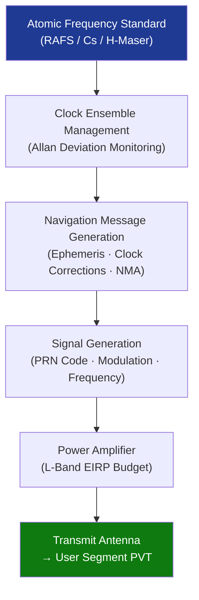

# STA 160-169 · 160-060 — Navigation Timing and Positioning Payloads

## 1. Purpose

Establishes design and performance requirements for navigation, timing, and positioning payloads on Q+ATLANTIDE STA-band spacecraft, covering GNSS signal generation, atomic frequency standards, timing accuracy budgets, signal integrity, and inter-satellite link timing.

## 2. Scope

- **GNSS signal generation payloads** — L-band signal-in-space (SIS) requirements covering frequency channels (L1/L2/L5 for GPS, E1/E5/E6 for Galileo equivalents), signal modulation (BPSK, CBOC, AltBOC), minimum received power floor, and pseudo-random noise (PRN) code assignment; signal generation chain shall comply with applicable GPS/Galileo SIS ICDs.
- **Atomic frequency standards** — Rubidium atomic frequency standard (RAFS), Caesium beam frequency standard, and Hydrogen maser options evaluated against stability requirements (Allan deviation at τ = 1 s, 100 s, 1 day); clock ensemble management and monitoring shall be declared in the payload timing architecture document.
- **Timing accuracy budget allocation** — end-to-end User Range Error (URE) and Signal-In-Space Range Error (SISRE) budgets shall be allocated across clock stability, orbit determination errors, signal generation errors, and inter-satellite link timing uncertainties; total SISRE shall meet service performance commitments.
- **Signal integrity and authenticity** — Navigation Message Authentication (NMA) and signal authentication provisions shall be declared where required by service design; anti-spoofing, anti-jamming margin, and interference environment analysis shall be produced as evidence artefacts.
- **Inter-satellite link timing** — cross-link ranging and time-transfer accuracy for constellations with inter-satellite links (ISL) shall be declared; ISL data latency and synchronisation protocol shall be consistent with CCSDS 131.0-B timing recommendations.
- **User receiver performance models** — user position, velocity, and time (PVT) accuracy models linking SISRE to dilution of precision (DOP) geometry shall be included; minimum constellation availability (PDOP ≤ 6, ≥ 4 visible satellites) shall be verified via simulation.

## 3. Diagram — Navigation Payload Timing Chain

## 4. Footprint

| Metric | Value |
|---|---|
| Architecture | `STA` — Space Technology Architecture |
| Master range | `100–199` |
| Code range | `160-169` |
| Section | `06` — Sensores y Carga Útil Espacial |
| Subsection | `160` — Cargas Útiles |
| Subsubject | `006` — Navigation, Timing and Positioning Payloads |
| Primary Q-Division | Q-SPACE[^qdiv] |
| ORB support | ORB-PMO, ORB-MKTG |
| Governance class | `baseline`[^gov] |
| Document | `160-060-Navigation-Timing-and-Positioning-Payloads.md` (this file) |
| Parent subsection | [`README.md`](./README.md) · [`160-000-General.md`](./160-000-General.md) |

## 5. References & Citations

[^qdiv]: **Q-Division authority** — See [`organization/Q+ATLANTIDE.md` §4](../../../../organization/Q+ATLANTIDE.md#4-notes).

[^gov]: **Governance class** — `baseline`.

### Applicable industry standards

| Standard | Title | Applicability |
|---|---|---|
| ECSS-E-ST-50C | Space engineering — Communications | Signal generation and communication link requirements |
| CCSDS 131.0-B | TM Synchronization and Channel Coding | Timing synchronisation and inter-satellite link protocols |
| GPS SIS ICD (IS-GPS-200) | GPS Interface Specification — Signal-in-Space | GPS L1/L2/L5 signal requirements |
| Galileo OS SIS ICD | Galileo Open Service Signal-in-Space ICD | Galileo E1/E5/E6 signal requirements |
| ITU-R M.1787 | Description of systems and networks in the radionavigation-satellite service | Frequency coordination for navigation payloads |
