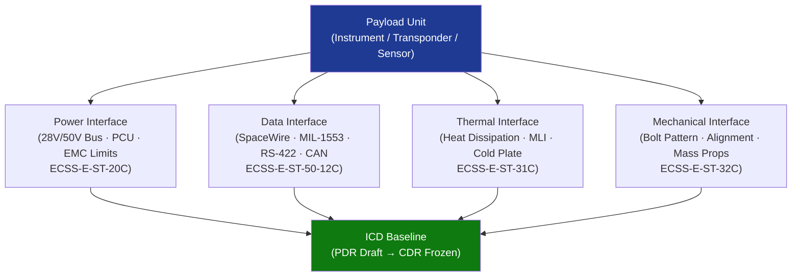

# STA 160-169 · 160-070 — Payload Interfaces Power Data Thermal and Mechanical

## 1. Purpose

Establishes interface control requirements for payload power, data, thermal, and mechanical interfaces on Q+ATLANTIDE STA-band spacecraft, defining the mandatory ICD content, interface freeze gates, and compliance evidence for all four interface domains.

## 2. Scope

- **Electrical power interface** — regulated bus voltage levels (28 V, 50 V, or 100 V unregulated buses as applicable), maximum steady-state current, in-rush current limiting, conducted emission limits, and EMC/EMI compliance per ECSS-E-ST-20C; payload power conditioning unit (PCU) interfaces and switch protection shall be declared in the power ICD annex.
- **Data interfaces** — SpaceWire (ECSS-E-ST-50-12C, 200 Mbit/s), MIL-STD-1553B (1 Mbit/s, remote terminal addressing), RS-422 (asynchronous, up to 10 Mbit/s), and CAN bus (1 Mbit/s, for low-rate housekeeping); interface type selection shall be justified against data rate, latency, and mass/power overhead; all digital interfaces shall declare connector pinouts and protocol stack in the data ICD annex.
- **Thermal interface** — steady-state and peak power dissipation declared per operational mode; multilayer insulation (MLI) blanket areas, conductive interface conductance (W/K), heat pipe attachment points, and cold plate mounting provisions shall be specified; thermal mathematical model (TMM) at instrument level shall be delivered per ECSS-E-ST-31C requirements.
- **Mechanical interface** — mounting provisions (bolt pattern, torque values, alignment reference features), alignment accuracy requirements (arcsec-level for optical payloads), launch vibration isolation provisions, shock response spectrum (SRS) at interface, and mass properties (CoM, mass, inertia tensor) shall be declared; structural verification shall reference ECSS-E-ST-32C.
- **Interface Control Document (ICD) requirement** — a payload ICD covering all four interface domains shall be established at project Phase B/C transition; ICD shall be baselined at PDR (draft) and frozen at CDR (controlled); all changes post-CDR require formal change control.

## 3. Diagram — Payload Interface Matrix

## 4. Footprint

| Metric | Value |
|---|---|
| Architecture | `STA` — Space Technology Architecture |
| Master range | `100–199` |
| Code range | `160-169` |
| Section | `06` — Sensores y Carga Útil Espacial |
| Subsection | `160` — Cargas Útiles |
| Subsubject | `007` — Payload Interfaces: Power, Data, Thermal and Mechanical |
| Primary Q-Division | Q-SPACE[^qdiv] |
| ORB support | ORB-PMO, ORB-MKTG |
| Governance class | `baseline`[^gov] |
| Document | `160-070-Payload-Interfaces-Power-Data-Thermal-and-Mechanical.md` (this file) |
| Parent subsection | [`README.md`](./README.md) · [`160-000-General.md`](./160-000-General.md) |

## 5. References & Citations

[^qdiv]: **Q-Division authority** — See [`organization/Q+ATLANTIDE.md` §4](../../../../organization/Q+ATLANTIDE.md#4-notes).

[^gov]: **Governance class** — `baseline`.

### Applicable industry standards

| Standard | Title | Applicability |
|---|---|---|
| ECSS-E-ST-20C | Space engineering — Electrical and electronic | Electrical power interface, EMC/EMI compliance |
| ECSS-E-ST-31C | Space engineering — Thermal control general requirements | Thermal interface specification, TMM delivery |
| ECSS-E-ST-50C | Space engineering — Communications | Data interface requirements |
| ECSS-E-ST-50-12C | Space engineering — SpaceWire — Links, nodes, routers and networks | SpaceWire data bus specification |
| MIL-STD-1553B | Digital Time Division Command/Response Multiplex Data Bus | MIL-STD-1553B data bus specification |
