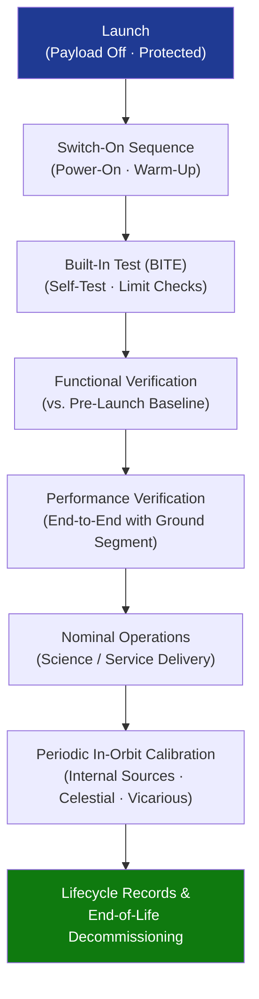

# STA 160-169 · 160-080 — Payload Operations Calibration and Commissioning

## 1. Purpose

Establishes operational procedures, calibration requirements, and commissioning logic for space payloads on Q+ATLANTIDE STA-band spacecraft, defining the mandatory commissioning sequence, operational mode management, in-orbit calibration cadence, health monitoring strategy, and end-of-life decommissioning procedures.

## 2. Scope

- **Commissioning sequence** — payload switch-on sequence (power-on, warm-up phase, built-in test execution (BITE), functional verification against pre-launch acceptance test predictions, and end-to-end performance verification with ground segment); commissioning plan shall be baselined at TRR and executed within the mission's commissioning window (nominally 3–6 months post-launch).
- **Operational mode management** — defined payload modes: NOMINAL (full science/service operation), STANDBY (powered, reduced function, low-power), SAFE (power-limited, thermally safe, commanded from ground or autonomy), and CALIBRATION (dedicated calibration observation sequences); mode transition logic and commanding authority shall be declared in the payload operations manual.
- **In-orbit calibration procedures** — internal calibration sources (on-board lamps, noise diodes, stable reference loads), celestial calibrators (solar observations, planetary flybys, astronomical standards), and vicarious calibration targets (PICS, deep convective clouds) shall be scheduled at defined intervals; calibration data shall be processed within the ground calibration pipeline and archived.
- **Health monitoring telemetry** — mandatory housekeeping parameters: detector temperatures, heater states, supply currents, bus voltages, detector dark count rates, operational mode register, and anomaly counters; out-of-limit detection thresholds and autonomous response actions shall be declared in the OBSW specification.
- **Anomaly response and safe-mode transition** — anomaly detection thresholds, watchdog timer configurations, automatic safe-mode entry conditions, and ground recovery procedures shall be documented; anomaly closure requires anomaly report, root-cause analysis, and corrective action evidence.
- **End-of-life decommissioning** — payload switch-off procedure, energy-safe passivation (discharge of batteries, vent of pressurised elements), and disposal orbit manoeuvre requirements shall be declared; compliance with IADC debris mitigation guidelines shall be confirmed in the end-of-life plan.

## 3. Diagram — Payload Commissioning Flow

## 4. Footprint

| Metric | Value |
|---|---|
| Architecture | `STA` — Space Technology Architecture |
| Master range | `100–199` |
| Code range | `160-169` |
| Section | `06` — Sensores y Carga Útil Espacial |
| Subsection | `160` — Cargas Útiles |
| Subsubject | `008` — Payload Operations, Calibration and Commissioning |
| Primary Q-Division | Q-SPACE[^qdiv] |
| ORB support | ORB-PMO, ORB-MKTG |
| Governance class | `baseline`[^gov] |
| Document | `160-080-Payload-Operations-Calibration-and-Commissioning.md` (this file) |
| Parent subsection | [`README.md`](./README.md) · [`160-000-General.md`](./160-000-General.md) |

## 5. References & Citations

[^qdiv]: **Q-Division authority** — See [`organization/Q+ATLANTIDE.md` §4](../../../../organization/Q+ATLANTIDE.md#4-notes).

[^gov]: **Governance class** — `baseline`.

### Applicable industry standards

| Standard | Title | Applicability |
|---|---|---|
| ECSS-E-ST-10C | Space engineering — System engineering general requirements | Commissioning planning, operational mode definition |
| ECSS-E-ST-10-03C | Space engineering — Testing | Functional and performance verification test requirements |
| NASA-HDBK-8739.23 | NASA Payload Safety Policy and Requirements Handbook | Safe-mode requirements, anomaly response procedures |
