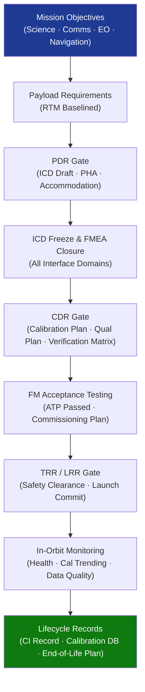

# STA 160-169 · 160-090 — Traceability Evidence and Lifecycle Governance

## 1. Purpose

Establishes requirements traceability, design evidence gates, and lifecycle governance requirements for the payloads subsystem on Q+ATLANTIDE STA-band spacecraft, defining the mandatory traceability matrix structure, evidence gate content, in-orbit performance monitoring strategy, and lifecycle record obligations.

## 2. Scope

- **Requirements traceability** — payload design requirements shall be traced from mission science/communications/EO/navigation objectives down to individual design elements, verification activities, and evidence artefacts; the requirements traceability matrix (RTM) shall be maintained in the project's configuration management system and shall be current at each review gate.
- **Evidence gates — PDR** — at Preliminary Design Review: payload requirements baselined in RTM, Interface Control Document (ICD) draft issued covering all four interface domains (power/data/thermal/mechanical), power/data/thermal/mechanical accommodation confirmed against platform budgets, and payload safety preliminary hazard analysis (PHA) completed.
- **Evidence gates — CDR** — at Critical Design Review: ICD frozen under configuration control, calibration plan approved and calibration model delivered, FMEA/FMECA closed for all single-point failures, environmental qualification plan approved (vibration/shock/thermal vacuum), and all design-to requirements verification methods declared (test/analysis/inspection/review of design).
- **Evidence gates — TRR** — at Test Readiness Review / Launch Readiness Review: flight model (FM) functional tests passed per acceptance test procedure (ATP), in-orbit commissioning plan approved and uploaded to mission control, and all launch-commit criteria satisfied including safety clearance from payload safety panel.
- **In-orbit performance monitoring** — mandatory telemetry channels for detector health (temperatures, dark currents/counts, bias voltages), operational mode status, calibration parameter trending, and data quality metric tracking (completeness, latency, calibration residuals); anomaly detection thresholds and automated alert logic shall be declared in the mission operations concept.
- **Lifecycle records** — the payload configuration item (CI) record shall include: as-built configuration, serial number, heritage data, calibration database with traceability to national metrology standards, all environmental test records (vibration, shock, thermal vacuum, EMC), manufacturing non-conformance reports (NCRs), and end-of-life disposal plan with compliance evidence for IADC debris mitigation guidelines.

## 3. Diagram — Payload Traceability and Governance Flow

## 4. Footprint

| Metric | Value |
|---|---|
| Architecture | `STA` — Space Technology Architecture |
| Master range | `100–199` |
| Code range | `160-169` |
| Section | `06` — Sensores y Carga Útil Espacial |
| Subsection | `160` — Cargas Útiles |
| Subsubject | `010` — Traceability, Evidence and Lifecycle Governance |
| Primary Q-Division | Q-SPACE[^qdiv] |
| ORB support | ORB-PMO, ORB-MKTG |
| Governance class | `baseline`[^gov] |
| Document | `160-090-Traceability-Evidence-and-Lifecycle-Governance.md` (this file) |
| Parent subsection | [`README.md`](./README.md) · [`160-000-General.md`](./160-000-General.md) |

## 5. References & Citations

[^qdiv]: **Q-Division authority** — See [`organization/Q+ATLANTIDE.md` §4](../../../../organization/Q+ATLANTIDE.md#4-notes).

[^gov]: **Governance class** — `baseline`.

### Applicable industry standards

| Standard | Title | Applicability |
|---|---|---|
| ECSS-E-ST-10C | Space engineering — System engineering general requirements | Requirements traceability, review gate content |
| ECSS-E-ST-10-02C | Space engineering — Verification | Verification methodology, evidence artefacts |
| NASA-HDBK-8739.23 | NASA Payload Safety Policy and Requirements Handbook | Safety panel clearance, hazard closure evidence |
