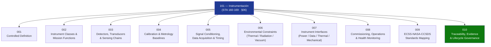

# STA 160-169 · Section 06 · Subsection 161 — Instrumentación

## 1. Purpose

Overview entry-point for the Instrumentación subsection within `160-169`. Introduces the instrumentation framework: controlled definitions, instrument classes, detector/transducer chains, calibration/metrology, signal conditioning, environmental constraints, interfaces, commissioning/health monitoring, standards mapping, and lifecycle governance. Designated mission-instrumentation critical.

## 2. Scope

- Covers the Instrumentation slice of parent code range `160-169`, establishing what constitutes spacecraft instrumentation in Q+ATLANTIDE STA-band platforms; distinguishes instrument from payload (→`160`) and scientific sensor (→`162`) scopes.
- Inherits Q-Division authority and ORB support from the parent row in [`../../README.md` §3](../../README.md#3-architecture-table).
- **Instrumentation Controlled Definition** (`001`) — normative boundary; instrument as a measurement device providing quantified physical observables, per ECSS-E-ST-10-03C testing and metrology conventions.
- **Instrument Classes and Mission Functions** (`002`) — taxonomy: in-situ/remote-sensing, passive/active, imaging/non-imaging; alignment to mission function.
- **Detectors, Transducers and Sensing Chains** (`003`) — detector technologies (photodetectors, bolometers, particle detectors, magnetometers), front-end electronics, analog/digital conversion.
- **Calibration Reference and Metrology Baselines** (`004`) — calibration hierarchy, reference standards, uncertainty budget per BIPM JCGM 100:2008 (GUM).
- **Signal Conditioning, Data Acquisition and Timing** (`005`) — amplifiers, filters, ADC specifications, timing synchronization, data latency.
- **Environmental Constraints: Thermal, Radiation and Vacuum** (`006`) — thermal operating range, total ionizing dose, SEU susceptibility, outgassing, vacuum qualification per NASA-HDBK-4002A and ECSS-E-ST-10-04C.
- **Instrument Interfaces: Power, Data, Thermal and Mechanical** (`007`) — SpaceWire, MIL-STD-1553, power rail specifications, alignment requirements.
- **Commissioning, Operations and Health Monitoring** (`008`) — switch-on sequence, functional verification, in-orbit calibration update, health telemetry.
- **ECSS-NASA-CCSDS Instrumentation Standards Mapping** (`009`) — standards hierarchy for instrumentation design and verification.
- **Traceability, Evidence and Lifecycle Governance** (`010`) — requirements traceability, evidence gates, lifecycle records.

## 3. Diagram — Instrumentation Subsection Map

## 4. Footprint

| Metric | Value |
|---|---|
| Architecture | `STA` — Space Technology Architecture |
| Master range | `100–199` |
| Code range | `160-169` |
| Section | `06` — Sensores y Carga Útil Espacial |
| Subsection | `161` — Instrumentación |
| Subsubject | `000` — Overview |
| Primary Q-Division | Q-SPACE[^qdiv] |
| ORB support | ORB-PMO, ORB-MKTG |
| Governance class | `baseline`[^gov] |
| Document | `000_Overview.md` (this file) |
| Parent subsection | [`README.md`](./README.md) |

## 5. References & Citations

[^qdiv]: **Q-Division authority** — See [`organization/Q+ATLANTIDE.md` §4](../../../../organization/Q+ATLANTIDE.md#4-notes).
[^gov]: **Governance class** — `baseline`.

### Applicable industry standards

| Standard | Title | Applicability |
|---|---|---|
| ECSS-E-ST-10-03C | Space Engineering: Testing | Instrument-level testing and thermal-vacuum qualification |
| ECSS-E-ST-10-04C | Space Engineering: Space Environment | Environmental specifications for instrumentation design |
| BIPM JCGM 100:2008 | GUM — Guide to the Expression of Uncertainty in Measurement | Calibration uncertainty budgets |
| ISO/IEC 17025 | General requirements for the competence of testing and calibration laboratories | Accredited calibration laboratory requirements |
| NASA-HDBK-4002A | Mitigating In-Space Charging Effects — A Guideline | Radiation and charging environment for detectors |
