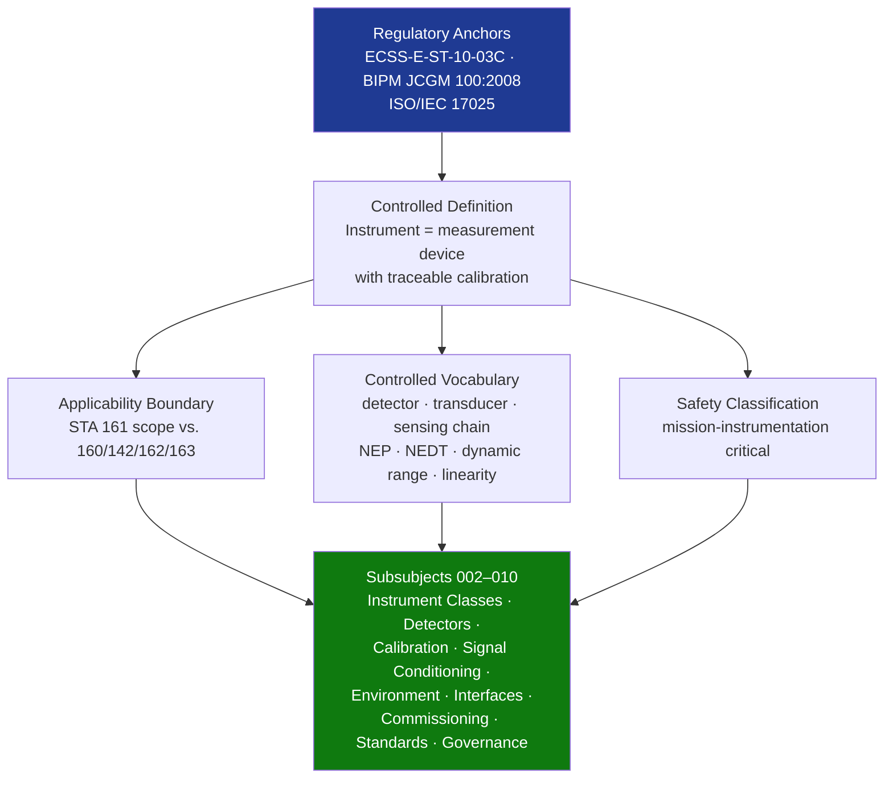

# STA 160-169 · Section 06 · Subsection 161 · Subsubject 001 — Instrumentation Controlled Definition

## 1. Purpose

Establishes the normative definition and controlled scope of spacecraft instrumentation within the Q+ATLANTIDE STA band, per ECSS-E-ST-10-03C testing and metrology framework. Provides the authoritative vocabulary and applicability boundaries for all downstream subsubjects.

## 2. Scope

- **Controlled definition** — Instrumentation encompasses all sensors, detectors, transducers, and associated electronics that generate quantified physical observables from the spacecraft environment or target, including readout chains, calibration sources, and data formatting functions.
- **Applicability boundary** — STA `161` covers the instrumentation subsystem on Q+ATLANTIDE STA-band platforms; excludes payload accommodation functions (→`160`), on-board software execution environment (→`142`), scientific data analysis (→`162`), and observation mission design (→`163`).
- **Controlled vocabulary** — *instrument*: measurement device with traceable calibration; *detector*: physical element converting signal to electrical output; *transducer*: device converting one physical quantity to another; *sensing chain*: detector through ADC; *noise equivalent power (NEP)*; *noise equivalent temperature difference (NEDT)*; *dynamic range*; *linearity*.
- **Safety classification** — mission-instrumentation critical; instrument malfunction may result in science data loss, false measurements leading to incorrect science conclusions, or collateral damage to spacecraft systems.
- **Interface boundaries** — Instrumentation interfaces with: payloads (160) as hosted instrument suite; avionics (141) for housekeeping; flight software (142) for instrument commanding; scientific sensors (162) for sensor-level characterization; observation (163) for data product definition.

## 3. Diagram — Instrumentation Definition Framework

## 4. Footprint

| Metric | Value |
|---|---|
| Architecture | `STA` — Space Technology Architecture |
| Master range | `100–199` |
| Code range | `160-169` |
| Section | `06` — Sensores y Carga Útil Espacial |
| Subsection | `161` — Instrumentación |
| Subsubject | `001` — Instrumentation Controlled Definition |
| Primary Q-Division | Q-SPACE[^qdiv] |
| ORB support | ORB-PMO, ORB-MKTG |
| Governance class | `baseline`[^gov] |
| Document | `001_Instrumentation-Controlled-Definition.md` (this file) |
| Parent subsection | [`README.md`](./README.md) · [`000_Overview.md`](./000_Overview.md) |

## 5. References & Citations

[^qdiv]: **Q-Division authority** — See [`organization/Q+ATLANTIDE.md` §4](../../../../organization/Q+ATLANTIDE.md#4-notes).
[^gov]: **Governance class** — `baseline`.

### Applicable industry standards

| Standard | Title | Applicability |
|---|---|---|
| ECSS-E-ST-10-03C | Space Engineering: Testing | Normative testing and metrology framework for instrumentation |
| BIPM JCGM 100:2008 | GUM — Guide to the Expression of Uncertainty in Measurement | Traceable calibration and uncertainty vocabulary |
| ISO/IEC 17025 | General requirements for the competence of testing and calibration laboratories | Calibration laboratory accreditation baseline |
