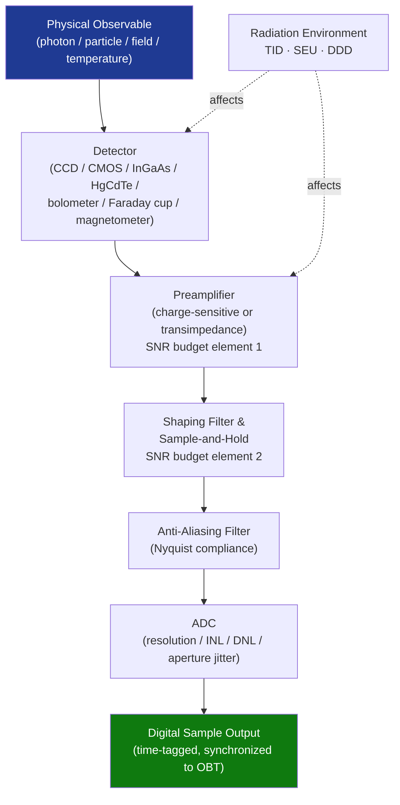

# STA 160-169 · Section 06 · Subsection 161 · Subsubject 003 — Detectors, Transducers and Sensing Chains

## 1. Purpose

Establishes design and performance requirements for detectors, transducers, and sensing chains in Q+ATLANTIDE STA-band spacecraft instrumentation. Defines the signal path from physical observable to digital sample including noise budget, radiation qualification, and timing requirements.

## 2. Scope

- **Photodetector technologies** — CCD (charge-coupled device), CMOS APS, InGaAs, HgCdTe, and bolometer arrays; spectral response, quantum efficiency, dark current, read noise; space radiation qualification requirements per NASA-HDBK-4002A.
- **Particle and field detectors** — Faraday cups, retarding potential analyzers, electron multipliers (channeltrons, MCPs), search-coil and fluxgate magnetometers; energy range, angular coverage, dynamic range, and cross-calibration requirements.
- **Analog sensing chain** — preamplifier (charge-sensitive or transimpedance), shaping filter, sample-and-hold, anti-aliasing filter; noise model (thermal, shot, flicker); signal-to-noise ratio (SNR) budget allocated to each chain element.
- **Analog-to-digital conversion** — ADC resolution (bits), sampling rate, integral/differential non-linearity, aperture jitter; Nyquist criterion compliance; dithering and oversampling strategies for low-signal instruments.
- **Timing and synchronization** — sensing chain timing accuracy requirements; synchronization with spacecraft time reference; latency budget from physical event to digital sample.
- **Environmental effects on detectors** — total ionizing dose (TID) effects on dark current and quantum efficiency; single-event upset (SEU) in readout electronics; displacement damage dose (DDD) on photodetectors; annealing strategies.

## 3. Diagram — Sensing Chain Signal Flow

## 4. Footprint

| Metric | Value |
|---|---|
| Architecture | `STA` — Space Technology Architecture |
| Master range | `100–199` |
| Code range | `160-169` |
| Section | `06` — Sensores y Carga Útil Espacial |
| Subsection | `161` — Instrumentación |
| Subsubject | `003` — Detectors, Transducers and Sensing Chains |
| Primary Q-Division | Q-SPACE[^qdiv] |
| ORB support | ORB-PMO, ORB-MKTG |
| Governance class | `baseline`[^gov] |
| Document | `003_Detectors-Transducers-and-Sensing-Chains.md` (this file) |
| Parent subsection | [`README.md`](./README.md) · [`000_Overview.md`](./000_Overview.md) |

## 5. References & Citations

[^qdiv]: **Q-Division authority** — See [`organization/Q+ATLANTIDE.md` §4](../../../../organization/Q+ATLANTIDE.md#4-notes).
[^gov]: **Governance class** — `baseline`.

### Applicable industry standards

| Standard | Title | Applicability |
|---|---|---|
| ECSS-E-ST-10-03C | Space Engineering: Testing | Detector and sensing chain test requirements |
| NASA-HDBK-4002A | Mitigating In-Space Charging Effects | Radiation qualification for photodetectors and readout electronics |
| ECSS-E-HB-10-12A | Radiation Effects Handbook | TID, SEU, and DDD modelling for detector elements |
