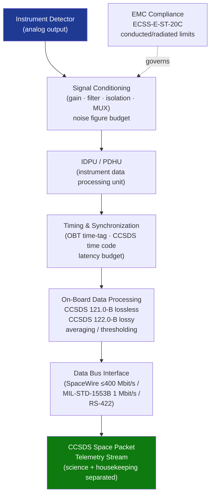

# STA 160-169 · Section 06 · Subsection 161 · Subsubject 005 — Signal Conditioning, Data Acquisition and Timing

## 1. Purpose

Establishes requirements for signal conditioning, data acquisition, and timing within Q+ATLANTIDE STA-band spacecraft instrumentation systems. Covers the electronic path from detector output to time-tagged, packetized telemetry including EMC and on-board data processing.

## 2. Scope

- **Signal conditioning** — amplification stages (gain, bandwidth, impedance matching), filtering (low-pass, band-pass, notch filters for EMI rejection), isolation (opto-couplers, differential signaling), signal multiplexing; noise figure budget allocation.
- **Data acquisition architecture** — instrument data processing unit (IDPU) or payload data handling unit (PDHU); acquisition modes (continuous, burst, event-triggered, programmatic); data volume estimation and on-board storage allocation.
- **Timing and synchronization** — time-tagging of science measurements; synchronization with spacecraft on-board time (OBT) per CCSDS time code formats; time transfer accuracy requirements (instrument-level to millisecond or better; for atomic standards to nanosecond level); latency budget from physical event to packetized telemetry.
- **Digital interface to platform** — data formatting in CCSDS space packets; SpaceWire or MIL-STD-1553 transport; data rate allocation, prioritization, and flow control; housekeeping versus science data channel separation.
- **On-board data processing** — lossless compression (Rice/CCSDS 121.0-B), lossy compression (CCSDS 122.0-B for imagery), on-board data reduction (averaging, thresholding, event selection); processing budget (MIPS, memory) per instrument.
- **EMC and cross-coupling** — conducted and radiated emission limits per ECSS-E-ST-20C; susceptibility requirements; instrument power supply filtering; grounding and bonding design.

## 3. Diagram — Data Acquisition and Timing Flow

## 4. Footprint

| Metric | Value |
|---|---|
| Architecture | `STA` — Space Technology Architecture |
| Master range | `100–199` |
| Code range | `160-169` |
| Section | `06` — Sensores y Carga Útil Espacial |
| Subsection | `161` — Instrumentación |
| Subsubject | `005` — Signal Conditioning, Data Acquisition and Timing |
| Primary Q-Division | Q-SPACE[^qdiv] |
| ORB support | ORB-PMO, ORB-MKTG |
| Governance class | `baseline`[^gov] |
| Document | `005_Signal-Conditioning-Data-Acquisition-and-Timing.md` (this file) |
| Parent subsection | [`README.md`](./README.md) · [`000_Overview.md`](./000_Overview.md) |

## 5. References & Citations

[^qdiv]: **Q-Division authority** — See [`organization/Q+ATLANTIDE.md` §4](../../../../organization/Q+ATLANTIDE.md#4-notes).
[^gov]: **Governance class** — `baseline`.

### Applicable industry standards

| Standard | Title | Applicability |
|---|---|---|
| ECSS-E-ST-20C | Space Engineering: Electrical and Electronic | EMC, grounding, bonding, and signal conditioning requirements |
| ECSS-E-ST-50C | Space Engineering: Communications | Data interface and protocol requirements |
| CCSDS 121.0-B | Lossless Data Compression | Lossless on-board compression standard |
| CCSDS 122.0-B | Image Data Compression | Lossy on-board image compression standard |
