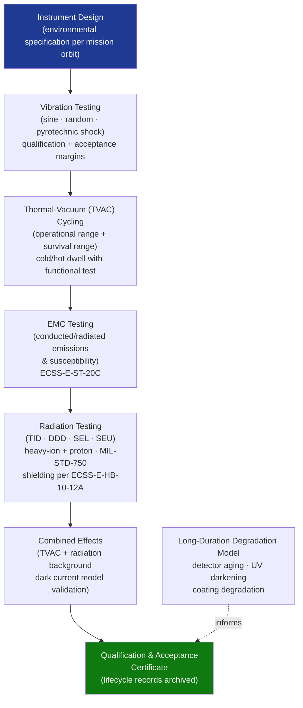

# STA 160-169 · Section 06 · Subsection 161 · Subsubject 006 — Environmental Constraints: Thermal, Radiation and Vacuum

## 1. Purpose

Establishes environmental qualification requirements and design constraints for spacecraft instrumentation exposed to thermal, radiation, and vacuum environments on Q+ATLANTIDE STA-band missions. Defines the test campaign, margin policy, and long-duration degradation models.

## 2. Scope

- **Thermal environment** — operational temperature range, non-operational survival range; thermal cycling testing requirements (ECSS-E-ST-10-03C); detector temperature stability requirements (typically ±0.1 K for cooled detectors, ±1 K for ambient-temperature detectors); passive radiative cooling vs. active mechanical cooler trade.
- **Radiation environment** — total ionizing dose (TID) design margin of ≥2× mission dose from SPENVIS or equivalent; displacement damage dose (DDD) for electro-optical devices; single-event latch-up (SEL) and single-event upset (SEU) rates; heavy-ion and proton testing per MIL-STD-750; shielding optimization per ECSS-E-HB-10-12A; NASA-HDBK-4002A applicability.
- **Vacuum environment** — outgassing requirements for optical and sensitive surfaces (ECSS-Q-ST-70-02C); materials selection for contamination control; pressure gradient effects on sealed detectors; corona discharge prevention for HV electronics.
- **Mechanical environment** — launch vibration and shock spectrum; random vibration test levels; sine vibration; pyrotechnic shock; qualification and acceptance margins per ECSS-E-ST-10-03C; instrument mounting stiffness requirements.
- **Combined effects testing** — thermal-vacuum (TVAC) cycling with radiation background; radiation-induced dark current increase modeled and tested; EMC testing in relevant operational configuration.
- **Long-duration mission degradation** — detector aging model; UV darkening of optical elements; mirror coating degradation; recalibration schedule to compensate degradation.

## 3. Diagram — Environmental Qualification Flow

## 4. Footprint

| Metric | Value |
|---|---|
| Architecture | `STA` — Space Technology Architecture |
| Master range | `100–199` |
| Code range | `160-169` |
| Section | `06` — Sensores y Carga Útil Espacial |
| Subsection | `161` — Instrumentación |
| Subsubject | `006` — Environmental Constraints: Thermal, Radiation and Vacuum |
| Primary Q-Division | Q-SPACE[^qdiv] |
| ORB support | ORB-PMO, ORB-MKTG |
| Governance class | `baseline`[^gov] |
| Document | `006_Environmental-Constraints-Thermal-Radiation-and-Vacuum.md` (this file) |
| Parent subsection | [`README.md`](./README.md) · [`000_Overview.md`](./000_Overview.md) |

## 5. References & Citations

[^qdiv]: **Q-Division authority** — See [`organization/Q+ATLANTIDE.md` §4](../../../../organization/Q+ATLANTIDE.md#4-notes).
[^gov]: **Governance class** — `baseline`.

### Applicable industry standards

| Standard | Title | Applicability |
|---|---|---|
| ECSS-E-ST-10-03C | Space Engineering: Testing | Qualification and acceptance test levels, margins, and thermal cycling |
| ECSS-E-ST-10-04C | Space Engineering: Space Environment | Environmental specification input for radiation and thermal design |
| ECSS-E-HB-10-12A | Radiation Effects Handbook | TID, DDD, SEE shielding and design guidelines |
| NASA-HDBK-4002A | Mitigating In-Space Charging Effects | Charging-induced radiation environment for detectors |
| ECSS-Q-ST-70-02C | Space Product Assurance: Thermal Vacuum Outgassing | Outgassing and contamination control for optical instruments |
