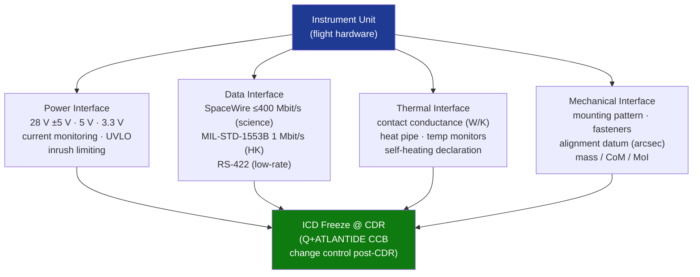

# STA 160-169 · Section 06 · Subsection 161 · Subsubject 007 — Instrument Interfaces: Power, Data, Thermal and Mechanical

## 1. Purpose

Establishes interface control requirements for instrument power, data, thermal, and mechanical interfaces on Q+ATLANTIDE STA-band spacecraft. Defines the ICD governance process including freeze milestones and change control after CDR.

## 2. Scope

- **Power interface** — regulated secondary power rails (typically 28 V ±5 V and/or 5 V, 3.3 V); maximum continuous and peak power allocation; inrush current limiting; conducted EMI limits at power input; power switching sequencing; under-voltage lockout; current monitoring for health telemetry.
- **Data interface** — SpaceWire (ECSS-E-ST-50-12C) primary science data interface at ≤400 Mbit/s; MIL-STD-1553B for housekeeping and command at 1 Mbit/s; RS-422 for lower-rate instruments; interface freeze at CDR+; protocol version, node address, and time-code format defined in ICD.
- **Thermal interface** — thermal contact conductance at mounting feet (W/K requirement); heat pipe interface if applicable; operating temperature range declared in ICD; instrument self-heating declared to thermal engineer; interface temperature monitor points agreed.
- **Mechanical interface** — mounting hole pattern, fastener specification (grade, torque), alignment reference datum (kinematic mount or 3-point flexure mount as applicable); alignment knowledge requirement (arcseconds); mass, center-of-mass, and moments of inertia documented in mass budget; purge/vent path requirements.
- **ICD governance** — preliminary ICD issued at phase B/C boundary; frozen ICD at CDR; change control via Q+ATLANTIDE CCB after CDR freeze; each ICD revision requires impact analysis on affected subsystems.
- **Connector and harness** — connector type and pin assignment defined per ECSS-Q-ST-70-08C (manual soldering) or equivalent; harness routing and strain relief; connector retention scheme.

## 3. Diagram — Instrument Interface Control

## 4. Footprint

| Metric | Value |
|---|---|
| Architecture | `STA` — Space Technology Architecture |
| Master range | `100–199` |
| Code range | `160-169` |
| Section | `06` — Sensores y Carga Útil Espacial |
| Subsection | `161` — Instrumentación |
| Subsubject | `007` — Instrument Interfaces: Power, Data, Thermal and Mechanical |
| Primary Q-Division | Q-SPACE[^qdiv] |
| ORB support | ORB-PMO, ORB-MKTG |
| Governance class | `baseline`[^gov] |
| Document | `007_Instrument-Interfaces-Power-Data-Thermal-and-Mechanical.md` (this file) |
| Parent subsection | [`README.md`](./README.md) · [`000_Overview.md`](./000_Overview.md) |

## 5. References & Citations

[^qdiv]: **Q-Division authority** — See [`organization/Q+ATLANTIDE.md` §4](../../../../organization/Q+ATLANTIDE.md#4-notes).
[^gov]: **Governance class** — `baseline`.

### Applicable industry standards

| Standard | Title | Applicability |
|---|---|---|
| ECSS-E-ST-20C | Space Engineering: Electrical and Electronic | Power interface requirements, EMC, grounding |
| ECSS-E-ST-31C | Space Engineering: Thermal Control General Requirements | Thermal interface requirements and contact conductance |
| ECSS-E-ST-50C | Space Engineering: Communications | Data interface protocol requirements |
| ECSS-E-ST-50-12C | Space Engineering: SpaceWire — Links, Nodes, Routers and Networks | SpaceWire primary science data interface standard |
| MIL-STD-1553B | Military Standard: Aircraft Internal Time Division Command/Response Multiplex Data Bus | Housekeeping and command data bus |
| ECSS-Q-ST-70-08C | Space Product Assurance: Manual Soldering of High-Reliability Electrical Connections | Connector and harness workmanship |
