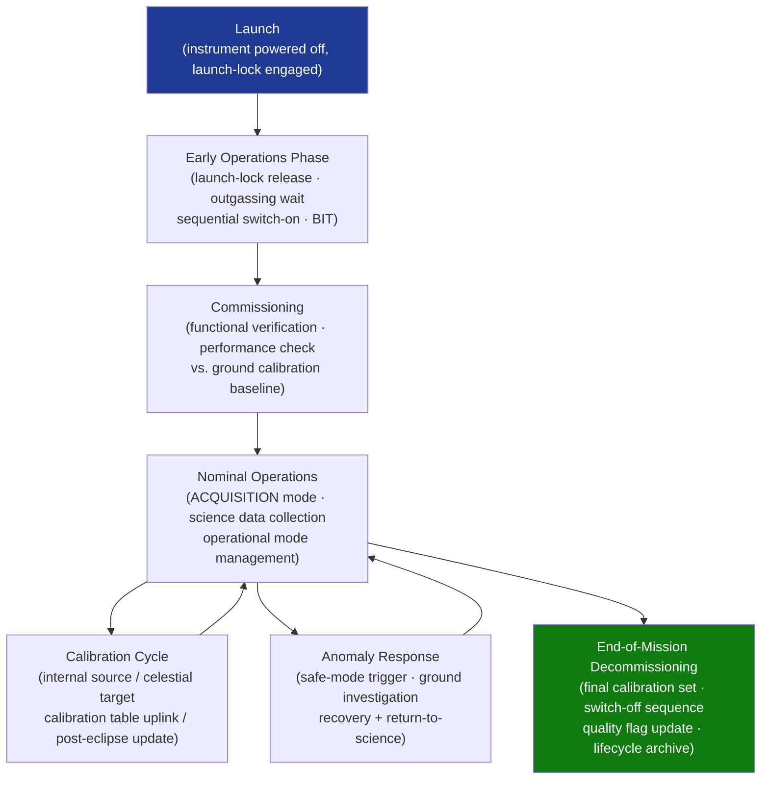

# STA 160-169 · Section 06 · Subsection 161 · Subsubject 008 — Commissioning, Operations and Health Monitoring

## 1. Purpose

Establishes commissioning sequences, operational procedure requirements, and health-monitoring architectures for Q+ATLANTIDE STA-band spacecraft instrumentation. Covers the full instrument lifecycle from launch-lock release through end-of-mission decommissioning.

## 2. Scope

- **Commissioning sequence** — launch-lock release, outgassing wait period, sequential switch-on (non-critical first, then progressively mission-critical); built-in test (BIT) execution; functional performance verification; performance verification against ground calibration baseline.
- **Operational mode management** — SAFE (power-off or survival-heater only), STANDBY (powered, not acquiring), ACQUISITION (active data collection), CALIBRATION (internal or celestial calibrator active), SAFE-INSTRUMENT (anomaly safe state); mode transition logic and autonomy rules.
- **In-orbit calibration update** — calibration parameter update procedure (ground uplink of new calibration table); commanded calibration sequence using internal calibration source; autonomous calibration update post-eclipse.
- **Health monitoring telemetry** — per-instrument monitoring of: supply currents and voltages, detector temperature, ADC noise floor, BIT status flags, housekeeping counters; limit checking and alert escalation; trend analysis for ageing monitoring.
- **Anomaly response** — autonomous safe-mode transition triggers (over-current, over-temperature, watchdog timeout); ground anomaly investigation procedure; recovery procedure and return-to-science sequence.
- **End-of-mission decommissioning** — instrument final calibration measurement set; instrument switch-off sequence; data product quality flag update; archiving of final calibration state in lifecycle records.

## 3. Diagram — Instrument Operations Lifecycle

## 4. Footprint

| Metric | Value |
|---|---|
| Architecture | `STA` — Space Technology Architecture |
| Master range | `100–199` |
| Code range | `160-169` |
| Section | `06` — Sensores y Carga Útil Espacial |
| Subsection | `161` — Instrumentación |
| Subsubject | `008` — Commissioning, Operations and Health Monitoring |
| Primary Q-Division | Q-SPACE[^qdiv] |
| ORB support | ORB-PMO, ORB-MKTG |
| Governance class | `baseline`[^gov] |
| Document | `008_Commissioning-Operations-and-Health-Monitoring.md` (this file) |
| Parent subsection | [`README.md`](./README.md) · [`000_Overview.md`](./000_Overview.md) |

## 5. References & Citations

[^qdiv]: **Q-Division authority** — See [`organization/Q+ATLANTIDE.md` §4](../../../../organization/Q+ATLANTIDE.md#4-notes).
[^gov]: **Governance class** — `baseline`.

### Applicable industry standards

| Standard | Title | Applicability |
|---|---|---|
| ECSS-E-ST-10C | Space Engineering: System Engineering General Requirements | Commissioning and operational requirements definition |
| ECSS-E-ST-10-03C | Space Engineering: Testing | BIT and functional performance verification requirements |
| NASA-HDBK-8739.23 | NASA Complex Electronics Handbook for Assurance Professionals | Health monitoring and BIT architecture guidance |
