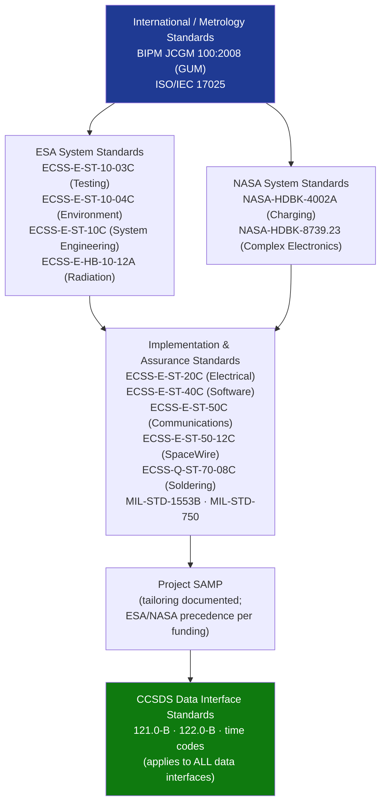

# STA 160-169 · Section 06 · Subsection 161 · Subsubject 009 — ECSS-NASA-CCSDS Instrumentation Standards Mapping

## 1. Purpose

Maps applicable ECSS, NASA, CCSDS, and metrology standards to instrumentation design, verification, and operational domains within Q+ATLANTIDE STA 161. Establishes the standards hierarchy, tailoring rules, and precedence for ESA-funded, NASA-funded, and jointly-developed instruments.

## 2. Scope

- **Testing standards** — ECSS-E-ST-10-03C (Space Engineering: Testing) governs instrument-level testing including thermal-vacuum cycling, vibration, EMC; defines qualification and acceptance test levels and margins.
- **Embedded software standards** — ECSS-E-ST-40C (Software) applies to instrument on-board software in IDPU/PDHU where software criticality class B or A is assigned; software verification requirements apply.
- **Soldering and workmanship** — ECSS-Q-ST-70-08C (Manual Soldering) governs hand-soldered connections in instrument front-end electronics; acceptance testing by certified operators.
- **Uncertainty quantification** — BIPM JCGM 100:2008 (GUM: Guide to the Expression of Uncertainty in Measurement) is the normative standard for calibration uncertainty budgets; ISO/IEC 17025 for accredited calibration laboratory requirements.
- **Radiation design** — NASA-HDBK-4002A (Mitigating In-Space Charging Effects) and ECSS-E-HB-10-12A (Radiation Effects Handbook) govern detector radiation qualification and shielding design.
- **Standards hierarchy and tailoring** — ECSS standards take precedence for ESA-funded missions; NASA standards applicable for NASA-funded or jointly-developed instruments; tailoring documented in project-level System Assurance Management Plan (SAMP); CCSDS standards apply to all data interfaces.

## 3. Diagram — Instrumentation Standards Hierarchy

## 4. Footprint

| Metric | Value |
|---|---|
| Architecture | `STA` — Space Technology Architecture |
| Master range | `100–199` |
| Code range | `160-169` |
| Section | `06` — Sensores y Carga Útil Espacial |
| Subsection | `161` — Instrumentación |
| Subsubject | `009` — ECSS-NASA-CCSDS Instrumentation Standards Mapping |
| Primary Q-Division | Q-SPACE[^qdiv] |
| ORB support | ORB-PMO, ORB-MKTG |
| Governance class | `baseline`[^gov] |
| Document | `009_ECSS-NASA-CCSDS-Instrumentation-Standards-Mapping.md` (this file) |
| Parent subsection | [`README.md`](./README.md) · [`000_Overview.md`](./000_Overview.md) |

## 5. References & Citations

[^qdiv]: **Q-Division authority** — See [`organization/Q+ATLANTIDE.md` §4](../../../../organization/Q+ATLANTIDE.md#4-notes).
[^gov]: **Governance class** — `baseline`.

### Applicable industry standards

| Standard | Title | Applicability |
|---|---|---|
| ECSS-E-ST-10-03C | Space Engineering: Testing | Instrument-level testing: thermal-vacuum, vibration, EMC |
| ECSS-E-ST-40C | Space Engineering: Software | On-board software in IDPU/PDHU (criticality class A/B) |
| ECSS-Q-ST-70-08C | Space Product Assurance: Manual Soldering | Hand-soldered front-end electronics workmanship |
| BIPM JCGM 100:2008 | GUM — Guide to the Expression of Uncertainty in Measurement | Normative calibration uncertainty standard |
| ISO/IEC 17025 | General requirements for the competence of testing and calibration laboratories | Accredited calibration laboratory |
| NASA-HDBK-4002A | Mitigating In-Space Charging Effects | Radiation and charging qualification for detectors |
