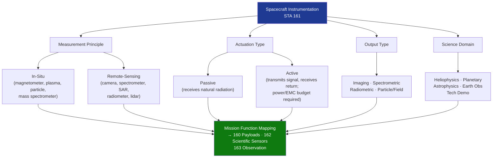

# STA 160-169 · 161-020 — Instrument Classes and Mission Functions

## 1. Purpose

Establishes the taxonomy of spacecraft instrument classes and their associated mission functions within Q+ATLANTIDE STA-band spacecraft. Provides the classification framework used across all downstream instrumentation design and verification activities.

## 2. Scope

- **Classification axes** — instruments classified by measurement principle (in-situ vs. remote-sensing), by actuation (passive vs. active), by output type (imaging vs. spectrometric vs. radiometric vs. in-situ particle/field), and by science domain (heliophysics, planetary, astrophysics, Earth observation, technology demonstration).
- **In-situ instruments** — magnetometers, plasma analyzers, particle detectors, mass spectrometers; measure physical quantities at spacecraft location; interface directly with local environment.
- **Remote-sensing instruments** — optical cameras, spectrometers, SAR, radiometers, lidar; measure physical quantities at a distance; require precise pointing knowledge from GNC (→`140`) and stable platform.
- **Active vs. passive distinction** — active instruments (radar, lidar, active sounder) transmit a signal and receive the return; require dedicated transmitter power budgets, frequency coordination, and EMC analysis; passive instruments rely solely on received natural radiation.
- **Mission function mapping** — each instrument class mapped to mission objective category (science return, navigation support, technology readiness, Earth observation) with primary interface node identification (`160`, `162`, `163`).
- **Accommodation constraints** — field-of-view requirements, pointing stability allocations, thermal stability windows, mass and power budgets per instrument class.

## 3. Diagram — Instrument Class Taxonomy

## 4. Footprint

| Metric | Value |
|---|---|
| Architecture | `STA` — Space Technology Architecture |
| Master range | `100–199` |
| Code range | `160-169` |
| Section | `06` — Sensores y Carga Útil Espacial |
| Subsection | `161` — Instrumentación |
| Subsubject | `002` — Instrument Classes and Mission Functions |
| Primary Q-Division | Q-SPACE[^qdiv] |
| ORB support | ORB-PMO, ORB-MKTG |
| Governance class | `baseline`[^gov] |
| Document | `161-020-Instrument-Classes-and-Mission-Functions.md` (this file) |
| Parent subsection | [`README.md`](./README.md) · [`161-000-General.md`](./161-000-General.md) |

## 5. References & Citations

[^qdiv]: **Q-Division authority** — See [`organization/Q+ATLANTIDE.md` §4](../../../../organization/Q+ATLANTIDE.md#4-notes).
[^gov]: **Governance class** — `baseline`.

### Applicable industry standards

| Standard | Title | Applicability |
|---|---|---|
| ECSS-E-ST-10C | Space Engineering: System Engineering General Requirements | System-level instrument taxonomy and mission function classification |
| ECSS-E-ST-10-03C | Space Engineering: Testing | Testing requirements by instrument class |
