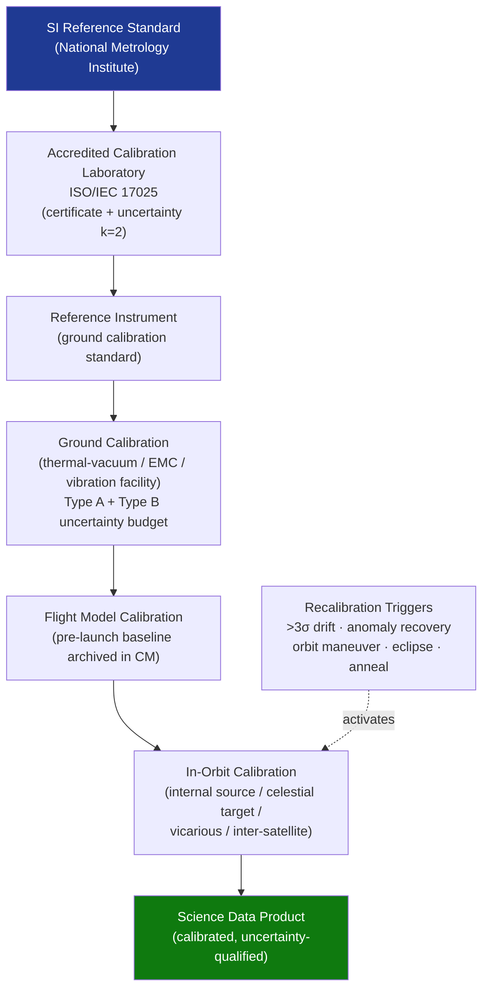

# STA 160-169 · 161-040 — Calibration Reference and Metrology Baselines

## 1. Purpose

Establishes calibration hierarchy, reference standard traceability, and metrology baseline requirements for Q+ATLANTIDE STA-band spacecraft instrumentation per BIPM JCGM 100:2008 (GUM). Defines the complete chain from SI reference standards through ground and in-orbit calibration to science data products.

## 2. Scope

- **Metrology traceability hierarchy** — calibration chain from national/international measurement standard (SI units) through reference instrument to flight model; each link documented with calibration certificate, uncertainty, and validity period; managed under ISO/IEC 17025 accredited laboratory or equivalent.
- **Uncertainty budget** — per BIPM JCGM 100:2008 (GUM); Type A (statistical) and Type B (systematic) uncertainty contributions identified, quantified, and combined in quadrature; expanded uncertainty at k=2 (95% confidence) reported for each measurand.
- **Pre-launch calibration** — ground calibration in environmental test facility (thermal-vacuum, EMC, vibration); reference standard instruments used for cross-calibration; calibration data archived in configuration management system.
- **In-orbit calibration** — internal calibration sources (lamps, radioactive sources, heaters); celestial calibration targets (stars, Moon, Sun); inter-satellite calibration for constellation missions; vicarious calibration using ground truth sites.
- **Calibration model** — mathematical calibration function (linear, polynomial, look-up table); model parameter uncertainty propagation; model validity range and saturation limits documented.
- **Recalibration triggers** — in-orbit calibration schedule (time-based, event-based); recalibration triggered by: >3σ drift in calibration parameter, anomaly recovery, orbit maneuver, eclipse emergence, detector anneal cycle.

## 3. Diagram — Calibration Traceability Chain

## 4. Footprint

| Metric | Value |
|---|---|
| Architecture | `STA` — Space Technology Architecture |
| Master range | `100–199` |
| Code range | `160-169` |
| Section | `06` — Sensores y Carga Útil Espacial |
| Subsection | `161` — Instrumentación |
| Subsubject | `004` — Calibration Reference and Metrology Baselines |
| Primary Q-Division | Q-SPACE[^qdiv] |
| ORB support | ORB-PMO, ORB-MKTG |
| Governance class | `baseline`[^gov] |
| Document | `161-040-Calibration-Reference-and-Metrology-Baselines.md` (this file) |
| Parent subsection | [`README.md`](./README.md) · [`161-000-General.md`](./161-000-General.md) |

## 5. References & Citations

[^qdiv]: **Q-Division authority** — See [`organization/Q+ATLANTIDE.md` §4](../../../../organization/Q+ATLANTIDE.md#4-notes).
[^gov]: **Governance class** — `baseline`.

### Applicable industry standards

| Standard | Title | Applicability |
|---|---|---|
| BIPM JCGM 100:2008 | GUM — Guide to the Expression of Uncertainty in Measurement | Normative uncertainty budget methodology |
| ISO/IEC 17025 | General requirements for the competence of testing and calibration laboratories | Accredited calibration laboratory requirements |
| ECSS-E-ST-10-03C | Space Engineering: Testing | Pre-launch calibration test requirements and traceability |
| CEOS Cal/Val | Committee on Earth Observation Satellites — Calibration and Validation | In-orbit vicarious calibration protocols for Earth observation instruments |
