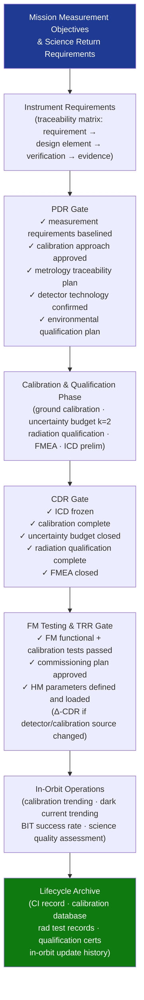

# STA 160-169 · 161-090 — Traceability Evidence and Lifecycle Governance

## 1. Purpose

Establishes requirements traceability, design evidence gates, and lifecycle governance requirements for the instrumentation subsystem on Q+ATLANTIDE STA-band spacecraft. Defines the complete governance flow from measurement objectives through in-orbit performance monitoring to lifecycle archiving.

## 2. Scope

- **Requirements traceability** — instrumentation design requirements traced from mission measurement objectives and science return requirements; traceability matrix linking each instrument requirement to: design element, calibration verification activity, and evidence artefact; managed in Q+ATLANTIDE requirements register.
- **Evidence gates** — PDR: instrument-level measurement requirements baselined, calibration approach approved, metrology traceability plan issued, detector technology selection confirmed, environmental qualification plan approved; CDR: preliminary ICD frozen, ground calibration complete, uncertainty budget closed at k=2, radiation qualification complete, FMEA closed.
- **Delta-CDR and TRR gates** — delta-CDR required for any post-CDR change to detector configuration, calibration source, or signal-chain architecture; TRR gate: all FM instrument functional and calibration tests passed, in-orbit commissioning plan approved, health monitoring parameters defined and loaded.
- **In-orbit performance monitoring** — calibration parameter trending against ground baseline; detector dark current and noise trending; BIT success rate and anomaly rate monitoring; periodic science data quality assessment against mission requirements.
- **Lifecycle records** — instrument CI record (serial number, hardware version, software version); ground calibration database (all calibration runs with environmental conditions, operator, uncertainty); radiation test records; environmental qualification certificates; in-orbit calibration update history.
- **Interface control documents (ICDs)** — per-instrument ICD freeze at CDR+; ICD includes all four interface domains (power, data, thermal, mechanical); post-CDR change control managed through Q+ATLANTIDE CCB.

## 3. Diagram — Instrumentation Governance Flow

## 4. Footprint

| Metric | Value |
|---|---|
| Architecture | `STA` — Space Technology Architecture |
| Master range | `100–199` |
| Code range | `160-169` |
| Section | `06` — Sensores y Carga Útil Espacial |
| Subsection | `161` — Instrumentación |
| Subsubject | `010` — Traceability, Evidence and Lifecycle Governance |
| Primary Q-Division | Q-SPACE[^qdiv] |
| ORB support | ORB-PMO, ORB-MKTG |
| Governance class | `baseline`[^gov] |
| Document | `161-090-Traceability-Evidence-and-Lifecycle-Governance.md` (this file) |
| Parent subsection | [`README.md`](./README.md) · [`161-000-General.md`](./161-000-General.md) |

## 5. References & Citations

[^qdiv]: **Q-Division authority** — See [`organization/Q+ATLANTIDE.md` §4](../../../../organization/Q+ATLANTIDE.md#4-notes).
[^gov]: **Governance class** — `baseline`.

### Applicable industry standards

| Standard | Title | Applicability |
|---|---|---|
| ECSS-E-ST-10-03C | Space Engineering: Testing | Evidence gates for qualification and acceptance test campaigns |
| ECSS-E-ST-10-02C | Space Engineering: Verification | Requirements verification and traceability matrix methodology |
| BIPM JCGM 100:2008 | GUM — Guide to the Expression of Uncertainty in Measurement | Uncertainty closure at CDR gate (k=2) |
| ISO/IEC 17025 | General requirements for the competence of testing and calibration laboratories | Calibration database and lifecycle records accreditation |
