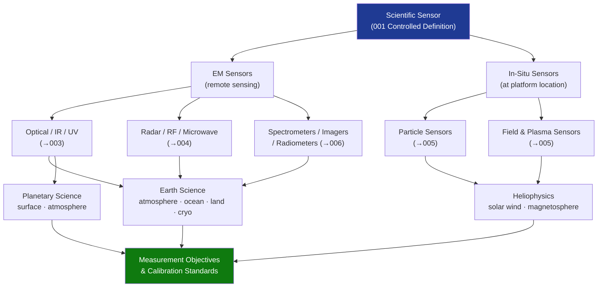

# STA 160-169 · Section 06 · Subsection 162 · Subsubject 002 — Sensor Classes and Scientific Measurement Objectives

## 1. Purpose

Establishes the taxonomy of scientific sensor classes and maps them to science measurement objectives within Q+ATLANTIDE STA-band spacecraft[^baseline][^n001].

## 2. Scope

- **Primary classification axis** — Electromagnetic (EM) sensors (measuring interaction of EM radiation with target) vs. in-situ sensors (measuring physical properties at sensor location); further sub-classified by spectral band (UV, optical, IR, microwave, radio) or physical quantity (magnetic field, electric field, particle flux, plasma density).
- **Science domain alignment** — Earth science (atmosphere, land, ocean, cryosphere); heliophysics (solar wind, magnetosphere, ionosphere); planetary science (surface composition, geology, atmosphere); astrophysics (stellar/galactic/extragalactic sources); technology demonstration sensors.
- **Measurement objective specification** — each sensor class assigned: primary measurand, measurement spectral/energy range, spatial resolution requirement, temporal resolution requirement, measurement accuracy and uncertainty requirement, and applicable calibration standard.
- **Active vs. passive sensors** — active sensors (radar, lidar, sounder) require transmitter sizing, frequency coordination, and specific interference analyses; passive sensors have simpler RF/optical budget but require strict stray-light and out-of-band rejection control.
- **Single vs. multi-sensor synergy** — multi-sensor measurement strategies (e.g., polarimetric SAR + optical + thermal) for improved geophysical retrieval; sensor synergy requirements imposed as cross-calibration constraints.
- **Heritage vs. novel technologies** — TRL requirements per ECSS-E-HB-10-12A; novel detector technologies (e.g., superconducting sensors, quantum sensors) require additional qualification margins.

## 3. Diagram — Sensor Class Map

## 4. Footprint

| Metric | Value |
|---|---|
| Architecture | `STA` — Space Technology Architecture |
| Master range | `100–199` |
| Code range | `160-169` |
| Section | `06` — Sensores y Carga Útil Espacial |
| Subsection | `162` — Sensores Científicos |
| Subsubject | `002` — Sensor Classes and Scientific Measurement Objectives |
| Primary Q-Division | Q-SPACE[^qdiv] |
| ORB support | ORB-PMO, ORB-MKTG |
| Governance class | `baseline`[^gov] |
| Document | `002_Sensor-Classes-and-Scientific-Measurement-Objectives.md` (this file) |
| Parent subsection | [`README.md`](./README.md) · [`000_Overview.md`](./000_Overview.md) |

## 5. References & Citations

[^baseline]: **Q+ATLANTIDE controlled baseline (v1.0.0)** — [`organization/Q+ATLANTIDE.md`](../../../../organization/Q+ATLANTIDE.md).

[^qdiv]: **Q-Division authority** — See [`organization/Q+ATLANTIDE.md` §4](../../../../organization/Q+ATLANTIDE.md#4-notes).

[^gov]: **Governance class** — `baseline`.

[^n001]: **Note N-001** — Q+ATLANTIDE is a taxonomy and traceability ecosystem, not an organization chart. See [`organization/Q+ATLANTIDE.md` §4](../../../../organization/Q+ATLANTIDE.md#4-notes).

### Applicable industry standards

- ECSS-E-ST-10C — Space engineering — System engineering general requirements
- ECSS-E-ST-10-03C — Testing
- ECSS-E-HB-10-12A — Radiation Effects Handbook
- CEOS Cal/Val — Committee on Earth Observation Satellites Calibration and Validation protocols
