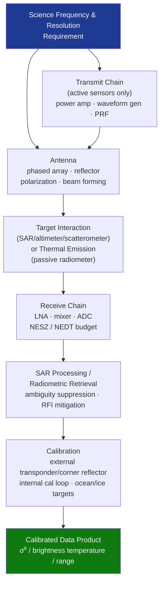

# STA 160-169 · Section 06 · Subsection 162 · Subsubject 004 — Radar, Radiofrequency and Microwave Sensors

## 1. Purpose

Establishes design and performance requirements for radar, radiofrequency, and microwave scientific sensors on Q+ATLANTIDE STA-band spacecraft[^baseline][^n001].

## 2. Scope

- **Sensor types** — synthetic aperture radar (SAR, L/C/X/Ka-band); radar altimeters (nadir-pointing, pulse-limited or delay-Doppler); scatterometers (ocean wind retrieval, pencil-beam or fan-beam); passive microwave radiometers (brightness temperature, 1–300 GHz); radio occultation receivers (GPS/GNSS-RO for atmospheric profiling).
- **Radar equation and link budget** — peak transmit power, antenna gain, pulse repetition frequency, bandwidth, range/azimuth resolution; noise equivalent sigma-zero (NESZ) as key figure of merit; ambiguity ratio (range/azimuth ambiguity suppression ≥25 dB).
- **Antenna design** — phased array vs. parabolic reflector vs. slotted waveguide array; polarization control (HH, VV, HV, VH) for polarimetric SAR; beam-forming network design; antenna pattern characterization and calibration.
- **Frequency coordination** — ITU-R frequency allocation for scientific Earth observation services; interference analysis with active communication payloads (→`160`); radio frequency interference (RFI) detection and mitigation for passive microwave sensors.
- **Calibration** — external calibrators (transponders, corner reflectors, distributed targets); internal calibration loop (injection path); ocean/ice reference targets for radiometers; calibration uncertainty ≤0.5 K (brightness temperature) for climate-quality passive microwave.
- **Passive microwave radiometer specifics** — total-power vs. Dicke-switched designs; noise figure and NEDT (Noise Equivalent Temperature Difference); antenna side-lobe contamination from Earth vs. cold space; spectral line vs. window channel selection.

## 3. Diagram — Radar/Microwave Sensor Architecture

## 4. Footprint

| Metric | Value |
|---|---|
| Architecture | `STA` — Space Technology Architecture |
| Master range | `100–199` |
| Code range | `160-169` |
| Section | `06` — Sensores y Carga Útil Espacial |
| Subsection | `162` — Sensores Científicos |
| Subsubject | `004` — Radar, Radiofrequency and Microwave Sensors |
| Primary Q-Division | Q-SPACE[^qdiv] |
| ORB support | ORB-PMO, ORB-MKTG |
| Governance class | `baseline`[^gov] |
| Document | `004_Radar-Radiofrequency-and-Microwave-Sensors.md` (this file) |
| Parent subsection | [`README.md`](./README.md) · [`000_Overview.md`](./000_Overview.md) |

## 5. References & Citations

[^baseline]: **Q+ATLANTIDE controlled baseline (v1.0.0)** — [`organization/Q+ATLANTIDE.md`](../../../../organization/Q+ATLANTIDE.md).

[^qdiv]: **Q-Division authority** — See [`organization/Q+ATLANTIDE.md` §4](../../../../organization/Q+ATLANTIDE.md#4-notes).

[^gov]: **Governance class** — `baseline`.

[^n001]: **Note N-001** — Q+ATLANTIDE is a taxonomy and traceability ecosystem, not an organization chart. See [`organization/Q+ATLANTIDE.md` §4](../../../../organization/Q+ATLANTIDE.md#4-notes).

### Applicable industry standards

- ECSS-E-ST-50C — Telecommunications
- ITU-R M.1787 — Description of systems and networks in the space research service operating between 25.5–27 GHz
- CEOS Cal/Val — Committee on Earth Observation Satellites Calibration and Validation protocols
- ECSS-E-ST-10-03C — Testing
