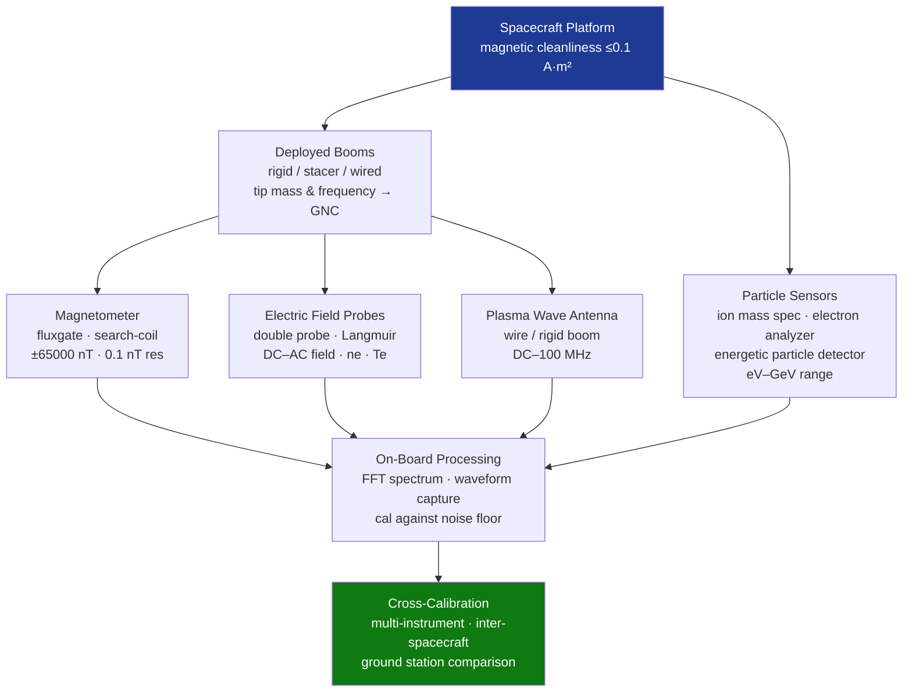

# STA 160-169 · Section 06 · Subsection 162 · Subsubject 005 — Particle, Field and Plasma Sensors

## 1. Purpose

Establishes design and performance requirements for particle, field, and plasma in-situ scientific sensors on Q+ATLANTIDE STA-band spacecraft[^baseline][^n001].

## 2. Scope

- **Particle sensors** — ion mass spectrometers (time-of-flight, magnetic sector); electron analyzers (hemispherical electrostatic, retarding potential); energetic particle detectors (solid-state silicon detectors, scintillators, Cherenkov detectors); energy range coverage from eV to MeV/GeV; geometric factor and energy resolution.
- **Magnetic field sensors** — fluxgate magnetometers (DC to 100 Hz, ±65,000 nT range, 0.1 nT resolution); search-coil/induction coil magnetometers (AC fields, 1 Hz–100 kHz); absolute scalar magnetometers (proton precession, optically pumped) for in-flight calibration; boom mounting to reduce spacecraft magnetic contamination.
- **Electric field sensors** — double probe (spherical/cylindrical Langmuir probe) for DC and AC electric field; Langmuir probe for electron density and temperature; wave-particle interaction sensors (combined E and B field); sensor bias control electronics.
- **Plasma wave instruments** — waveform capture receivers; spectrum analyzers (FFT-based on-board); frequency range DC–100 MHz; sensitivity calibration against theoretical noise floor; antennas (wire, rigid boom) sizing and deployment.
- **In-situ sensor accommodation** — boom deployment (deployable rigid/stacer/wired booms to minimize spacecraft interference); magnetic cleanliness requirements on spacecraft (residual magnetic moment ≤0.1 A·m²); boom tip mass and fundamental frequency requirements fed to GNC (→140).
- **Cross-calibration and inter-comparison** — cross-calibration between instruments in multi-sensor suites; inter-spacecraft calibration for constellation/multi-point missions; comparison with ground-based ionospheric stations or model predictions.

## 3. Diagram — In-Situ Sensor Suite Architecture

## 4. Footprint

| Metric | Value |
|---|---|
| Architecture | `STA` — Space Technology Architecture |
| Master range | `100–199` |
| Code range | `160-169` |
| Section | `06` — Sensores y Carga Útil Espacial |
| Subsection | `162` — Sensores Científicos |
| Subsubject | `005` — Particle, Field and Plasma Sensors |
| Primary Q-Division | Q-SPACE[^qdiv] |
| ORB support | ORB-PMO, ORB-MKTG |
| Governance class | `baseline`[^gov] |
| Document | `005_Particle-Field-and-Plasma-Sensors.md` (this file) |
| Parent subsection | [`README.md`](./README.md) · [`000_Overview.md`](./000_Overview.md) |

## 5. References & Citations

[^baseline]: **Q+ATLANTIDE controlled baseline (v1.0.0)** — [`organization/Q+ATLANTIDE.md`](../../../../organization/Q+ATLANTIDE.md).

[^qdiv]: **Q-Division authority** — See [`organization/Q+ATLANTIDE.md` §4](../../../../organization/Q+ATLANTIDE.md#4-notes).

[^gov]: **Governance class** — `baseline`.

[^n001]: **Note N-001** — Q+ATLANTIDE is a taxonomy and traceability ecosystem, not an organization chart. See [`organization/Q+ATLANTIDE.md` §4](../../../../organization/Q+ATLANTIDE.md#4-notes).

### Applicable industry standards

- ECSS-E-ST-10-03C — Testing
- ECSS-E-HB-10-12A — Radiation Effects Handbook
- NASA-HDBK-4002A — Mitigating In-Space Charging Effects
- BIPM JCGM 100:2008 — Guide to the Expression of Uncertainty in Measurement (GUM)
