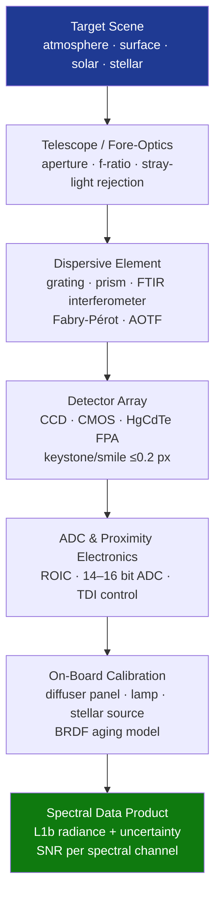

# STA 160-169 · Section 06 · Subsection 162 · Subsubject 006 — Spectrometers, Imagers and Radiometers

## 1. Purpose

Establishes design and performance requirements for spectrometers, imaging sensors, and radiometers as scientific sensors on Q+ATLANTIDE STA-band spacecraft[^baseline][^n001].

## 2. Scope

- **Spectrometer types** — grating spectrometers (transmission/reflection grating, echelle); Fourier transform infrared (FTIR) spectrometers; Fabry-Pérot interferometers; acousto-optic tunable filters (AOTF); key parameters: spectral range, spectral resolution (λ/Δλ), stray-light in-band rejection, diffraction order cross-contamination.
- **Imaging spectrometers and hyperspectral sensors** — push-broom slit spectrograph; keystone and smile distortion control (≤0.2 pixel); spatial-spectral alignment; across-track swath and spectral channel count; signal-to-noise ratio (SNR) per spectral channel vs. integration time.
- **Multi-band imagers** — multi-spectral push-broom or frame camera; band co-registration requirements (≤0.2 pixel between spectral bands); ground sampling distance (GSD), MTF, and dynamic range; TDI (time-delay integration) for low-light applications.
- **Radiometers** — narrowband solar irradiance monitors; broadband Earth radiation budget sensors (shortwave + longwave); multi-channel microwave radiometers (see also →`004`); absolute calibration of total solar irradiance (TSI) sensors to ≤0.01% (1σ).
- **Detector focal plane assembly (FPA)** — mosaic CCD/CMOS/FPA assembly; cold-strap or thermal strap to radiator; FPA operating temperature control; proximity electronics (ROIC, ADC) thermal management; radiation hard design for high-orbit missions.
- **Calibration and performance verification** — pre-flight spectroradiometric calibration in TVAC; in-orbit spectral calibration using atmospheric absorption lines or stellar sources; radiometric calibration via onboard diffuser or lamp; BRDF characterization of diffuser panel aging.

## 3. Diagram — Spectrometer/Radiometer Signal Chain

## 4. Footprint

| Metric | Value |
|---|---|
| Architecture | `STA` — Space Technology Architecture |
| Master range | `100–199` |
| Code range | `160-169` |
| Section | `06` — Sensores y Carga Útil Espacial |
| Subsection | `162` — Sensores Científicos |
| Subsubject | `006` — Spectrometers, Imagers and Radiometers |
| Primary Q-Division | Q-SPACE[^qdiv] |
| ORB support | ORB-PMO, ORB-MKTG |
| Governance class | `baseline`[^gov] |
| Document | `006_Spectrometers-Imagers-and-Radiometers.md` (this file) |
| Parent subsection | [`README.md`](./README.md) · [`000_Overview.md`](./000_Overview.md) |

## 5. References & Citations

[^baseline]: **Q+ATLANTIDE controlled baseline (v1.0.0)** — [`organization/Q+ATLANTIDE.md`](../../../../organization/Q+ATLANTIDE.md).

[^qdiv]: **Q-Division authority** — See [`organization/Q+ATLANTIDE.md` §4](../../../../organization/Q+ATLANTIDE.md#4-notes).

[^gov]: **Governance class** — `baseline`.

[^n001]: **Note N-001** — Q+ATLANTIDE is a taxonomy and traceability ecosystem, not an organization chart. See [`organization/Q+ATLANTIDE.md` §4](../../../../organization/Q+ATLANTIDE.md#4-notes).

### Applicable industry standards

- ECSS-E-ST-10-03C — Testing
- BIPM JCGM 100:2008 — Guide to the Expression of Uncertainty in Measurement (GUM)
- CEOS Cal/Val — Committee on Earth Observation Satellites Calibration and Validation protocols
- ISO 19157 — Geographic information — Data quality
