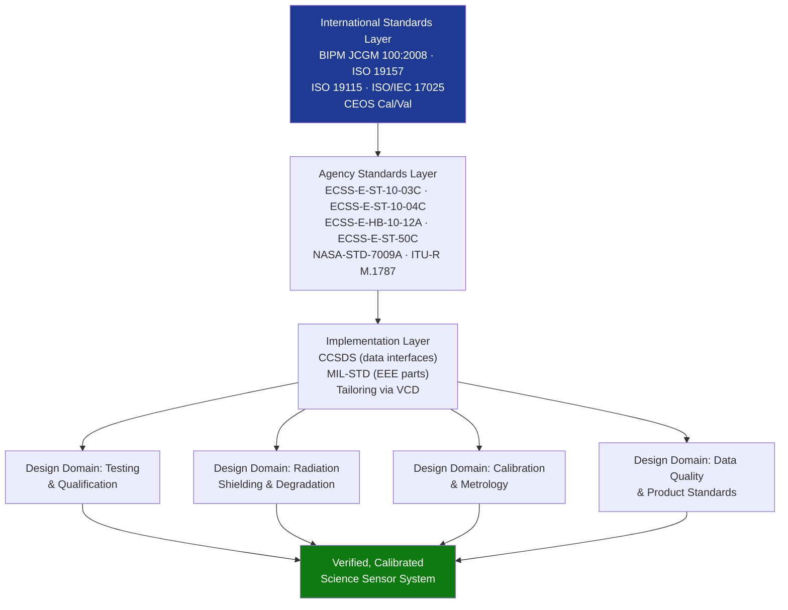

# STA 160-169 · Section 06 · Subsection 162 · Subsubject 009 — ECSS-NASA-CCSDS Scientific Sensor Standards Mapping

## 1. Purpose

Maps applicable ECSS, NASA, CCSDS, and scientific community standards to scientific sensor design, verification, and data quality domains within Q+ATLANTIDE STA 162[^baseline][^n001].

## 2. Scope

- **Testing and environmental qualification** — ECSS-E-ST-10-03C (Testing): sensor-level test requirements; ECSS-E-ST-10-04C (Space Environment): environment specification for sensor design margins; test levels and margins per ECSS philosophy.
- **Radiation effects** — ECSS-E-HB-10-12A (Radiation Effects Handbook): radiation shielding design, detector degradation model, SEU/SEL rate prediction; BIPM JCGM 100:2008 (GUM): uncertainty impact of radiation-induced gain changes.
- **Calibration and metrology** — BIPM JCGM 100:2008 (GUM) as normative uncertainty standard; CEOS Cal/Val Working Group protocols for inter-comparison; ISO/IEC 17025 for calibration facilities.
- **Data quality and geographic standards** — ISO 19157 (Data Quality) for quality flagging of geospatial products; ISO 19115 (Metadata) for data product description; GEO/CEOS Data Cube standards for Level-3 products.
- **Standards hierarchy and tailoring** — ECSS/ESA primary for European missions; NASA-STD-7009A for model and simulation validation of sensor models; mission-specific standards per applicable launch authority; CCSDS for all data interfaces regardless of agency.
- **Tailoring guidance** — scientific sensor tailoring deviations from ECSS-E-ST-10-03C standard test levels documented in Verification Control Document (VCD) and approved by project system engineer; all deviations require formal justification and risk acceptance.

## 3. Diagram — Scientific Sensor Standards Map

## 4. Footprint

| Metric | Value |
|---|---|
| Architecture | `STA` — Space Technology Architecture |
| Master range | `100–199` |
| Code range | `160-169` |
| Section | `06` — Sensores y Carga Útil Espacial |
| Subsection | `162` — Sensores Científicos |
| Subsubject | `009` — ECSS-NASA-CCSDS Scientific Sensor Standards Mapping |
| Primary Q-Division | Q-SPACE[^qdiv] |
| ORB support | ORB-PMO, ORB-MKTG |
| Governance class | `baseline`[^gov] |
| Document | `009_ECSS-NASA-CCSDS-Scientific-Sensor-Standards-Mapping.md` (this file) |
| Parent subsection | [`README.md`](./README.md) · [`000_Overview.md`](./000_Overview.md) |

## 5. References & Citations

[^baseline]: **Q+ATLANTIDE controlled baseline (v1.0.0)** — [`organization/Q+ATLANTIDE.md`](../../../../organization/Q+ATLANTIDE.md).

[^qdiv]: **Q-Division authority** — See [`organization/Q+ATLANTIDE.md` §4](../../../../organization/Q+ATLANTIDE.md#4-notes).

[^gov]: **Governance class** — `baseline`.

[^n001]: **Note N-001** — Q+ATLANTIDE is a taxonomy and traceability ecosystem, not an organization chart. See [`organization/Q+ATLANTIDE.md` §4](../../../../organization/Q+ATLANTIDE.md#4-notes).

### Applicable industry standards

- ECSS-E-ST-10-03C — Testing
- ECSS-E-ST-10-04C — Space Environment
- ECSS-E-HB-10-12A — Radiation Effects Handbook
- BIPM JCGM 100:2008 — Guide to the Expression of Uncertainty in Measurement (GUM)
- ISO 19157 — Geographic information — Data quality
- CEOS Cal/Val — Committee on Earth Observation Satellites Calibration and Validation protocols
