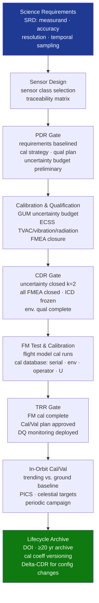

# STA 160-169 · Section 06 · Subsection 162 · Subsubject 010 — Traceability, Evidence and Lifecycle Governance

## 1. Purpose

Establishes requirements traceability, design evidence gates, and lifecycle governance requirements for scientific sensors on Q+ATLANTIDE STA-band spacecraft[^baseline][^n001].

## 2. Scope

- **Requirements traceability** — science measurement objectives traced from mission science requirements document (SRD); each sensor measurement requirement (accuracy, resolution, spectral range, temporal sampling) linked to: design element, calibration verification activity, and evidence artefact; traceability matrix managed in Q+ATLANTIDE requirements register.
- **Evidence gates** — PDR: science measurement requirements baselined, sensor class selection confirmed, calibration strategy approved, uncertainty budget preliminary, environmental qualification plan issued; CDR: calibration uncertainty budget closed (k=2 per GUM), all sensor-level FMEA items closed, ICD frozen, environmental qualification complete for all sensor units.
- **Delta-CDR and TRR gates** — delta-CDR for any post-CDR change to sensor configuration, calibration source, or spectral range; TRR gate: FM calibration complete, in-orbit commissioning plan approved, data quality monitoring system deployed, Cal/Val plan approved.
- **In-orbit performance monitoring** — calibration parameter trending against ground baseline; data quality metric monitoring (bias, noise, outlier rate); periodic Cal/Val campaign against independent references; science team review of long-term data quality trends.
- **Lifecycle records** — sensor CI record (serial number, hardware version, firmware version); complete calibration database (all calibration runs with environmental conditions, operator ID, uncertainty); radiation test records; environmental qualification certificates; in-orbit Cal/Val campaign results and calibration update history.
- **Data product provenance** — processing algorithm version control; calibration coefficient version control; data product DOI assignment for publication-quality products; long-term data archive plan (≥20 years for climate data records).

## 3. Diagram — Scientific Sensor Lifecycle Governance

## 4. Footprint

| Metric | Value |
|---|---|
| Architecture | `STA` — Space Technology Architecture |
| Master range | `100–199` |
| Code range | `160-169` |
| Section | `06` — Sensores y Carga Útil Espacial |
| Subsection | `162` — Sensores Científicos |
| Subsubject | `010` — Traceability, Evidence and Lifecycle Governance |
| Primary Q-Division | Q-SPACE[^qdiv] |
| ORB support | ORB-PMO, ORB-MKTG |
| Governance class | `baseline`[^gov] |
| Document | `010_Traceability-Evidence-and-Lifecycle-Governance.md` (this file) |
| Parent subsection | [`README.md`](./README.md) · [`000_Overview.md`](./000_Overview.md) |

## 5. References & Citations

[^baseline]: **Q+ATLANTIDE controlled baseline (v1.0.0)** — [`organization/Q+ATLANTIDE.md`](../../../../organization/Q+ATLANTIDE.md).

[^qdiv]: **Q-Division authority** — See [`organization/Q+ATLANTIDE.md` §4](../../../../organization/Q+ATLANTIDE.md#4-notes).

[^gov]: **Governance class** — `baseline`.

[^n001]: **Note N-001** — Q+ATLANTIDE is a taxonomy and traceability ecosystem, not an organization chart. See [`organization/Q+ATLANTIDE.md` §4](../../../../organization/Q+ATLANTIDE.md#4-notes).

### Applicable industry standards

- ECSS-E-ST-10-03C — Testing
- ECSS-E-ST-10-02C — Verification
- BIPM JCGM 100:2008 — Guide to the Expression of Uncertainty in Measurement (GUM)
- ISO 19157 — Geographic information — Data quality
- CEOS Cal/Val — Committee on Earth Observation Satellites Calibration and Validation protocols
