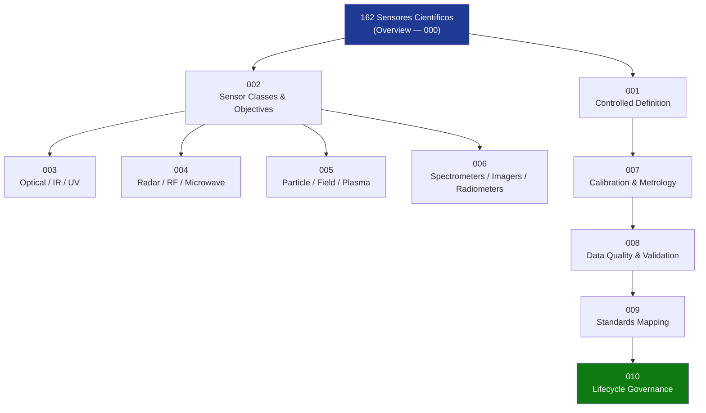

# STA 160-169 · 162-000 — General

## 1. Purpose

Overview entry-point for the *Sensores Científicos* subsection (`162`) within STA `160-169` — *Sensores y Carga Útil Espacial*. Introduces the scientific sensors framework covering controlled definitions, sensor classes, optical/IR/UV sensors, radar/RF/microwave sensors, particle/field/plasma sensors, spectrometers/imagers/radiometers, calibration/metrology, data quality/uncertainty, standards mapping, and lifecycle governance. This subsection is designated **mission-science critical**: all documents require explicit measurement objectives, calibration baseline, metrology traceability, uncertainty quantification, data-quality validation, environmental qualification, and lifecycle evidence[^baseline][^n001].

## 2. Scope

- Covers the Scientific Sensors slice of parent code range `160-169`, establishing what constitutes a scientific sensor in Q+ATLANTIDE STA-band platforms; distinguishes from instrumentation subsystem (→`161`) and observation mission architecture (→`163`).
- Inherits Q-Division authority and ORB support from `../../README.md §3`[^archtable].
- **Scientific Sensors Controlled Definition** (`001`) — normative boundary; scientific sensor as a calibrated measurement device generating quantified physical observables traceable to SI units.
- **Sensor Classes and Scientific Measurement Objectives** (`002`) — taxonomy: EM sensors (optical, IR, UV, radio), in-situ field/particle sensors, remote-sensing sensors; alignment to measurement objectives.
- **Optical, Infrared and Ultraviolet Sensors** (`003`) — telescope optics, focal-plane detectors (CCD, HgCdTe, UV-enhanced CMOS), bandpass filters, stray-light rejection.
- **Radar, Radiofrequency and Microwave Sensors** (`004`) — SAR, altimeters, scatterometers, passive microwave radiometers, radio occultation receivers.
- **Particle, Field and Plasma Sensors** (`005`) — ion/electron analyzers, magnetometers, plasma wave sensors, energetic particle detectors.
- **Spectrometers, Imagers and Radiometers** (`006`) — grating/prism/FTIR spectrometers, push-broom imagers, multi-channel radiometers; spectral resolution and sensitivity requirements.
- **Calibration, Metrology and Reference Standards** (`007`) — calibration hierarchy, BIPM GUM uncertainty budget, SI traceability, in-orbit calibration strategy.
- **Data Quality, Uncertainty and Validation** (`008`) — data quality flags, ISO 19157, uncertainty propagation through processing chain.
- **Standards Mapping** (`009`) and **Lifecycle Governance** (`010`).

## 3. Diagram — Scientific Sensors Subsection Map

## 4. Footprint

| Metric | Value |
|---|---|
| Architecture | `STA` — Space Technology Architecture |
| Master range | `100–199` |
| Code range | `160-169` |
| Section | `06` — Sensores y Carga Útil Espacial |
| Subsection | `162` — Sensores Científicos |
| Subsubject | `000` — Overview |
| Primary Q-Division | Q-SPACE[^qdiv] |
| ORB support | ORB-PMO, ORB-MKTG |
| Governance class | `baseline`[^gov] |
| Document | `162-000-General.md` (this file) |
| Parent subsection | [`README.md`](./README.md) |

## 5. References & Citations

[^baseline]: **Q+ATLANTIDE controlled baseline (v1.0.0)** — [`organization/Q+ATLANTIDE.md`](../../../../organization/Q+ATLANTIDE.md).

[^archtable]: **§3 — Architecture Table (parent)** — [`../../README.md` §3](../../README.md#3-architecture-table).

[^qdiv]: **Q-Division authority** — See [`organization/Q+ATLANTIDE.md` §4](../../../../organization/Q+ATLANTIDE.md#4-notes).

[^gov]: **Governance class** — `baseline`.

[^n001]: **Note N-001** — Q+ATLANTIDE is a taxonomy and traceability ecosystem, not an organization chart. See [`organization/Q+ATLANTIDE.md` §4](../../../../organization/Q+ATLANTIDE.md#4-notes).

### Applicable industry standards

- ECSS-E-ST-10-03C — Testing
- ECSS-E-ST-10-04C — Space Environment
- ECSS-E-HB-10-12A — Radiation Effects Handbook
- BIPM JCGM 100:2008 — Guide to the Expression of Uncertainty in Measurement (GUM)
- CEOS Cal/Val — Committee on Earth Observation Satellites Calibration and Validation protocols
- ISO 19157 — Geographic information — Data quality
