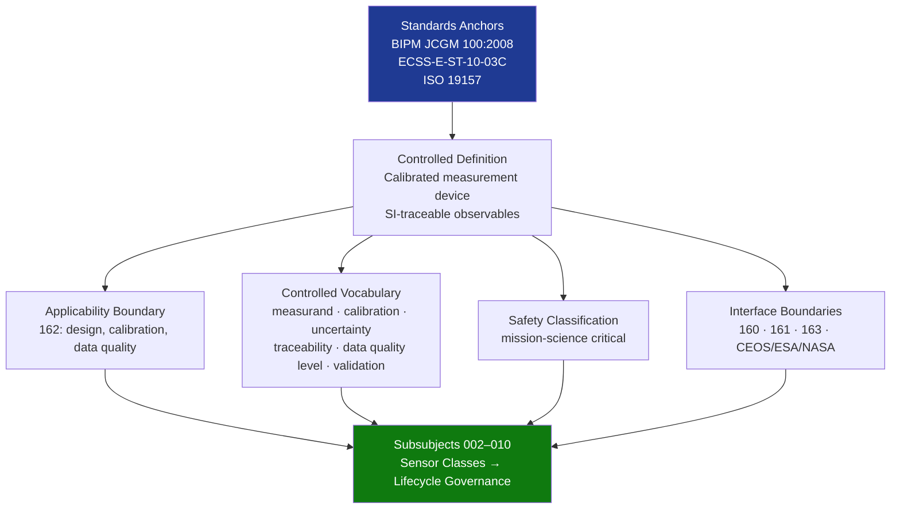

# STA 160-169 · 162-010 — Scientific Sensors Controlled Definition

## 1. Purpose

Establishes the normative definition and controlled scope of scientific sensors within the Q+ATLANTIDE STA band, per ECSS-E-ST-10-03C and BIPM JCGM 100:2008 metrological framework[^baseline][^n001].

## 2. Scope

- **Controlled definition** — A scientific sensor is a calibrated space measurement device that generates quantified physical observables of the natural environment, with documented uncertainty budgets traceable to SI units, and whose data products are used directly as science data records or level-1 products.
- **Applicability boundary** — STA `162` covers scientific sensor design, calibration, and data quality on Q+ATLANTIDE STA-band platforms; excludes payload accommodation (→`160`), instrument-level signal-chain engineering (→`161`), and observation mission data product chain (→`163`).
- **Controlled vocabulary** — *measurand*: specific physical quantity being measured; *calibration*: operation establishing relation between measured value and true value; *uncertainty*: parameter characterizing dispersion of values attributed to measurand; *traceability*: property of calibration relating to SI; *data quality level* (L0 raw, L1 calibrated, L2 geophysical); *validation*: confirmation by objective evidence that data meets intended scientific requirements.
- **Safety classification** — mission-science critical; erroneous science data without proper uncertainty characterization may propagate unchecked through downstream analysis, leading to incorrect scientific conclusions and potentially policy or mission planning errors.
- **Interface boundaries** — Scientific sensors interface with: instrumentation (`161`) for detector/signal-chain engineering; payloads (`160`) for accommodation; observation (`163`) for data product chain; external: CEOS, ESA, NASA science programs for calibration/validation inter-comparison.

## 3. Diagram — Scientific Sensor Definition Framework

## 4. Footprint

| Metric | Value |
|---|---|
| Architecture | `STA` — Space Technology Architecture |
| Master range | `100–199` |
| Code range | `160-169` |
| Section | `06` — Sensores y Carga Útil Espacial |
| Subsection | `162` — Sensores Científicos |
| Subsubject | `001` — Scientific Sensors Controlled Definition |
| Primary Q-Division | Q-SPACE[^qdiv] |
| ORB support | ORB-PMO, ORB-MKTG |
| Governance class | `baseline`[^gov] |
| Document | `162-010-Scientific-Sensors-Controlled-Definition.md` (this file) |
| Parent subsection | [`README.md`](./README.md) · [`162-000-General.md`](./162-000-General.md) |

## 5. References & Citations

[^baseline]: **Q+ATLANTIDE controlled baseline (v1.0.0)** — [`organization/Q+ATLANTIDE.md`](../../../../organization/Q+ATLANTIDE.md).

[^qdiv]: **Q-Division authority** — See [`organization/Q+ATLANTIDE.md` §4](../../../../organization/Q+ATLANTIDE.md#4-notes).

[^gov]: **Governance class** — `baseline`.

[^n001]: **Note N-001** — Q+ATLANTIDE is a taxonomy and traceability ecosystem, not an organization chart. See [`organization/Q+ATLANTIDE.md` §4](../../../../organization/Q+ATLANTIDE.md#4-notes).

### Applicable industry standards

- BIPM JCGM 100:2008 — Guide to the Expression of Uncertainty in Measurement (GUM)
- ECSS-E-ST-10-03C — Testing
- ISO 19157 — Geographic information — Data quality
- CEOS Cal/Val — Committee on Earth Observation Satellites Calibration and Validation protocols
