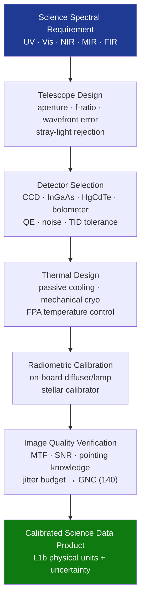

# STA 160-169 · 162-030 — Optical Infrared and Ultraviolet Sensors

## 1. Purpose

Establishes design and performance requirements for optical, infrared, and ultraviolet scientific sensors on Q+ATLANTIDE STA-band spacecraft[^baseline][^n001].

## 2. Scope

- **Spectral band coverage** — UV (100–400 nm), visible (400–700 nm), near-IR (700 nm–2.5 µm), mid-IR (2.5–20 µm), far-IR (20–350 µm); each band requires specific detector material (UV-enhanced CCD, Si CCD, InGaAs, HgCdTe, bolometer), optical coating, and bandpass filter.
- **Telescope and optical design** — aperture sizing from aperture-limited SNR model; focal length and f-ratio for detector fill-factor; optical aberration budget (RMS wavefront error ≤λ/14 for diffraction-limited performance); stray-light rejection (≥10⁶ for solar-viewing instruments).
- **Detector selection and qualification** — quantum efficiency vs. wavelength curve; read noise, dark current, and full-well capacity; radiation degradation model and total dose allocation; operating temperature (passive cooling to 150–200 K for near-IR, active mechanical cooling to 40–80 K for mid-IR/far-IR).
- **Radiometric calibration** — on-board solar/stellar calibrators; diffuser panels for solar irradiance sensors; calibration lamps for nightside imaging; calibration uncertainty allocation ≤2% (1σ) for climate-quality products.
- **Pointing knowledge and stability** — absolute pointing knowledge (typically ≤0.1–1 arcsec depending on application); image motion smear budget (sub-pixel MTF degradation ≤10% for pushbroom imagers); jitter isolation requirements fed back to GNC (→140) AOCS stability allocation.
- **UV-specific considerations** — MgF₂ or LiF window materials for deep UV; detector window contamination control; solar blind filter design (rejection of visible >10⁶ in solar-blind UV sensors); UV photon counting mode vs. linear mode selection.

## 3. Diagram — Optical/IR/UV Sensor Design Flow

## 4. Footprint

| Metric | Value |
|---|---|
| Architecture | `STA` — Space Technology Architecture |
| Master range | `100–199` |
| Code range | `160-169` |
| Section | `06` — Sensores y Carga Útil Espacial |
| Subsection | `162` — Sensores Científicos |
| Subsubject | `003` — Optical, Infrared and Ultraviolet Sensors |
| Primary Q-Division | Q-SPACE[^qdiv] |
| ORB support | ORB-PMO, ORB-MKTG |
| Governance class | `baseline`[^gov] |
| Document | `162-030-Optical-Infrared-and-Ultraviolet-Sensors.md` (this file) |
| Parent subsection | [`README.md`](./README.md) · [`162-000-General.md`](./162-000-General.md) |

## 5. References & Citations

[^baseline]: **Q+ATLANTIDE controlled baseline (v1.0.0)** — [`organization/Q+ATLANTIDE.md`](../../../../organization/Q+ATLANTIDE.md).

[^qdiv]: **Q-Division authority** — See [`organization/Q+ATLANTIDE.md` §4](../../../../organization/Q+ATLANTIDE.md#4-notes).

[^gov]: **Governance class** — `baseline`.

[^n001]: **Note N-001** — Q+ATLANTIDE is a taxonomy and traceability ecosystem, not an organization chart. See [`organization/Q+ATLANTIDE.md` §4](../../../../organization/Q+ATLANTIDE.md#4-notes).

### Applicable industry standards

- ECSS-E-ST-10-03C — Testing
- ECSS-E-ST-10-04C — Space Environment
- ECSS-E-HB-10-12A — Radiation Effects Handbook
- BIPM JCGM 100:2008 — Guide to the Expression of Uncertainty in Measurement (GUM)
