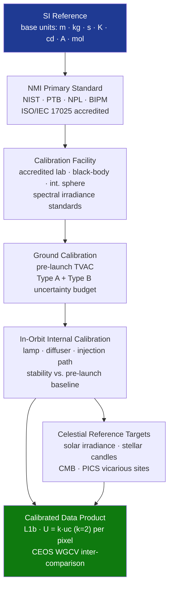

# STA 160-169 · 162-070 — Calibration Metrology and Reference Standards

## 1. Purpose

Establishes calibration hierarchy, metrology traceability, and reference standard requirements for scientific sensors within Q+ATLANTIDE STA 162[^baseline][^n001].

## 2. Scope

- **SI traceability chain** — measurement traceability from spacecraft science data to SI fundamental units; traceability chain: SI base unit → national metrology institute (NMI) primary standard → working reference standard → instrument under calibration; each link documented with calibration certificate, expanded uncertainty U (k=2), and validity period.
- **Uncertainty budget (GUM method)** — per BIPM JCGM 100:2008; Type A (random, from repeated measurements) and Type B (systematic, from calibration certificates, datasheet, models) contributions; combined standard uncertainty uc by quadrature combination; expanded uncertainty U = k·uc (k=2 for 95% confidence); separate uncertainty budget for each calibration state (pre-launch, in-orbit, degraded).
- **Pre-launch calibration reference** — ISO/IEC 17025 accredited calibration facility for primary reference instruments; spectral calibration using NIST-traceable spectral irradiance standards; radiometric calibration using black-body or integrating sphere of known temperature and emissivity.
- **In-orbit calibration strategies** — internal calibration sources (stability monitored against pre-launch baseline); celestial reference targets (solar irradiance for solar sensors, stellar standard candles for photometric sensors, CMB for microwave radiometers); vicarious calibration using Earth surface reference sites (PICS: pseudo-invariant calibration sites).
- **CEOS Cal/Val framework** — alignment with CEOS Working Group on Calibration and Validation (WGCV) protocols; inter-comparison with other spacecraft sensors in GEO/CEOS frameworks; data product quality monitoring post-launch through operational Cal/Val campaign.
- **Degradation monitoring and recalibration** — scheduled in-orbit calibration period (e.g., monthly, annually); calibration parameter trending; recalibration triggers (>2σ drift from baseline); calibration update procedure and version control.

## 3. Diagram — Calibration Chain: SI to Science Data

## 4. Footprint

| Metric | Value |
|---|---|
| Architecture | `STA` — Space Technology Architecture |
| Master range | `100–199` |
| Code range | `160-169` |
| Section | `06` — Sensores y Carga Útil Espacial |
| Subsection | `162` — Sensores Científicos |
| Subsubject | `007` — Calibration, Metrology and Reference Standards |
| Primary Q-Division | Q-SPACE[^qdiv] |
| ORB support | ORB-PMO, ORB-MKTG |
| Governance class | `baseline`[^gov] |
| Document | `162-070-Calibration-Metrology-and-Reference-Standards.md` (this file) |
| Parent subsection | [`README.md`](./README.md) · [`162-000-General.md`](./162-000-General.md) |

## 5. References & Citations

[^baseline]: **Q+ATLANTIDE controlled baseline (v1.0.0)** — [`organization/Q+ATLANTIDE.md`](../../../../organization/Q+ATLANTIDE.md).

[^qdiv]: **Q-Division authority** — See [`organization/Q+ATLANTIDE.md` §4](../../../../organization/Q+ATLANTIDE.md#4-notes).

[^gov]: **Governance class** — `baseline`.

[^n001]: **Note N-001** — Q+ATLANTIDE is a taxonomy and traceability ecosystem, not an organization chart. See [`organization/Q+ATLANTIDE.md` §4](../../../../organization/Q+ATLANTIDE.md#4-notes).

### Applicable industry standards

- BIPM JCGM 100:2008 — Guide to the Expression of Uncertainty in Measurement (GUM)
- ISO/IEC 17025 — General requirements for the competence of testing and calibration laboratories
- CEOS WGCV — Working Group on Calibration and Validation protocols
- ECSS-E-ST-10-03C — Testing
