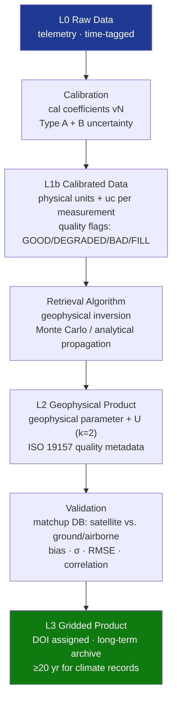

# STA 160-169 · 162-080 — Data Quality Uncertainty and Validation

## 1. Purpose

Establishes data quality control, uncertainty quantification, and validation requirements for scientific sensor data products within Q+ATLANTIDE STA 162[^baseline][^n001].

## 2. Scope

- **Data quality levels** — L0 (raw telemetry), L1a (raw engineering units, time-tagged), L1b (calibrated physical units with uncertainty), L2 (geophysical parameters), L3 (gridded/composited products); each level has defined quality flags, uncertainty metadata, and processing algorithm version traceability.
- **Quality flagging scheme** — per ISO 19157 (data quality) and ISO 19115 (geographic information metadata); binary quality flags (GOOD, DEGRADED, BAD, FILL) per measurement; quality flags propagated through processing chain; metadata include calibration version, algorithm version, processing timestamp.
- **Uncertainty propagation** — measurement uncertainty at L1b propagated through geophysical retrieval algorithm to L2 product uncertainty; Monte Carlo or analytical propagation method; final L2 uncertainty declared per pixel/measurement in product metadata.
- **Validation against ground truth** — matchup database construction (co-incident satellite measurement + ground station/airborne reference); statistical validation metrics (bias, standard deviation, correlation coefficient, RMSE); validation site network (e.g., AERONET, Argo, SURFRAD for respective geophysical domains).
- **Consistency and cross-validation** — inter-sensor consistency checks within multi-instrument suites; cross-comparison with independent sensors on other platforms; consistency monitoring across mission lifetime; zonal mean anomaly detection.
- **Data quality monitoring system** — automated daily data quality report; statistical anomaly alerts (>3σ from rolling mean); regular review by science team; quality flag update procedure with versioning and user notification.

## 3. Diagram — Data Quality Control Flow

## 4. Footprint

| Metric | Value |
|---|---|
| Architecture | `STA` — Space Technology Architecture |
| Master range | `100–199` |
| Code range | `160-169` |
| Section | `06` — Sensores y Carga Útil Espacial |
| Subsection | `162` — Sensores Científicos |
| Subsubject | `008` — Data Quality, Uncertainty and Validation |
| Primary Q-Division | Q-SPACE[^qdiv] |
| ORB support | ORB-PMO, ORB-MKTG |
| Governance class | `baseline`[^gov] |
| Document | `162-080-Data-Quality-Uncertainty-and-Validation.md` (this file) |
| Parent subsection | [`README.md`](./README.md) · [`162-000-General.md`](./162-000-General.md) |

## 5. References & Citations

[^baseline]: **Q+ATLANTIDE controlled baseline (v1.0.0)** — [`organization/Q+ATLANTIDE.md`](../../../../organization/Q+ATLANTIDE.md).

[^qdiv]: **Q-Division authority** — See [`organization/Q+ATLANTIDE.md` §4](../../../../organization/Q+ATLANTIDE.md#4-notes).

[^gov]: **Governance class** — `baseline`.

[^n001]: **Note N-001** — Q+ATLANTIDE is a taxonomy and traceability ecosystem, not an organization chart. See [`organization/Q+ATLANTIDE.md` §4](../../../../organization/Q+ATLANTIDE.md#4-notes).

### Applicable industry standards

- ISO 19157 — Geographic information — Data quality
- ISO 19115 — Geographic information — Metadata
- BIPM JCGM 100:2008 — Guide to the Expression of Uncertainty in Measurement (GUM)
- CEOS Cal/Val — Committee on Earth Observation Satellites Calibration and Validation protocols
