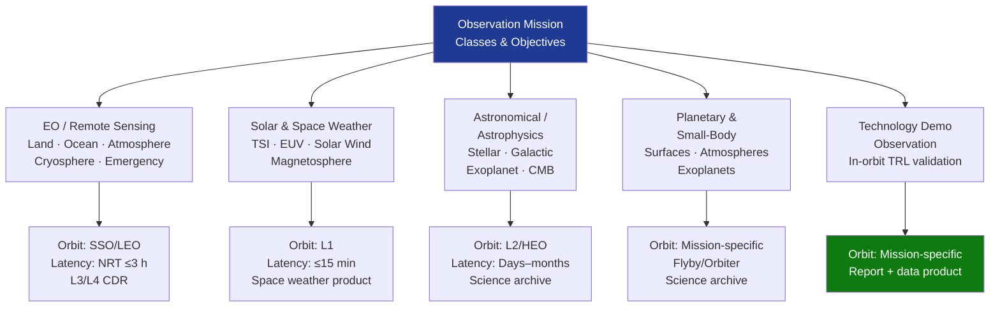

# STA 160-169 · Section 06 · Subsection 163 · Subsubject 002 — Observation Mission Classes and Objectives

## 1. Purpose

Establishes the taxonomy of observation mission classes and maps them to science, operational, and societal measurement objectives within Q+ATLANTIDE STA-band spacecraft, per ECSS-E-ST-10C[^ecss10c] and the CEOS and GEO/GEOSS international frameworks[^ceos][^geo].

## 2. Scope

- **Mission class taxonomy** — five primary observation mission classes: (1) Earth Observation/Remote Sensing (EO/RS) — land, ocean, atmosphere, cryosphere, emergency response; (2) Solar and Space Weather Observation — solar irradiance, solar wind, magnetospheric dynamics; (3) Astronomical/Astrophysics Observation — stellar, galactic, extragalactic, CMB, gravitational wave follow-up; (4) Planetary and Small-Body Observation — planetary surfaces and atmospheres, exoplanet transit photometry; (5) Technology Demonstration Observation — in-orbit technology readiness validation with calibrated measurement outputs.
- **Measurement objective specification** — each mission class is assigned: primary observables, measurement spectral/spatial/temporal requirements, user data latency requirements, data continuity requirements, and applicable international framework (CEOS, GEO, ESA Science Programme, NASA Science Mission Directorate). Measurement objectives shall be traceable to a Mission User Requirements Document (URD) per ECSS-E-ST-10C §4.
- **Orbit selection** — LEO sun-synchronous orbit (SSO) for consistent illumination (98.7° inclination at 500–900 km); polar orbit for atmospheric sampling and cryosphere; MEO for navigation observation; GEO for continuous hemispheric coverage; HEO (Molniya/Tundra) for polar Earth observation; L1/L2 halo or Lissajous orbits for solar and deep-space astronomical observation. Orbit selection trade-off documented in mission analysis report per ECSS-E-ST-10C §6.
- **Observation campaign strategy** — single-satellite vs. constellation strategy; coordinated multi-sensor measurement campaigns (virtual constellation); temporal baseline requirements (single-shot vs. time series vs. sustained monitoring); global coverage cycle time as function of swath, inclination, and orbit altitude; campaign plan approved at PDR.
- **Data product users and latency** — operational and near-real-time users (NRT ≤3 hours for weather and emergency response); offline science users (days to months acceptable); long-term climate record users (years; requires multi-mission data continuity); user tiering defined in URD and maintained in the Mission Science Requirements Document (SRD).
- **Heritage and continuity** — multi-mission data record continuity requirements; overlap period between successive missions (minimum 1 year for ECV records); inter-calibration requirements to ensure data homogeneity across mission series; continuity plan traceable to GCOS requirements[^gcos] for Essential Climate Variable missions.

## 3. Diagram — Observation Mission Class Map

## 4. Footprint

| Metric | Value |
|---|---|
| Architecture | `STA` — Space Technology Architecture |
| Master range | `100–199` |
| Code range | `160-169` |
| Section | `06` — Sensores y Carga Útil Espacial |
| Subsection | `163` — Observación |
| Subsubject | `002` — Observation Mission Classes and Objectives |
| Primary Q-Division | Q-SPACE[^qdiv] |
| ORB support | ORB-PMO, ORB-MKTG |
| Governance class | `baseline`[^gov] |
| Document | `002_Observation-Mission-Classes-and-Objectives.md` (this file) |
| Parent subsection | [`README.md`](./README.md) · [`000_Overview.md`](./000_Overview.md) |

## 5. References & Citations

[^ecss10c]: **ECSS-E-ST-10C** — Space Engineering: Mission Analysis and Design. European Cooperation for Space Standardization.

[^ceos]: **CEOS** — Committee on Earth Observation Satellites. <https://ceos.org>

[^geo]: **GEO/GEOSS** — Group on Earth Observations / Global Earth Observation System of Systems. <https://earthobservations.org>

[^gcos]: **GCOS** — Global Climate Observing System. Essential Climate Variable requirements. <https://gcos.wmo.int>

[^qdiv]: **Q-Division authority** — See [`organization/Q+ATLANTIDE.md` §4](../../../../organization/Q+ATLANTIDE.md#4-notes).

[^gov]: **Governance class** — `baseline`.

### Applicable industry standards

| Standard | Scope |
|---|---|
| ECSS-E-ST-10C | Mission Analysis and Design — orbit and campaign trade documentation |
| CEOS | Mission class and data product quality frameworks |
| GEO/GEOSS | Data sharing principles and interoperability |
| ESA Earth Observation Science Strategy | Mission class prioritisation and heritage |
| ISO 19115:2014 | Metadata standard for data product user and latency attributes |
