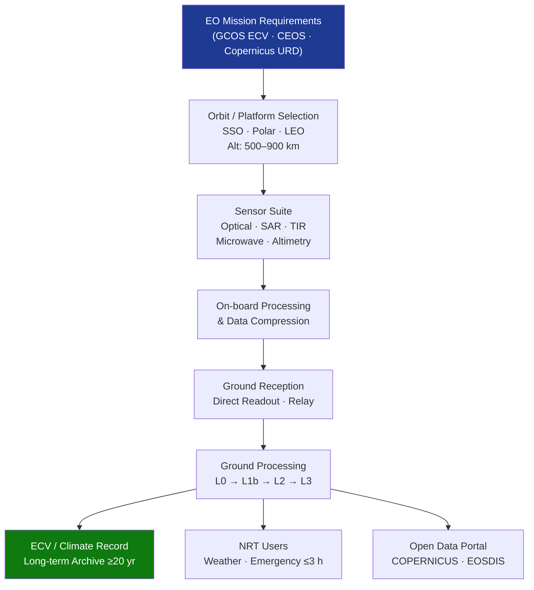

# STA 160-169 · Section 06 · Subsection 163 · Subsubject 003 — Earth Observation and Remote Sensing

## 1. Purpose

Establishes design and performance requirements for Earth observation and remote sensing observation missions on Q+ATLANTIDE STA-band spacecraft, covering land, ocean, atmosphere, and cryosphere domains, and incorporating Essential Climate Variable (ECV) monitoring requirements per GCOS[^gcos] and CEOS frameworks[^ceos].

## 2. Scope

- **EO domain coverage** — land surface observation (vegetation indices, urban mapping, soil moisture, geology, fire detection, disaster response): multi-spectral and hyperspectral optical sensors, spatial resolution 1–30 m, revisit 1–10 days; ocean observation (sea surface temperature, sea surface height, ocean colour, wind speed and wave height): SST accuracy ≤0.3 K, SSH accuracy ≤2 cm, wind speed accuracy ≤2 m/s; atmosphere (temperature and humidity profiles, cloud properties, aerosol optical depth, trace gas columns): limb and nadir sounding instruments, vertical resolution 1–5 km; cryosphere (sea ice extent, ice sheet surface elevation, snow cover extent): SAR, altimetry, and passive microwave sensors.
- **Orbit and coverage requirements** — sun-synchronous orbit (SSO) for consistent solar illumination (inclination ~98.7° at 500–900 km altitude); equatorial crossing time selected for solar zenith angle optimisation (10:30 LST descending node for vegetation and land; 22:00 for SST); polar orbit for cryosphere and atmosphere; repeat ground-track cycle selected to meet revisit requirement vs. spatial sampling trade.
- **Multi-sensor approach** — coordinated observation using optical, SAR, thermal IR, passive microwave, and altimetry sensors; temporal and spatial co-registration requirements (≤0.5 km cross-sensor for multi-source analysis); data fusion at processing level; virtual constellation architecture coordinated through CEOS and Copernicus frameworks.
- **Environmental observation and ECV requirements** — Essential Climate Variable requirements per GCOS: long-term stability requirements stricter than mission accuracy (0.1 K/decade for SST, 0.3%/decade for normalised vegetation index); sustained observational record ≥30 years; mandatory overlap and inter-calibration between successive missions; ECV product uncertainty declared per pixel in L2 product metadata.
- **Ground segment and data dissemination** — near-real-time ground reception network (direct readout stations or relay via TDRSS or commercial relay satellite); ground processing and archiving facility; data archive and dissemination portal; open data policy per CEOS and GEO principles; user access tiers (NRT operational, systematic offline, full archive).
- **Emergency and rapid response capability** — rapid observation scheduling (≤24 h from crisis trigger to first acquisition); emergency tasking protocol and command uplink priority; data product dissemination within 3 hours of acquisition for emergency users; compatible with Copernicus Emergency Management Service (EMS) data flow model and International Charter for Space and Major Disasters protocols.

## 3. Diagram — EO Mission Architecture

## 4. Footprint

| Metric | Value |
|---|---|
| Architecture | `STA` — Space Technology Architecture |
| Master range | `100–199` |
| Code range | `160-169` |
| Section | `06` — Sensores y Carga Útil Espacial |
| Subsection | `163` — Observación |
| Subsubject | `003` — Earth Observation and Remote Sensing |
| Primary Q-Division | Q-SPACE[^qdiv] |
| ORB support | ORB-PMO, ORB-MKTG |
| Governance class | `baseline`[^gov] |
| Document | `003_Earth-Observation-and-Remote-Sensing.md` (this file) |
| Parent subsection | [`README.md`](./README.md) · [`000_Overview.md`](./000_Overview.md) |

## 5. References & Citations

[^gcos]: **GCOS** — Global Climate Observing System. Essential Climate Variable requirements. <https://gcos.wmo.int>

[^ceos]: **CEOS** — Committee on Earth Observation Satellites. Cal/Val protocols and virtual constellation frameworks. <https://ceos.org>

[^qdiv]: **Q-Division authority** — See [`organization/Q+ATLANTIDE.md` §4](../../../../organization/Q+ATLANTIDE.md#4-notes).

[^gov]: **Governance class** — `baseline`.

### Applicable industry standards

| Standard | Scope |
|---|---|
| ECSS-E-ST-10C | Mission Analysis and Design — orbit design for EO missions |
| CEOS Cal/Val | Calibration and validation protocols for EO data products |
| ISO 19115:2014 | Geographic Information Metadata for EO data products |
| ISO 19157:2013 | Data Quality framework for EO products |
| GCOS requirements | ECV accuracy, stability and continuity requirements |
| ESA Sentinel standards | Heritage reference for EO data product definitions and levels |
