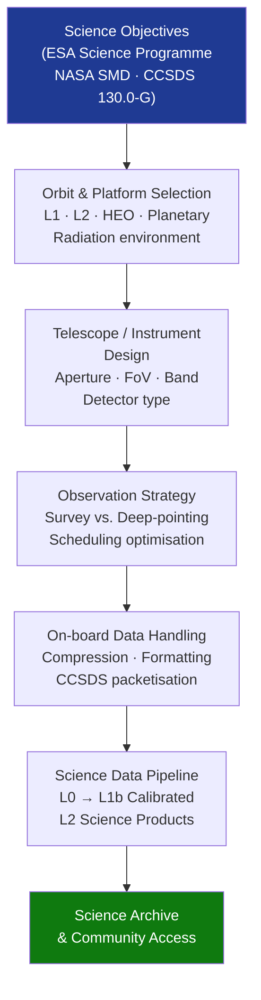

# STA 160-169 · Section 06 · Subsection 163 · Subsubject 004 — Space Observation and Astronomical Sensing

## 1. Purpose

Establishes design and performance requirements for space observation and astronomical sensing missions on Q+ATLANTIDE STA-band spacecraft, covering astrophysics, heliophysics, planetary, and solar observation domains, per ECSS-E-ST-10C[^ecss10c], NASA Science Mission Directorate standards, and ESA Science Programme requirements[^esasci].

## 2. Scope

- **Astrophysics observation** — X-ray, gamma-ray, UV, optical, IR, and radio astronomy missions; telescope aperture sizing from sensitivity model (limiting magnitude or minimum detectable flux per science case); background noise sources: zodiacal light, stray Earth-shine, cosmic X-ray background, detector dark current and read noise; photometric stability and calibration requirements for time-domain astronomy (stellar variability, transient detection, exoplanet transit photometry requiring relative photometric stability ≤10⁻⁴ over transit duration of 1–10 hours).
- **Solar and heliophysics observation** — total solar irradiance (TSI) monitoring from Sun-Earth L1 (absolute accuracy ≤0.1%, long-term stability ≤0.01%/year); solar EUV and UV spectral irradiance for space weather and climate forcing; solar imaging (coronagraph for coronal mass ejection (CME) detection, EUV full-disk imager for active region and flare monitoring); heliospheric in-situ plasma and magnetic field sensing at L1 for solar wind monitoring; space weather product latency requirement ≤15 min from observation acquisition to forecast product delivery.
- **Planetary and small-body observation** — remote sensing of planetary surfaces and atmospheres from flyby trajectory, orbit insertion, or proximity operations; imaging spatial resolution requirement derived from science objectives (e.g., 50 m/pixel for global mapping, 1 m/pixel for targeted geology); visible and near-IR spectrometer for surface composition analysis; laser altimeter or radar sounder for topographic mapping and subsurface sounding; required spatial coverage per science objective (global mapping vs. targeted high-priority site observations).
- **Survey vs. deep-pointing observing strategies** — wide-field survey (large field of view ≥1 deg², short exposure ≤60 s, high cadence for transient detection and all-sky mapping) vs. deep-field pointing (small FoV, long integration time ≥1 ks for high sensitivity and faint source characterisation); scheduling optimisation for science return per unit observation time; conflict resolution between competing observation programmes managed via observing time allocation committee.
- **Background radiation environment** — Sun-Earth L2 orbit radiation environment (low trapped particle radiation, continuous thermal stability, unobstructed deep-space view): preferred for sensitive infrared and optical observatories; radiation-hard detector design required for high-radiation environments (Jupiter orbit ≥10⁵ rad total ionising dose, highly elliptical Earth orbit traversing radiation belts); proton-induced transient event rate budgeted for detector and electronics qualification.
- **Pointing and stability requirements** — astrophysics: absolute pointing accuracy ≤1 arcsec, pointing stability ≤0.01 arcsec/orbit for coronagraphy and exoplanet imaging; solar observation: fine pointing ≤1 arcsec to solar disk features (heliocentric co-rotation); planetary mapping: pointing knowledge ≤0.5 mrad for spectral map co-registration with imaging data; all pointing requirements flow to GNC subsystem design (→`140`) via a formal requirement allocation matrix.

## 3. Diagram — Space Observation Architecture

## 4. Footprint

| Metric | Value |
|---|---|
| Architecture | `STA` — Space Technology Architecture |
| Master range | `100–199` |
| Code range | `160-169` |
| Section | `06` — Sensores y Carga Útil Espacial |
| Subsection | `163` — Observación |
| Subsubject | `004` — Space Observation and Astronomical Sensing |
| Primary Q-Division | Q-SPACE[^qdiv] |
| ORB support | ORB-PMO, ORB-MKTG |
| Governance class | `baseline`[^gov] |
| Document | `004_Space-Observation-and-Astronomical-Sensing.md` (this file) |
| Parent subsection | [`README.md`](./README.md) · [`000_Overview.md`](./000_Overview.md) |

## 5. References & Citations

[^ecss10c]: **ECSS-E-ST-10C** — Space Engineering: Mission Analysis and Design. European Cooperation for Space Standardization.

[^esasci]: **ESA Science Programme** — ESA Science and Exploration Directorate standards and mission requirements. <https://sci.esa.int>

[^qdiv]: **Q-Division authority** — See [`organization/Q+ATLANTIDE.md` §4](../../../../organization/Q+ATLANTIDE.md#4-notes).

[^gov]: **Governance class** — `baseline`.

### Applicable industry standards

| Standard | Scope |
|---|---|
| ECSS-E-ST-10C | Mission Analysis and Design — orbit and environment trade |
| NASA Science Mission Directorate standards | Requirements for NASA-funded science missions |
| ESA Science Programme standards | Mission-level requirements for ESA Cosmic Vision and Voyage 2050 |
| CCSDS 130.0-G | Space Data Link Protocol — applicable to science data downlink |
| ISO 19115:2014 | Metadata for astronomical data products |
