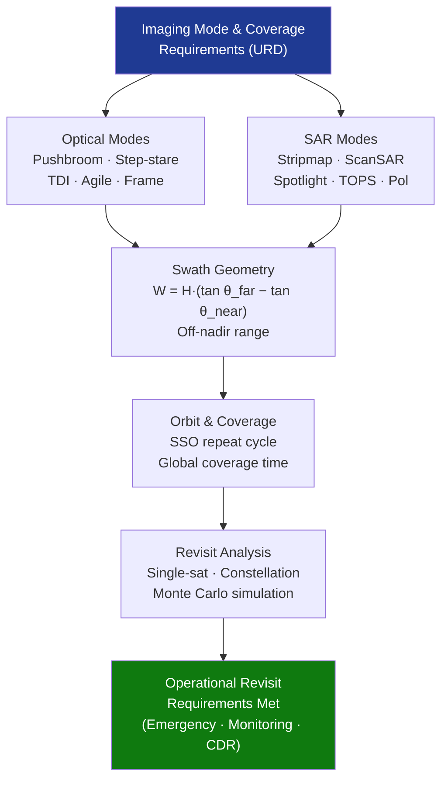

# STA 160-169 · Section 06 · Subsection 163 · Subsubject 006 — Imaging Modes, Swath, Coverage and Revisit Time

## 1. Purpose

Establishes definitions and performance requirements for satellite imaging modes, swath geometry, global coverage cycles, and revisit time for observation missions on Q+ATLANTIDE STA-band spacecraft, per ECSS-E-ST-10C[^ecss10c] and ESA Sentinel standard imaging mode definitions[^esa_sent].

## 2. Scope

- **Optical imaging modes** — *pushbroom* (linear detector array scanning continuously along-track via orbital motion): wide continuous swath with constant integration time; *step-stare* (pointing instrument manoeuvred to extend dwell on target beyond orbital pushbroom period): higher SNR for low-radiance or narrow-swath applications; *frame camera* (2D area-array detector): fixed area snapshot, limited swath, used for stereo and sub-metre applications; *TDI pushbroom* (time-delay integration across multiple rows): enhanced SNR for low-radiance or high-GSD scenes; *agile pointing* (satellite roll/pitch/yaw manoeuvre for off-nadir or stereo acquisition): enables stereoscopic 3D mapping and rapid-response tasking.
- **SAR imaging modes** — *stripmap* (constant look angle, side-looking, continuous swath at moderate resolution ~5–25 m): baseline mode; *ScanSAR* (switched beam across multiple sub-swaths in burst sequence): wide swath 100–500 km at reduced resolution 25–100 m; *spotlight* (beam steered to illuminate target during extended aperture synthesis period): high resolution 1–3 m at the cost of limited scene extent; *TOPS* (Terrain Observation by Progressive Scans): homogeneous Doppler spectrum over wide swath, used in Sentinel-1; *polarimetric SAR* (quad-pol, dual-pol, or compact-pol): enables enhanced geophysical retrieval (vegetation biomass, sea ice type, soil moisture).
- **Swath geometry and off-nadir capability** — swath width for flat-Earth approximation: W = H × (tan θ_far − tan θ_near); maximum off-nadir angle typically 30–45° for optical EO and 20–45° for SAR; nadir exclusion zone for SAR (range ambiguity constraint near nadir); incidence angle range selected to balance swath width against geometric distortion and foreshortening; along-track agility (pitch manoeuvre) enables extended-scene or cross-track strip acquisition.
- **Global coverage cycle** — ground track repeat period for SSO: calculated from exact orbit repeat condition (number of orbits per repeat cycle, e.g., Sentinel-2: 143 orbits / 10 days); daily equatorial coverage fraction as function of swath width (e.g., 290 km swath → global coverage in ≤10 days at 786 km altitude); polar latitudes benefit from higher revisit due to orbit convergence; constellation sizing for sub-daily revisit derived from analytical or Monte Carlo coverage simulation.
- **Revisit time analysis** — single-satellite mean revisit time at target latitude φ: T_revisit = T_orbit / (W / (2π R_E cos φ) × N_passes_per_day); Monte Carlo orbital analysis for constellation revisit statistics (mean, 90th percentile, maximum gap); design requirements for operational response: emergency mapping ≤24 h, rapid change detection ≤3 days, routine vegetation/agriculture monitoring ≤10 days, climate monitoring ≤16 days, sea ice daily coverage.
- **Multi-look and multi-temporal analysis** — multi-temporal optical image stack for land cover change detection and crop monitoring; InSAR (interferometric SAR) coherent pair temporal baseline: C-band coherence window 6–12 days for vegetated terrain, 30–60 days for dry bare soil; along-track interferometry (ATI) for ocean surface current mapping; repeat-pass coherence window for forest biomass and soil moisture retrieval; all multi-temporal product types defined in data product specification (→`007`).

## 3. Diagram — Imaging Mode and Coverage Trade

## 4. Footprint

| Metric | Value |
|---|---|
| Architecture | `STA` — Space Technology Architecture |
| Master range | `100–199` |
| Code range | `160-169` |
| Section | `06` — Sensores y Carga Útil Espacial |
| Subsection | `163` — Observación |
| Subsubject | `006` — Imaging Modes, Swath, Coverage and Revisit Time |
| Primary Q-Division | Q-SPACE[^qdiv] |
| ORB support | ORB-PMO, ORB-MKTG |
| Governance class | `baseline`[^gov] |
| Document | `006_Imaging-Modes-Swath-Coverage-and-Revisit-Time.md` (this file) |
| Parent subsection | [`README.md`](./README.md) · [`000_Overview.md`](./000_Overview.md) |

## 5. References & Citations

[^ecss10c]: **ECSS-E-ST-10C** — Space Engineering: Mission Analysis and Design. European Cooperation for Space Standardization.

[^esa_sent]: **ESA Sentinel standard imaging modes** — Sentinel-1 TOPS, Sentinel-2 pushbroom, Sentinel-3 OLCI/SLSTR definitions. ESA.

[^qdiv]: **Q-Division authority** — See [`organization/Q+ATLANTIDE.md` §4](../../../../organization/Q+ATLANTIDE.md#4-notes).

[^gov]: **Governance class** — `baseline`.

### Applicable industry standards

| Standard | Scope |
|---|---|
| ECSS-E-ST-10C | Mission Analysis and Design — coverage and revisit analysis |
| CEOS principles | Coverage and revisit design principles for EO constellations |
| ISO 19115:2014 | Metadata for imaging mode and acquisition parameters |
| ESA Sentinel standard imaging modes | Heritage SAR and optical imaging mode definitions |
