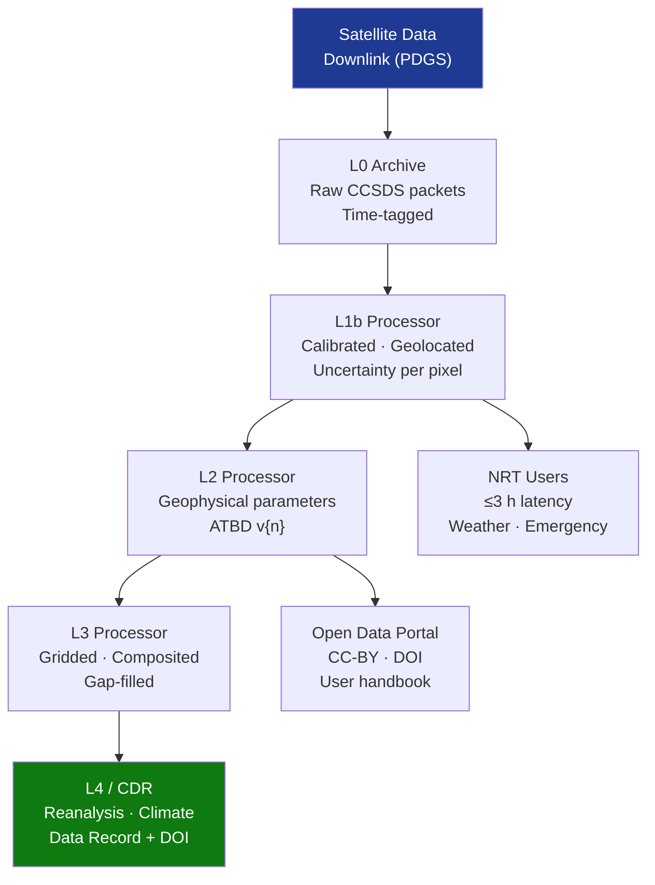

# STA 160-169 · Section 06 · Subsection 163 · Subsubject 007 — Data Products, Levels and Processing Chains

## 1. Purpose

Establishes the data product hierarchy, processing level definitions, and ground segment processing chain requirements for observation missions on Q+ATLANTIDE STA-band spacecraft, per ISO 19115[^iso19115], ISO 19157[^iso19157], and ESA Sentinel data product heritage[^esa_sent].

## 2. Scope

- **Data product level hierarchy** — L0 (raw instrument data, telemetry decommutated, spacecraft time-tagged, no radiometric or geometric correction applied; format: CCSDS packets or mission-specific binary); L1a (L0 with annotated time-stamps and coarse geolocation tags, raw engineering units, sensor housekeeping merged); L1b (fully radiometrically calibrated and geolocated at instrument footprint, physical units, pixel-level expanded uncertainty U(k=2), quality flags per ISO 19157; format: NetCDF-CF or HDF5); L2 (geophysical parameters derived from L1b per documented algorithm version: SST, LAI, aerosol optical depth, deformation, etc.; format: NetCDF-CF with CF metadata, GeoTIFF for imagery); L3 (spatially and/or temporally composited, gridded, and gap-filled L2 products; format: NetCDF-CF with regular grid); L4 (model-assimilated, reanalysis, or Climate Data Records derived from L3; managed as long-term data series with DOI).
- **Ground segment processing architecture** — Payload Data Ground Station (PDGS) or Processing and Archiving Facility (PAF) receives raw telemetry from ground reception station; near-real-time processor generates L1b products within 3 hours of acquisition; systematic processor runs daily batch reprocessing; calibration processor generates and applies updated calibration coefficients on defined schedule; computing infrastructure sized for peak load (FLOPS, TB/day throughput, network bandwidth) per mission data rate budget; disaster recovery and redundancy requirements specified at CDR.
- **Algorithm version control** — L2 and higher processing algorithms managed under full software configuration control (Git-tagged CI/CD pipeline, JIRA change requests); Algorithm Theoretical Basis Document (ATBD) published for each L2 product type before mission launch; algorithm change control process: test dataset comparison, independent validation dataset assessment, peer review, CCB approval before release to operations; all product versions in archive carry algorithm version tag and input calibration coefficient version.
- **Geolocation and geometric correction** — satellite orbit determination from on-board GNSS receiver (post-processed precise orbits from GNSS network ≤5 cm radial accuracy) or from SLR tracking; attitude determination from star tracker and gyroscope combination; geometric sensor model combining precise orbit, attitude quaternion, and instrument mounting alignment calibration; orthorectification using digital elevation model (SRTM 30 m or Copernicus DEM 10 m); geolocation accuracy target ≤1 GSD for optical, ≤0.5 m for high-resolution products; spectral band co-registration ≤0.2 GSD.
- **Data volume and archive** — raw data rate budgeted per sensor (e.g., high-resolution optical 150 Gbps raw → 10:1 on-board compression → 15 Gbps downlink); ground data flow: acquisition → downlink → L0 archive → L1b processing → L1b archive → L2 processing → L2 archive → dissemination portal → user; long-term archive policy ≥20 years for climate-relevant data records; data format evolution plan to ensure readability over archive lifetime; reprocessing capacity maintained for full mission reprocessing within 2 years.
- **Open data and dissemination policy** — CEOS and GEO open data principles applied; data licensing: Creative Commons CC-BY 4.0 or equivalent open licence for scientific and operational data products; DOI assigned per data product type and version in Zenodo or equivalent DOI registry; data citation requirements documented in data user handbook; operational vs. research user service tiers with defined SLA (data latency, format, volume); data quality notice system for anomaly notification.

## 3. Diagram — Data Processing Chain

## 4. Footprint

| Metric | Value |
|---|---|
| Architecture | `STA` — Space Technology Architecture |
| Master range | `100–199` |
| Code range | `160-169` |
| Section | `06` — Sensores y Carga Útil Espacial |
| Subsection | `163` — Observación |
| Subsubject | `007` — Data Products, Levels and Processing Chains |
| Primary Q-Division | Q-SPACE[^qdiv] |
| ORB support | ORB-PMO, ORB-MKTG |
| Governance class | `baseline`[^gov] |
| Document | `007_Data-Products-Levels-and-Processing-Chains.md` (this file) |
| Parent subsection | [`README.md`](./README.md) · [`000_Overview.md`](./000_Overview.md) |

## 5. References & Citations

[^iso19115]: **ISO 19115:2014** — Geographic Information — Metadata. International Organization for Standardization.

[^iso19157]: **ISO 19157:2013** — Geographic Information — Data Quality. International Organization for Standardization.

[^esa_sent]: **ESA Sentinel data product standards** — Sentinel-1/-2/-3/-5P product specifications. ESA.

[^qdiv]: **Q-Division authority** — See [`organization/Q+ATLANTIDE.md` §4](../../../../organization/Q+ATLANTIDE.md#4-notes).

[^gov]: **Governance class** — `baseline`.

### Applicable industry standards

| Standard | Scope |
|---|---|
| ISO 19115:2014 | Geographic Information Metadata — data product metadata standard |
| ISO 19157:2013 | Data Quality — quality flag framework |
| CEOS ARD | Analysis-Ready Data standard for Level-2+ products |
| CF Conventions | Climate and Forecast metadata conventions for NetCDF products |
| OGC WMS/WCS/WFS | Data service interoperability standards |
| CCSDS 650.0-M | XML Spacecraft Monitoring and Control — telemetry formatting |
| ESA Sentinel data product standards | Heritage reference for L0–L4 product definitions |
