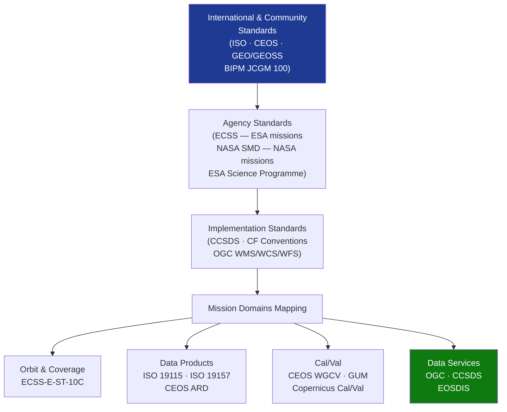

# STA 160-169 · Section 06 · Subsection 163 · Subsubject 009 — ECSS-NASA-CCSDS Observation Standards Mapping

## 1. Purpose

Maps applicable ECSS, NASA, CCSDS, and scientific community standards to observation mission design, data product, and calibration/validation domains within Q+ATLANTIDE STA `163`, establishing the standards hierarchy and tailoring rules for both ESA-funded and NASA-funded missions as well as agency-independent international observation data products.

## 2. Scope

- **Mission analysis and orbit design** — ECSS-E-ST-10C (Mission Analysis and Design): mandatory for ESA-funded observation missions; provides mission analysis methodology, orbit design and selection, coverage analysis, launch window analysis, and end-of-life disposal orbit; applicable to all STA `163` observation missions for documenting orbit trade and coverage simulation.
- **Data product and geographic standards** — ISO 19115:2014 (Geographic Information — Metadata): mandatory data product metadata standard for all observation data products regardless of funding agency; ISO 19157:2013 (Data Quality): quality flag framework and spatial accuracy reporting; CEOS Analysis-Ready Data (ARD) standard for Level-2+ products intended for direct scientific analysis; GEO/GEOSS data sharing principles: open, timely, and unrestricted data access for societal benefit.
- **Scientific data format standards** — CCSDS 650.0-M (XML Spacecraft Monitoring and Control): applicable to telemetry structure and L0 data packaging; CEOS ARD standard for L2+ data interoperability; CF Conventions (Climate and Forecast metadata conventions) for NetCDF data products: mandatory for L3/L4 climate-relevant products; OGC standards (WMS/WCS/WFS/OGC API): applicable to data service interface interoperability for user access portals.
- **Cal/Val frameworks** — CEOS WGCV (Working Group on Calibration and Validation): inter-calibration protocols and recommended practices published as CEOS Cal/Val guides; applicable to all EO missions for in-orbit radiometric and geometric calibration; Copernicus Cal/Val framework for ESA Sentinel-class missions; BIPM JCGM 100:2008 (GUM): normative calibration uncertainty standard applicable to all instrument calibration chains.
- **Earth observation community frameworks** — ESA Sentinel data product specifications: heritage reference for L0–L4 product definitions, data format, and metadata; NASA EOSDIS data system architecture: reference for long-term archive and data management; Copernicus Core Service data policy: open access model for operational EO services; GCOS Essential Climate Variable requirements: define accuracy, stability, and continuity requirements for climate-relevant observation products.
- **Standards hierarchy and applicability decision** — ECSS standards: mandatory for ESA-funded missions, recommended for non-ESA missions with ECSS tailoring note; NASA standards: applicable for NASA-funded missions and optional for international missions; CEOS/ISO/GEO standards: apply to ALL observation data products regardless of funding agency or programme; CCSDS standards: applicable to all spacecraft data link and data management systems; tailoring deviations documented in Mission Science Requirements Document (SRD) §N and Verification Control Document (VCD) §N per ECSS-E-ST-10C Annex A.

## 3. Diagram — Observation Standards Hierarchy

## 4. Footprint

| Metric | Value |
|---|---|
| Architecture | `STA` — Space Technology Architecture |
| Master range | `100–199` |
| Code range | `160-169` |
| Section | `06` — Sensores y Carga Útil Espacial |
| Subsection | `163` — Observación |
| Subsubject | `009` — ECSS-NASA-CCSDS Observation Standards Mapping |
| Primary Q-Division | Q-SPACE[^qdiv] |
| ORB support | ORB-PMO, ORB-MKTG |
| Governance class | `baseline`[^gov] |
| Document | `009_ECSS-NASA-CCSDS-Observation-Standards-Mapping.md` (this file) |
| Parent subsection | [`README.md`](./README.md) · [`000_Overview.md`](./000_Overview.md) |

## 5. References & Citations

[^qdiv]: **Q-Division authority** — See [`organization/Q+ATLANTIDE.md` §4](../../../../organization/Q+ATLANTIDE.md#4-notes).

[^gov]: **Governance class** — `baseline`.

### Applicable industry standards

| Standard | Scope | Applicability |
|---|---|---|
| ECSS-E-ST-10C | Mission Analysis and Design | Mandatory — ESA-funded; recommended — others |
| ISO 19115:2014 | Geographic Information Metadata | Mandatory — all observation data products |
| ISO 19157:2013 | Data Quality | Mandatory — all observation data products |
| CEOS WGCV | Cal/Val protocols | Mandatory — EO missions; recommended — others |
| BIPM JCGM 100:2008 | Calibration uncertainty (GUM) | Mandatory — all calibration chains |
| GEO/GEOSS | Data sharing principles | Mandatory — publicly funded observation missions |
| CCSDS 650.0-M | Telemetry format | Recommended — all CCSDS-compliant missions |
| CF Conventions | NetCDF metadata | Mandatory — L3/L4 climate products |
| OGC WMS/WCS/WFS | Data service interfaces | Recommended — user access portals |
