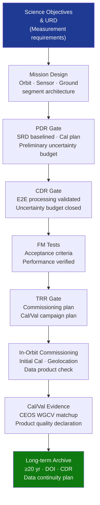

# STA 160-169 · Section 06 · Subsection 163 · Subsubject 010 — Traceability, Evidence and Lifecycle Governance

## 1. Purpose

Establishes requirements traceability, design evidence gates, and lifecycle governance requirements for observation missions on Q+ATLANTIDE STA-band spacecraft, per ECSS-E-ST-10C[^ecss10c], ECSS-E-ST-10-02C[^ecss10_02c], and CEOS data continuity requirements[^ceos].

## 2. Scope

- **Requirements traceability** — observation mission design requirements traced top-down from top-level science measurement objectives and User Requirements Document (URD) through Mission Science Requirements Document (SRD) to satellite design elements; traceability matrix linking each observation requirement (resolution, coverage, revisit, data latency, uncertainty, availability) to: satellite design element (sensor, orbit, GNC, data handling), calibration/validation activity, and evidence artefact (test report, validation statistics, uncertainty budget); traceability matrix managed in Q+ATLANTIDE requirements register and verified at each mission review gate.
- **PDR evidence gates** — Preliminary Design Review (PDR) observation-specific evidence: science measurement requirements baselined and approved in SRD; orbit design confirmed and coverage/revisit analysis completed; sensor and instrument selection confirmed (heritage TRL ≥4); data product hierarchy defined (L0–L4) with formats and metadata standards specified; calibration strategy documented in Calibration Plan; preliminary end-to-end uncertainty budget (k=2) closed at instrument level; ground segment architecture approved; Observation Campaign Plan submitted for review.
- **CDR evidence gates** — Critical Design Review (CDR) observation-specific evidence: end-to-end processing chain validated on simulated or representative test data; calibration algorithm and coefficient generation pipeline baselined in software CM system; closed end-to-end uncertainty budget (k=2) from sensor noise to L2 geophysical product, reviewed by independent Cal/Val authority; geometric model validated on synthetic aperture data or emulated orbital geometry; FMEA closed at mission observation chain level; data format and metadata implementation validated against ISO 19115 and ISO 19157 compliance test suite.
- **Delta-CDR and TRR gates** — Delta-CDR triggered by any post-CDR changes to: orbital parameters (inclination, altitude, repeat cycle), sensor configuration (band selection, integration time), data product format or metadata standard, or calibration algorithm; Test Readiness Review (TRR) gate: flight model (FM) functional and performance tests complete to acceptance criteria; in-orbit commissioning plan approved; Cal/Val campaign plan approved (reference sites confirmed, airborne campaign scheduled); ground segment fully operational and tested end-to-end including data dissemination to users.
- **In-orbit commissioning and Cal/Val evidence** — commissioning phase (typically 3–6 months post-launch): sensor switch-on and health verification, functional performance check, initial radiometric and geometric calibration, geolocation accuracy assessment (against reference reflector or DEM tie-points), first data product quality assessment; Cal/Val phase: matchup database collection against in-situ reference (buoys, radiosonde, albedo reference sites, corner reflectors); outcome: product quality declaration (accuracy and uncertainty per product type) submitted to mission Cal/Val Board; first data release to users contingent on passed Cal/Val phase closure.
- **Lifecycle records** — mission configuration baseline: satellite hardware configuration item (CI) records, sensor calibration coefficient database (versioned), ground segment software baseline (tagged releases), precise orbital element archive; calibration database: all calibration runs with dates, versions, uncertainty records, and change log; data product release history: algorithm version, calibration version, reprocessing record with justification and change impact assessment; Cal/Val campaign results: matchup statistics, validation reports, and annual stability assessments.
- **Long-term data continuity governance** — observation data continuity plan: inter-mission overlap period (minimum 1 year for ECV), inter-calibration campaign executed during overlap, harmonisation factor derived and documented; long-term archive policy: ≥20 years retention for climate-relevant products, repository designation (ESA DIAS, NASA EOSDIS, Copernicus DIAS, or equivalent); DOI assignment per data product type/version with citation governance; end-of-mission final reprocessing with best available calibration version; compliance assessment against CEOS data continuity requirements and GCOS ECV long-term record requirements.

## 3. Diagram — Observation Lifecycle Governance Flow

## 4. Footprint

| Metric | Value |
|---|---|
| Architecture | `STA` — Space Technology Architecture |
| Master range | `100–199` |
| Code range | `160-169` |
| Section | `06` — Sensores y Carga Útil Espacial |
| Subsection | `163` — Observación |
| Subsubject | `010` — Traceability, Evidence and Lifecycle Governance |
| Primary Q-Division | Q-SPACE[^qdiv] |
| ORB support | ORB-PMO, ORB-MKTG |
| Governance class | `baseline`[^gov] |
| Document | `010_Traceability-Evidence-and-Lifecycle-Governance.md` (this file) |
| Parent subsection | [`README.md`](./README.md) · [`000_Overview.md`](./000_Overview.md) |

## 5. References & Citations

[^ecss10c]: **ECSS-E-ST-10C** — Space Engineering: Mission Analysis and Design. European Cooperation for Space Standardization.

[^ecss10_02c]: **ECSS-E-ST-10-02C** — Space Engineering: Verification. European Cooperation for Space Standardization.

[^ceos]: **CEOS** — Committee on Earth Observation Satellites. Data continuity requirements and inter-calibration protocols. <https://ceos.org>

[^qdiv]: **Q-Division authority** — See [`organization/Q+ATLANTIDE.md` §4](../../../../organization/Q+ATLANTIDE.md#4-notes).

[^gov]: **Governance class** — `baseline`.

### Applicable industry standards

| Standard | Scope |
|---|---|
| ECSS-E-ST-10C | Mission Analysis and Design — mission review gate evidence requirements |
| ECSS-E-ST-10-02C | Verification — verification methodology and evidence closure |
| BIPM JCGM 100:2008 | GUM — uncertainty budget closure evidence at CDR |
| CEOS Cal/Val | Cal/Val evidence protocol for product quality declaration |
| ISO 19157:2013 | Data Quality — quality metadata and product conformance evidence |
| GEO/GEOSS | Long-term data continuity and open data governance |
