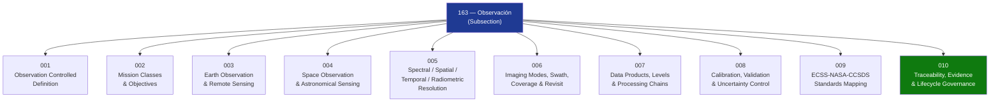

# STA 160-169 · 163-000 — General

## 1. Purpose

Overview entry-point for the *Observación* subsection within STA `160-169`, establishing the observation framework covering controlled definitions, mission classes and objectives, Earth observation and remote sensing, space and astronomical observation, measurement resolution parameters, imaging modes, swath, coverage and revisit time, data products and processing chains, calibration and validation, standards mapping, and lifecycle governance. This subsection is designated **mission-observation critical** within the Q+ATLANTIDE ATLAS-1000 register[^baseline][^n001].

## 2. Scope

- Covers the Observation slice of parent code range `160-169`, establishing what constitutes an observation mission in Q+ATLANTIDE STA-band spacecraft; distinguishes from sensor-level design (→`162`) and instrumentation engineering (→`161`).
- Inherits Q-Division authority and ORB support from the parent row in [`../../README.md` §3](../../README.md#3-architecture-table)[^archtable] and the section index in [`../README.md`](../README.md).
- **Observation Controlled Definition** (`001`) — normative boundary of observation within STA; observation as a systematic, calibrated measurement campaign generating reusable data products traceable to measurement standards.
- **Observation Mission Classes and Objectives** (`002`) — Earth observation, space science, solar/planetary observation, surveillance; mission objectives specification and orbit strategy.
- **Earth Observation and Remote Sensing** (`003`) — land, ocean, atmosphere, cryosphere; multi-spectral/hyperspectral/SAR/altimetry approaches and ECV monitoring requirements.
- **Space Observation and Astronomical Sensing** (`004`) — astrophysics, heliophysics, planetary; telescope designs, survey vs. deep-pointing strategies, pointing requirements.
- **Spectral, Spatial, Temporal and Radiometric Resolution** (`005`) — resolution parameter definitions, SNR models, MTF budget, trade-off analysis, mission requirement derivation.
- **Imaging Modes, Swath, Coverage and Revisit Time** (`006`) — stripmap/ScanSAR/spotlight for SAR; pushbroom/step-stare for optical; constellation coverage optimisation.
- **Data Products, Levels and Processing Chains** (`007`) — L0–L4 product hierarchy, algorithm version control, ground segment data flow, open data policy.
- **Calibration, Validation and Uncertainty Control** (`008`) — sensor calibration traceability to SI, vicarious validation, CEOS Cal/Val protocols, uncertainty control.
- **ECSS-NASA-CCSDS Observation Standards Mapping** (`009`) — applicable standards mapped to mission domains; standards hierarchy and tailoring rules.
- **Traceability, Evidence and Lifecycle Governance** (`010`) — requirements traceability, evidence gates (PDR/CDR/TRR), in-orbit commissioning, long-term data continuity governance.

## 3. Diagram — Observation Subsection Map

## 4. Footprint

| Metric | Value |
|---|---|
| Architecture | `STA` — Space Technology Architecture |
| Master range | `100–199` |
| Code range | `160-169` |
| Section | `06` — Sensores y Carga Útil Espacial |
| Subsection | `163` — Observación |
| Subsubject | `000` — Overview |
| Primary Q-Division | Q-SPACE[^qdiv] |
| ORB support | ORB-PMO, ORB-MKTG |
| Governance class | `baseline`[^gov] |
| Document | `163-000-General.md` (this file) |
| Parent subsection | [`README.md`](./README.md) |

## 5. References & Citations

[^baseline]: **Q+ATLANTIDE controlled baseline (v1.0.0)** — [`organization/Q+ATLANTIDE.md`](../../../../organization/Q+ATLANTIDE.md).

[^archtable]: **§3 — Architecture Table (parent)** — [`../../README.md` §3](../../README.md#3-architecture-table).

[^qdiv]: **Q-Division authority** — See [`organization/Q+ATLANTIDE.md` §4](../../../../organization/Q+ATLANTIDE.md#4-notes).

[^gov]: **Governance class** — `baseline`.

[^n001]: **Note N-001** — Q+ATLANTIDE (with its ATLAS-1000 register subpart) is a taxonomy and traceability ecosystem, not an organization chart. See [`organization/Q+ATLANTIDE.md` §4](../../../../organization/Q+ATLANTIDE.md#4-notes).

### Applicable industry standards

| Standard | Scope |
|---|---|
| ECSS-E-ST-10C | Mission Analysis and Design — applicable to observation orbit design and coverage analysis |
| CEOS principles | Committee on Earth Observation Satellites — data interoperability and quality frameworks |
| ISO 19115:2014 | Geographic Information — Metadata standard for data products |
| ISO 19157:2013 | Data Quality — quality flag framework for observation data products |
| ESA Sentinel data products | Heritage reference for EO data product definitions and levels |
| GEO/CEOS frameworks | Group on Earth Observations and CEOS observation requirements and principles |
