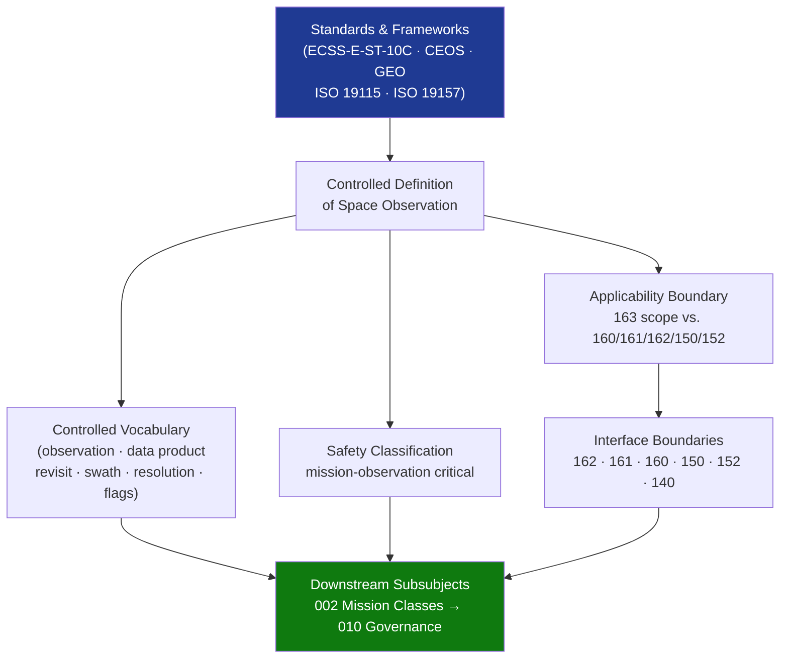

# STA 160-169 · 163-010 — Observation Controlled Definition

## 1. Purpose

Establishes the normative definition and controlled scope of space observation within the Q+ATLANTIDE STA band, per ECSS-E-ST-10C mission analysis framework and CEOS/GEO observation frameworks[^ecss10c][^ceos]. This document defines the precise boundary of what constitutes an observation within STA `163`, enabling unambiguous traceability from science measurement objectives down to sensor and data product design.

## 2. Scope

- **Controlled definition** — Observation encompasses the systematic, calibrated sensing of physical phenomena by space-borne instruments, generating controlled data products traceable to measurement standards, subject to documented uncertainty budgets, and forming the basis of reusable Earth or space science data records. A single observation act is a *measurement* event; a structured set of measurement events executed per an approved observation plan is an *observation campaign*.
- **Applicability boundary** — STA `163` covers observation mission design, data product architecture, coverage and revisit planning, and end-to-end calibration and validation chains. It explicitly excludes: sensor-level detector engineering (→`162`), instrumentation signal chains and electronics (→`161`), payload accommodation and mechanical/thermal integration (→`160`), and communication/data relay chain design (→`150`, `152`).
- **Controlled vocabulary** — *observation*: a single calibrated measurement act; *data product*: a processed output at a defined quality level; *revisit time*: time between successive observations of the same target; *swath*: ground width covered by one sensor pass; *spatial resolution*: smallest resolvable feature at the ground; *spectral resolution*: smallest resolvable spectral interval; *radiometric resolution*: smallest detectable signal difference; *data quality flag*: per-measurement quality indicator encoded in product metadata per ISO 19157[^iso19157].
- **Safety classification** — mission-observation critical; observation chain failures include: missing science data due to instrument anomaly or coverage gap, systematic biases in data products due to calibration drift, incorrect geolocation due to attitude or orbit knowledge error, and temporal gaps in time-series observations. Long-duration systematic errors in climate data records may have policy-level consequences requiring formal correction and reprocessing.
- **Interface boundaries** — Observation interfaces with: scientific sensors (→`162`) for sensor characterisation inputs and raw calibration data; instrumentation (→`161`) for signal chain calibration; payloads (→`160`) for accommodation constraints; communications (→`150`) for data downlink budget; networks (→`152`) for ground data distribution; GNC (→`140`) for attitude and orbit knowledge inputs to geolocation.
- **Regulatory and framework context** — CEOS (Committee on Earth Observation Satellites) and GEO (Group on Earth Observations) define requirements for observation data interoperability and quality in the international context. ECSS-E-ST-10C provides mission analysis standards applicable to observation orbit design. ISO 19115[^iso19115] and ISO 19157 define data product metadata and quality standards applicable to all observation data products regardless of funding agency or programme.

## 3. Diagram — Observation Definition Framework

## 4. Footprint

| Metric | Value |
|---|---|
| Architecture | `STA` — Space Technology Architecture |
| Master range | `100–199` |
| Code range | `160-169` |
| Section | `06` — Sensores y Carga Útil Espacial |
| Subsection | `163` — Observación |
| Subsubject | `001` — Observation Controlled Definition |
| Primary Q-Division | Q-SPACE[^qdiv] |
| ORB support | ORB-PMO, ORB-MKTG |
| Governance class | `baseline`[^gov] |
| Document | `163-010-Observation-Controlled-Definition.md` (this file) |
| Parent subsection | [`README.md`](./README.md) · [`163-000-General.md`](./163-000-General.md) |

## 5. References & Citations

[^ecss10c]: **ECSS-E-ST-10C** — Space Engineering: Mission Analysis and Design. European Cooperation for Space Standardization.

[^ceos]: **CEOS** — Committee on Earth Observation Satellites. Principles and frameworks for observation data quality and interoperability. <https://ceos.org>

[^iso19115]: **ISO 19115:2014** — Geographic Information — Metadata. International Organization for Standardization.

[^iso19157]: **ISO 19157:2013** — Geographic Information — Data Quality. International Organization for Standardization.

[^qdiv]: **Q-Division authority** — See [`organization/Q+ATLANTIDE.md` §4](../../../../organization/Q+ATLANTIDE.md#4-notes).

[^gov]: **Governance class** — `baseline`.

### Applicable industry standards

| Standard | Scope |
|---|---|
| ECSS-E-ST-10C | Mission Analysis and Design — normative basis for observation mission scoping |
| CEOS | Committee on Earth Observation Satellites — international observation data quality framework |
| GEO/GEOSS | Group on Earth Observations — data sharing and interoperability principles |
| ISO 19115:2014 | Geographic Information Metadata — data product metadata standard |
| ISO 19157:2013 | Data Quality — quality flag framework for observation data products |
