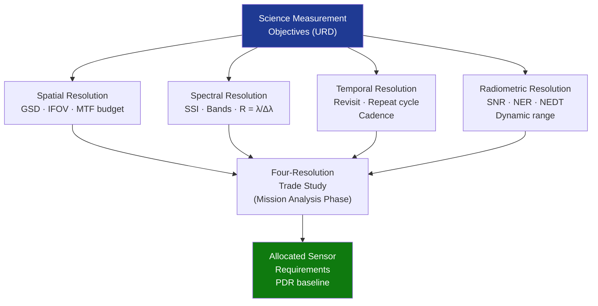

# STA 160-169 · 163-050 — Spectral Spatial Temporal and Radiometric Resolution

## 1. Purpose

Establishes definitions, requirement derivation methods, and trade-off analysis frameworks for the four fundamental observation resolution parameters: spectral, spatial, temporal, and radiometric resolution, per ECSS-E-ST-10C[^ecss10c] and GUM uncertainty framework[^gum].

## 2. Scope

- **Spatial resolution** — ground sampling distance (GSD): pixel size projected at nadir onto the Earth's surface; instantaneous field of view (IFOV = detector element size / focal length × altitude); effective spatial resolution accounts for modulation transfer function (MTF) of the full optical and detector system; MTF budget includes contributions from: telescope optics diffraction and aberrations, detector point spread function, image motion/smear (attitude rate × integration time), and atmospheric blur; requirement derived from minimum feature size of science or operational target; diffraction limit for circular aperture: θ_min = 1.22 λ/D; GSD ≤ H × θ_min for diffraction-limited case.
- **Spectral resolution** — spectral sampling interval (SSI, nm/pixel for grating spectrometer); spectral bandwidth (FWHM of bandpass filter for multi-spectral imager); resolving power R = λ/Δλ (for spectrometers; R > 1000 for narrow trace gas retrieval, R ~ 10–20 for multi-spectral imager); number of spectral bands and their centre wavelengths selected based on absorption features of target species (O₃ Hartley/Huggins, CO₂ near-IR bands, vegetation chlorophyll red-edge at 700–720 nm), atmospheric transmission windows; hyperspectral (≥100 contiguous bands) vs. multispectral (≤15 selected bands) trade-off documented in science requirements matrix.
- **Temporal resolution** — revisit time (time between successive observations of the same surface point for LEO): function of orbital period (~100 min at 700 km), swath width, and inclination; ground-track repeat cycle (days); constellation geometry for sub-daily revisit; temporal sampling frequency for in-situ or space science time series spans seconds (solar irradiance transient) to decades (ECV climate records); cadence requirement for change detection defined per application (daily for sea ice, 5–10 days for agricultural monitoring, 12 days for SAR InSAR deformation).
- **Radiometric resolution** — signal-to-noise ratio (SNR) at reference scene radiance L_ref; noise equivalent radiance (NER = L_ref/SNR); noise equivalent temperature difference (NEDT for thermal IR detectors, typically ≤0.1 K at 300 K); dynamic range (ratio of saturation radiance to NER); number of quantisation bits for ADC (typically 10–14 bits); SNR model: SNR = (L_scene × Ω_IFOV × A_aperture × η_opt × η_detector × t_int) / N_total, where N_total = √(N_photon² + N_dark² + N_read²) in photon count units; each noise term budgeted in sensor design document.
- **Resolution trade-off framework** — four-resolution trade space: high spatial resolution (small GSD) reduces swath width and revisit frequency for a given orbit altitude; high spectral resolution (many bands) reduces temporal sampling rate in pushbroom operation; high radiometric resolution (high SNR) requires larger aperture or longer integration time, conflicting with spatial resolution via image smear; formal four-dimensional resolution trade study documented at mission analysis phase and updated at PDR.
- **User requirement allocation** — resolution requirements derived top-down: science measurement objectives → user URD → mission requirements → sensor design requirements → verification against sensor model (radiometric, geometric) pre-launch → validated against in-orbit measurements post-launch; requirements matrix for each data product type and observing mode.

## 3. Diagram — Resolution Trade-off Space

## 4. Footprint

| Metric | Value |
|---|---|
| Architecture | `STA` — Space Technology Architecture |
| Master range | `100–199` |
| Code range | `160-169` |
| Section | `06` — Sensores y Carga Útil Espacial |
| Subsection | `163` — Observación |
| Subsubject | `005` — Spectral, Spatial, Temporal and Radiometric Resolution |
| Primary Q-Division | Q-SPACE[^qdiv] |
| ORB support | ORB-PMO, ORB-MKTG |
| Governance class | `baseline`[^gov] |
| Document | `163-050-Spectral-Spatial-Temporal-and-Radiometric-Resolution.md` (this file) |
| Parent subsection | [`README.md`](./README.md) · [`163-000-General.md`](./163-000-General.md) |

## 5. References & Citations

[^ecss10c]: **ECSS-E-ST-10C** — Space Engineering: Mission Analysis and Design. European Cooperation for Space Standardization.

[^gum]: **BIPM JCGM 100:2008** — Evaluation of measurement data — Guide to the Expression of Uncertainty in Measurement (GUM). Bureau International des Poids et Mesures.

[^qdiv]: **Q-Division authority** — See [`organization/Q+ATLANTIDE.md` §4](../../../../organization/Q+ATLANTIDE.md#4-notes).

[^gov]: **Governance class** — `baseline`.

### Applicable industry standards

| Standard | Scope |
|---|---|
| ECSS-E-ST-10C | Mission Analysis and Design — resolution requirement derivation and trade documentation |
| BIPM JCGM 100:2008 | GUM — uncertainty framework for radiometric noise and SNR budgets |
| CEOS Cal/Val | In-orbit resolution measurement and verification protocols |
| ISO 19157:2013 | Data Quality — spatial accuracy and resolution metadata |
