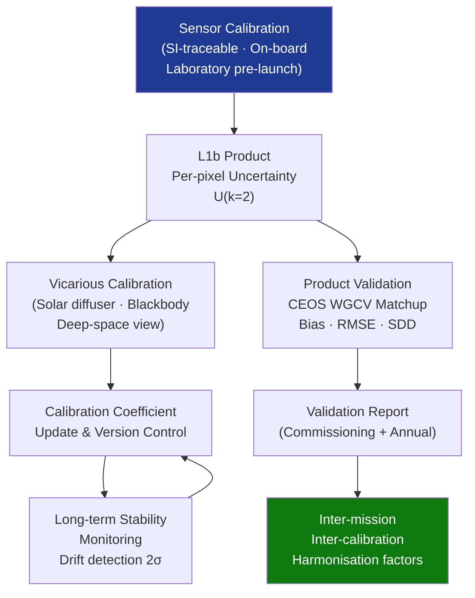

# STA 160-169 · 163-080 — Calibration Validation and Uncertainty Control

## 1. Purpose

Establishes observation-level calibration strategy, product validation methodology, and end-to-end uncertainty control requirements for Q+ATLANTIDE STA `163` observation missions, per BIPM JCGM 100:2008 (GUM)[^gum], CEOS Cal/Val protocols[^ceos_calval], and ISO 19157[^iso19157].

## 2. Scope

- **Sensor-to-product calibration chain** — radiometric calibration of sensor (see →`161` instrumentation calibration chain and →`162` sensor characterisation): coefficients traceable to SI via on-board calibration sources (solar diffuser panel, blackbody, deep-space view) or pre-launch laboratory calibration; calibration applied in L1b processor as gain/offset per spectral band and detector element; calibration coefficient update schedule (annual or event-triggered by monitoring threshold); L1b product uncertainty declared per pixel as expanded uncertainty U(k=2) incorporating: sensor noise, calibration coefficient uncertainty, and residual non-linearity.
- **Geometric calibration** — boresight calibration and band-to-band co-registration calibration using dedicated calibration sites (airport runways for optical, geodetic corner reflectors for SAR); in-orbit geometric model update procedure (star sensor bore-sight, instrument-to-spacecraft alignment); geolocation accuracy assessment against independent reference (ICESat-2 or Copernicus DEM tie-points for optical, trihedral corner reflector network for SAR); geolocation accuracy assessment report published during commissioning.
- **Product validation methodology** — CEOS WGCV Cal/Val protocol[^ceos_calval]: matchup database of independent reference data (in-situ buoy measurements, airborne campaign data, high-accuracy ground-based retrievals) matched to satellite product within defined spatio-temporal coincidence window (typically ±1 h, ±25 km, ±10° solar angle); statistical validation metrics: mean bias, RMSE, standard deviation of differences (SDD), Pearson correlation, fractional coverage meeting accuracy target; matchup database maintained and updated throughout mission lifetime; validation report published at commissioning close-out and annually thereafter.
- **Uncertainty budget at product level** — end-to-end uncertainty budget structured per JCGM 100:2008: sensor measurement uncertainty → radiometric calibration uncertainty → atmospheric correction uncertainty (for optical products: aerosol optical depth uncertainty → surface reflectance uncertainty) → geophysical retrieval algorithm uncertainty; combined standard uncertainty u_c propagated through processing chain; expanded uncertainty U = k × u_c (k=2, ≈95% confidence) declared in product metadata per pixel; quality flag raised when U exceeds user-defined threshold.
- **Long-term stability monitoring** — on-board or dedicated vicarious calibration targets monitored on monthly/annual cycle; calibration parameter trend analysis over mission lifetime; threshold-based drift detection: when calibration parameter drift exceeds 2σ of expected stability, calibration update triggered; absolute accuracy vs. stability distinction documented (ECV applications require stability ≤0.1 K/decade for SST, ≤0.3%/decade for vegetation reflectance); stability target documented in Calibration Plan and monitored in annual calibration review.
- **Inter-mission Cal/Val** — inter-calibration between Q+ATLANTIDE sensor and reference sensors within CEOS/GEO virtual constellation per CEOS WGCV inter-calibration protocols; orbit-coincident (within 5 min, 50 km nadir separation) and pseudo-coincident (same target within 24 h, ±10° solar/view angle) matchup analysis; harmonisation factor derivation and uncertainty quantification for multi-mission data record construction; mandatory participation in CEOS WGCV inter-calibration campaigns for ECV and operational data products.

## 3. Diagram — Calibration and Validation Flow

## 4. Footprint

| Metric | Value |
|---|---|
| Architecture | `STA` — Space Technology Architecture |
| Master range | `100–199` |
| Code range | `160-169` |
| Section | `06` — Sensores y Carga Útil Espacial |
| Subsection | `163` — Observación |
| Subsubject | `008` — Calibration, Validation and Uncertainty Control |
| Primary Q-Division | Q-SPACE[^qdiv] |
| ORB support | ORB-PMO, ORB-MKTG |
| Governance class | `baseline`[^gov] |
| Document | `163-080-Calibration-Validation-and-Uncertainty-Control.md` (this file) |
| Parent subsection | [`README.md`](./README.md) · [`163-000-General.md`](./163-000-General.md) |

## 5. References & Citations

[^gum]: **BIPM JCGM 100:2008** — Evaluation of measurement data — Guide to the Expression of Uncertainty in Measurement (GUM). Bureau International des Poids et Mesures.

[^ceos_calval]: **CEOS WGCV** — Working Group on Calibration and Validation. Inter-calibration protocols and recommended practices. <https://ceos.org/ourwork/workinggroups/wgcv/>

[^iso19157]: **ISO 19157:2013** — Geographic Information — Data Quality. International Organization for Standardization.

[^qdiv]: **Q-Division authority** — See [`organization/Q+ATLANTIDE.md` §4](../../../../organization/Q+ATLANTIDE.md#4-notes).

[^gov]: **Governance class** — `baseline`.

### Applicable industry standards

| Standard | Scope |
|---|---|
| BIPM JCGM 100:2008 | GUM — uncertainty budget framework and propagation |
| CEOS WGCV | Cal/Val protocols, matchup database, inter-calibration |
| ISO 19157:2013 | Data Quality — quality flags and accuracy reporting |
| ECSS-E-ST-10-03C | Space Engineering: Testing — applicable to pre-launch calibration |
| ESA Cal/Val requirements | ESA mission Cal/Val programme requirements |
