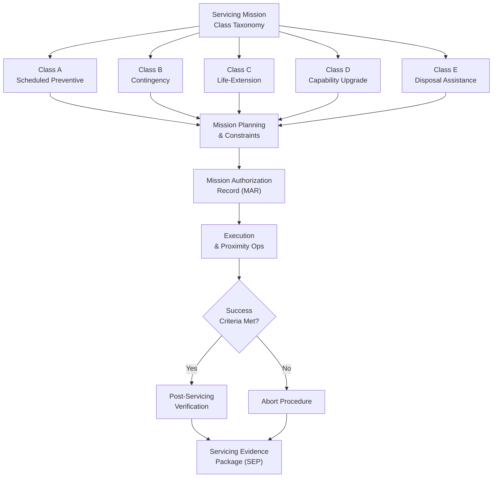

# STA 170-179 · Section 07 · Subsection 170 · Subsubject 002 — Servicing Mission Classes and Objectives

## 1. Purpose

Defines the taxonomy of on-orbit servicing mission classes and their objectives, mission planning constraints, success criteria, and abort criteria within the Q+ATLANTIDE STA-band servicing framework[^baseline]. The mission class taxonomy defined here governs the planning, authorization, execution, and post-servicing evaluation of all OOS missions within STA `170`.

## 2. Scope

- **Mission class taxonomy** — Five canonical mission classes are defined and controlled per `001`[^oos001]: *Class A — Scheduled Preventive Servicing*: periodic refueling, consumables replenishment, and LRU exchange per maintenance plan; driven by fleet maintenance schedule and propellant budget; *Class B — Contingency Servicing*: unplanned response to in-orbit anomaly, subsystem failure, or unexpected degradation; requires expedited mission authorization; *Class C — Life-Extension Servicing*: propellant top-up and targeted component replacement to extend operational life beyond original design life; typically planned 6–24 months before projected end of life; *Class D — Capability Upgrade Servicing*: replacement or addition of payload modules, avionics units, or instruments to increase or change spacecraft capability; requires detailed interface compatibility analysis and software integration planning; *Class E — Disposal Assistance*: controlled deorbit burn support or graveyard orbit relocation for client spacecraft at end of life; subject to IADC debris mitigation guidelines and national regulatory requirements. Each class is traceable to a distinct proximity operations profile and evidence package structure.

- **Mission objectives per class** — Each mission class carries formally defined objectives: *Primary objectives* define the minimum success condition for the servicing mission; *Secondary objectives* define additional value-add tasks if time and propellant permit; *Minimum success criteria* define the threshold for declaring mission success and returning client to nominal operations; *Extended success criteria* define the full-scope success condition including all planned tasks completed; objectives are linked to mission requirements per `010`[^oos010] and traced to the Servicing Evidence Package. Example: Class A primary objective = refueling to planned propellant mass within ±2%; minimum success = refueling to at least 80% of planned mass with client spacecraft returned to safe mode.

- **Mission planning constraints** — Mission planning is constrained by: approach corridor design driven by client spacecraft geometry and operational keep-out zones (→`003`[^oos003]); servicer propellant budget — ΔV allocation per class accounts for rendezvous, proximity operations, servicing, and departure; servicer mass budget — including LRU stowage mass, consumables, and margin; communication window scheduling for teleoperated robotic operations with acceptable round-trip latency; orbital mechanics constraints on rendezvous phasing: launch window, co-elliptic approach, final approach corridor selection; mission duration: each class has a nominal and maximum mission duration before consumable exhaustion or orbital drift constraints trigger abort.

- **Success criteria** — Formally defined for each mission: *Primary success* = planned servicing task completed within specification tolerances, client spacecraft returned to nominal operations mode, all interfaces disconnected and verified clean within safety margins; *Secondary success* = partial task completion with client spacecraft placed in stable safe mode, servicer withdrawn to safe standoff; *Mission abort criteria* include: exceedance of collision risk threshold (Pc > 1×10⁻³), loss of relative navigation solution, fault detection in servicer capture system, client spacecraft attitude excursion beyond proximity operations limits, servicer propellant below reserve threshold, loss of communication beyond defined window. All abort criteria are pre-defined in the Mission Authorization Record and verified in simulation before operations begin.

- **Mission authorization process** — Each servicing mission requires formal Mission Authorization Record (MAR) before any proximity operations begin. MAR process: (1) client spacecraft operator formal consent and interface data package delivery; (2) regulatory filing with responsible national space authority; (3) conjunction analysis clearance from Space Surveillance Network or equivalent; (4) servicer spacecraft readiness review sign-off with verified system health; (5) mission director formal sign-off on MAR document; (6) MAR version-controlled and archived as part of mission traceability record per `010`. Emergency (Class B) missions have an expedited MAR process with minimum 48-hour coordination timeline and pre-approved expedited procedure.

- **Lessons learned and heritage** — The mission class taxonomy supports systematic cross-mission learning within the Q+ATLANTIDE framework: each completed servicing mission generates a Servicing Evidence Package (SEP) with lessons learned annex; SEPs are archived in the heritage database; mission class performance statistics (success rate, anomaly rate, abort frequency) are maintained and inform future mission class design and planning constraints; heritage database contributions are formally reviewed at each new mission PDR; Class B contingency servicing generates mandatory anomaly investigation reports with root cause and corrective action records.

## 3. Diagram

## 4. Footprint

| Metric | Value |
|---|---|
| Architecture | `STA` — Space Technology Architecture |
| Master range | `100–199` |
| Code range | `170-179` |
| Section | `07` — Operaciones y Mantenimiento en Órbita |
| Subsection | `170` — Servicing Orbital |
| Subsubject | `002` — Servicing Mission Classes and Objectives |
| Primary Q-Division | Q-SPACE[^qdiv] |
| ORB support | ORB-LEG |
| Governance class | `baseline`[^gov] |
| Document | `002_Servicing-Mission-Classes-and-Objectives.md` (this file) |
| Parent subsection | [`README.md`](./README.md) · [`000_Overview.md`](./000_Overview.md) |

## 5. References & Citations

[^baseline]: **Q+ATLANTIDE controlled baseline (v1.0.0)** — [`organization/Q+ATLANTIDE.md`](../../../../organization/Q+ATLANTIDE.md).

[^oos001]: **STA 170.001** — On-Orbit Servicing Controlled Definition — [`001_On-Orbit-Servicing-Controlled-Definition.md`](./001_On-Orbit-Servicing-Controlled-Definition.md).

[^oos003]: **STA 170.003** — Rendezvous, Proximity and Servicing Boundaries — [`003_Rendezvous-Proximity-and-Servicing-Boundaries.md`](./003_Rendezvous-Proximity-and-Servicing-Boundaries.md).

[^oos010]: **STA 170.010** — Traceability, Evidence and Lifecycle Governance — [`010_Traceability-Evidence-and-Lifecycle-Governance.md`](./010_Traceability-Evidence-and-Lifecycle-Governance.md).

[^ecss7011]: **ECSS-E-ST-70-11C** — *Space Engineering: Space segment operability* (ECSS, 2008).

[^ccsds5202]: **CCSDS 520.2-G-3** — *Rendezvous and Proximity Operations* (CCSDS, 2014).

[^nasastd3000]: **NASA-STD-3000** — *Human Integration Design Requirements* (NASA). Applicable for crewed servicing missions.

[^iso17770]: **ISO 17770:2019** — *Space systems — Space docking interfaces* (ISO).

[^qdiv]: **Q-Division authority** — [`organization/Q-Divisions/`](../../../../organization/Q-Divisions/).

[^gov]: **Governance class** — `baseline` denotes documents under controlled change management within the Q+ATLANTIDE baseline.
