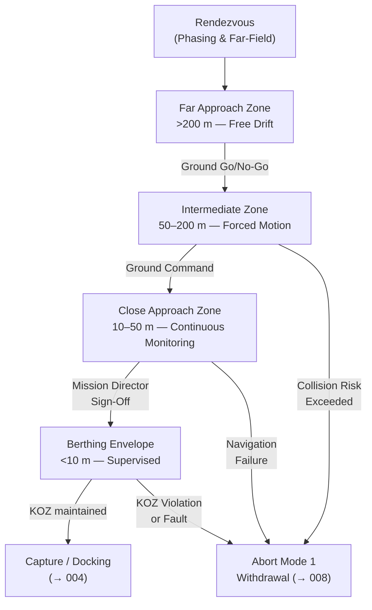

# STA 170-179 · Section 07 · Subsection 170 · Subsubject 003 — Rendezvous, Proximity and Servicing Boundaries

## 1. Purpose

Specifies the rendezvous approach corridor design, proximity operations zone definitions, keep-out zone geometries, relative navigation requirements, and servicing boundary constraints for on-orbit servicing missions within the Q+ATLANTIDE STA-band[^baseline]. This subsubject governs the spatial and operational framework within which all proximity operations defined in subsection `170` are conducted.

## 2. Scope

- **Rendezvous approach corridor** — Approach trajectory design is based on client spacecraft geometry, solar panel exclusion zones, thruster plume impingement avoidance, and solar illumination requirements for relative navigation sensors. Three canonical approach trajectory options are defined: *V-bar approach* (along the velocity vector — low ΔV, long duration, suitable for Class A/C/D missions); *R-bar approach* (along the local vertical — natural braking in lower approach, used for ISS-heritage berthing); *W-bar approach* (along the orbit normal — used for specialized geometries or co-orbital client configurations). Approach corridor half-angle, standoff distance, and approach velocity profile are defined per mission class in the Mission Authorization Record[^oos002] and verified in rendezvous simulation per CCSDS 520.2-G-3[^ccsds5202].

- **Proximity operations zones** — Five operational zones are defined around the client spacecraft: *Far Approach Zone* (>200 m from client center of mass): servicer operates under free drift with continuous relative state monitoring; no approach velocity constraint; *Intermediate Zone* (50–200 m): forced motion trajectory required; ground approval required for zone entry; approach velocity ≤1.0 m/s; *Close Approach Zone* (10–50 m): continuous ground monitoring mandatory; approach velocity ≤0.2 m/s; attitude hold required; servicer camera/LIDAR active; *Berthing Envelope* (<10 m): manual or supervised autonomous operation only; mission director approval required for entry; approach velocity ≤0.1 m/s; communication latency limit applies to teleoperated operations; *Keep-Out Zone* (KOZ): mission-specific volume where servicer entry is prohibited without explicit authorization — defined by client spacecraft structural envelope plus clearance margin; KOZ violation is a safety-critical event. Zone dimensions are defined in the client spacecraft ICD per `004`[^oos004].

- **Keep-out zone definition and management** — KOZ geometry is formally defined in the client spacecraft Interface Control Document (ICD). The KOZ encompasses: the client spacecraft structural envelope; solar array sweep volume during attitude maneuvers; thruster plume exclusion cones; all antenna beam exclusion volumes. The servicer shall maintain positive KOZ margin at all times during nominal operations: minimum positive margin ≥ 3σ navigation uncertainty at each zone boundary. KOZ violations are classified as safety-critical events requiring immediate Abort Mode 1 execution (→`008`[^oos008]). Automatic abort is triggered on predicted KOZ violation within 30 seconds based on current state and trajectory extrapolation. All KOZ events are logged in the Servicing Safety Log.

- **Relative navigation requirements** — Relative navigation solution accuracy requirements are defined per proximity zone: Far Approach Zone: position ≤10 m (3σ), velocity ≤0.1 m/s (3σ); Intermediate Zone: position ≤2 m (3σ), velocity ≤0.05 m/s (3σ); Close Approach Zone: position ≤0.5 m (3σ), velocity ≤0.02 m/s (3σ); Berthing Envelope: position ≤0.05 m (3σ), velocity ≤0.005 m/s (3σ). Navigation sensor suite: radar altimeter (far/intermediate), LIDAR (intermediate/close/berthing), visual odometry and docking cameras (close/berthing), GPS differential (all zones as available). Navigation filter: extended Kalman filter with sensor fusion; navigation failure modes are defined abort triggers per `008`.

- **Servicing boundary definitions** — Three formal spatial boundaries define the servicing engagement envelope: *Berthing Box* — the rectangular volume within which the physical capture attempt shall be initiated; defined in client spacecraft body frame; dimensions driven by capture tool reach and alignment tolerance; *Capture Envelope* — the volume in which the capture tool end-effector can successfully engage the client grapple fixture; defined by end-effector geometry and reach; *Post-Capture Rigid Body Reference* — the spatial reference frame established after successful capture, used as the reference for all subsequent robotic servicing operations. All boundary definitions are specified in the mission ICD and verified in hardware-in-the-loop simulation.

- **Zone transition authority** — Zone entry authorization process: *Far → Intermediate*: ground go/no-go command required; automatic confirmation of navigation solution validity before authorization; *Intermediate → Close Approach*: explicit ground command required; servicer attitude hold verified; abort modes pre-armed; *Close Approach → Berthing Envelope*: mission director sign-off required; relative navigation solution verified at ≤0.5 m accuracy; *Berthing Envelope → Capture*: mission director explicit command; all abort modes verified active; final approach velocity verified ≤0.1 m/s. All zone transitions are logged in the Servicing Event Record with timestamp, operator ID, and navigation state at transition. Zone transition authorities are listed in the MAR.

## 3. Diagram

## 4. Footprint

| Metric | Value |
|---|---|
| Architecture | `STA` — Space Technology Architecture |
| Master range | `100–199` |
| Code range | `170-179` |
| Section | `07` — Operaciones y Mantenimiento en Órbita |
| Subsection | `170` — Servicing Orbital |
| Subsubject | `003` — Rendezvous, Proximity and Servicing Boundaries |
| Primary Q-Division | Q-SPACE[^qdiv] |
| ORB support | ORB-LEG |
| Governance class | `baseline`[^gov] |
| Document | `003_Rendezvous-Proximity-and-Servicing-Boundaries.md` (this file) |
| Parent subsection | [`README.md`](./README.md) · [`000_Overview.md`](./000_Overview.md) |

## 5. References & Citations

[^baseline]: **Q+ATLANTIDE controlled baseline (v1.0.0)** — [`organization/Q+ATLANTIDE.md`](../../../../organization/Q+ATLANTIDE.md).

[^oos002]: **STA 170.002** — Servicing Mission Classes and Objectives — [`002_Servicing-Mission-Classes-and-Objectives.md`](./002_Servicing-Mission-Classes-and-Objectives.md).

[^oos004]: **STA 170.004** — Docking, Berthing and Capture Interfaces — [`004_Docking-Berthing-and-Capture-Interfaces.md`](./004_Docking-Berthing-and-Capture-Interfaces.md).

[^oos008]: **STA 170.008** — Servicing Safety Zones and Fault Containment — [`008_Servicing-Safety-Zones-and-Fault-Containment.md`](./008_Servicing-Safety-Zones-and-Fault-Containment.md).

[^ccsds5202]: **CCSDS 520.2-G-3** — *Rendezvous and Proximity Operations* (CCSDS, 2014).

[^ecss7011]: **ECSS-E-ST-70-11C** — *Space Engineering: Space segment operability* (ECSS, 2008).

[^iso17770]: **ISO 17770:2019** — *Space systems — Space docking interfaces* (ISO).

[^ecss1003]: **ECSS-E-ST-10-03C** — *Space Engineering: Testing* (ECSS, 2012).

[^qdiv]: **Q-Division authority** — [`organization/Q-Divisions/`](../../../../organization/Q-Divisions/).

[^gov]: **Governance class** — `baseline` denotes documents under controlled change management within the Q+ATLANTIDE baseline.
