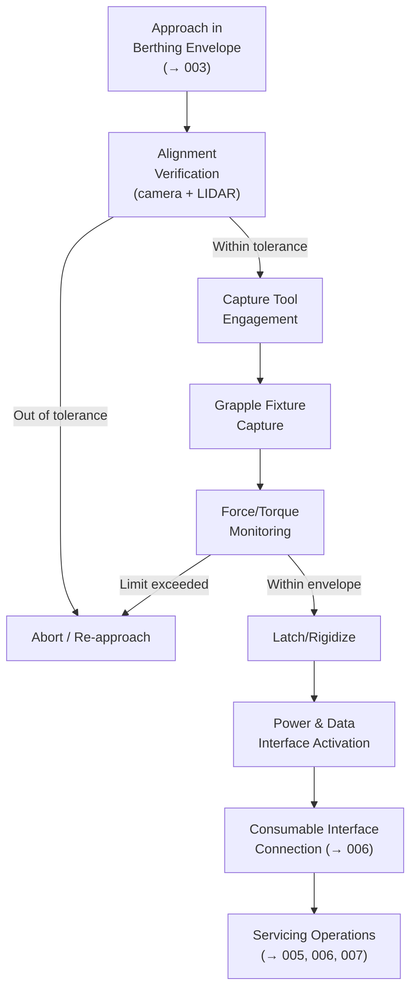

# STA 170-179 · Section 07 · Subsection 170 · Subsubject 004 — Docking, Berthing and Capture Interfaces

## 1. Purpose

Defines docking and berthing mechanism interface standards, capture tool interface requirements, alignment tolerances, and force/torque envelopes for on-orbit servicing physical connection within the Q+ATLANTIDE STA-band[^baseline]. This subsubject establishes the interface engineering requirements that govern physical connection between servicer and client spacecraft.

## 2. Scope

- **Docking interface standards** — Three docking interface standard families are applicable within STA `170`: *IDSS — International Docking System Standard*: applicable for servicing missions involving crewed vehicles or IDSS-compatible client spacecraft; defines interface ring geometry (800 mm active ring), guide petal geometry, latching mechanism loads, electrical and fluid connector locations; *CBM — Common Berthing Mechanism*: applicable for ISS-heritage berthing operations; 50-inch square common berthing interface; capture, ready-to-latch, and bolted configurations; power and data connector locations per ISS ICD; *Low-impact docking system*: applicable for small spacecraft servicing missions (<500 kg class) with reduced mass and power budgets; probe-and-cone or androgynous low-force interface. Interface standard selection criteria shall be documented in the mission ICD and justified against client spacecraft heritage, mass constraints, and power budget. Hybrid missions requiring multiple interface standards shall carry explicit interface compatibility analysis.

- **Berthing mechanism requirements** — Berthing arm end-effector geometry shall be compatible with the client spacecraft grapple fixture per the mission ICD. Requirements: grapple fixture interface tolerance: ±75 mm position, ±5° attitude at end-effector approach; berthing force/torque limits during engagement and latching: maximum engagement force ≤200 N axial, ≤50 N lateral; latching torque ≤50 N·m per latch fitting; berthing arm reach envelope verified to cover full capture box volume defined in `003`[^oos003]; singularity-free trajectory through capture maneuver verified in kinematic simulation; power and data connections activated post-berthing per defined power-up sequence; pressurized interface leak-before-break verification required per ECSS-E-ST-10-04C[^ecss1004].

- **Capture tool and grapple fixture interfaces** — Robotic capture tool interface: jaw geometry, closure force, and torque resistance specified per end-effector type (→`005`[^oos005]); standard robotic capture interface: based on SSRMS heritage grapple fixture (GF) — 0.1875-inch diameter snare pin pattern or equivalent; grapple fixture design requirements for client spacecraft: standardized pin-and-socket preferred for new-design client spacecraft; custom grapple fixtures require heritage data and full qualification; launch lock state verification required before capture attempt: capture shall not be attempted with launch lock engaged; capture tool actuator redundancy: dual independent actuators for jaw closure; single-fault-tolerant release mechanism.

- **Alignment tolerances and approach envelopes** — Position tolerance at initial contact: ±50 mm (requirement), ±20 mm (goal), consistent with relative navigation accuracy at Berthing Envelope zone (→`003`). Attitude tolerance at contact: ±2° (requirement), ±0.5° (goal). Relative velocity at contact: ≤0.1 m/s closing velocity, ≤0.01 m/s lateral drift. Alignment monitoring via: docking alignment camera (minimum 2 cameras for redundant coverage), LIDAR point cloud for final approach, pattern recognition on docking target markings. Tolerance stack-up analysis covering navigation uncertainty, structural flexibility, and thermal distortion is required in the ICD; worst-case stack-up shall be within interface engagement envelope.

- **Force and torque envelopes** — Maximum allowable contact force during capture attempt: defined per interface standard (IDSS: ≤4000 N; CBM: ≤3000 N; low-impact: ≤500 N); structural limit loads for docking interface hardware: 1.5× maximum contact force; force/torque monitoring via 6-DOF force/torque sensor at docking interface — automatic abort on exceedance of contact force limits within 100 ms; post-capture rigidization force requirements: latching preload per interface standard specifications; thermal interface activation sequence after rigid connection: defined in ICD with thermal settling time and verification procedure.

- **Interface control document requirements** — Each servicing mission shall produce and maintain a mission ICD covering: mating and demating sequence step-by-step procedures; interface geometry drawings with tolerances; structural load envelopes; power and data connector pinout and activation sequence; consumable interface specifications (fluid coupling type, pressure ratings, leak test procedure); emergency demating procedure for each interface state (pre-capture, post-capture, post-latch, post-rigid); version control: ICD under formal configuration control from PDR baseline; deviations from interface standard require formal waiver with safety analysis; ICD acceptance signatures required from both servicer and client spacecraft engineering organizations.

## 3. Diagram

## 4. Footprint

| Metric | Value |
|---|---|
| Architecture | `STA` — Space Technology Architecture |
| Master range | `100–199` |
| Code range | `170-179` |
| Section | `07` — Operaciones y Mantenimiento en Órbita |
| Subsection | `170` — Servicing Orbital |
| Subsubject | `004` — Docking, Berthing and Capture Interfaces |
| Primary Q-Division | Q-SPACE[^qdiv] |
| ORB support | ORB-LEG |
| Governance class | `baseline`[^gov] |
| Document | `004_Docking-Berthing-and-Capture-Interfaces.md` (this file) |
| Parent subsection | [`README.md`](./README.md) · [`000_Overview.md`](./000_Overview.md) |

## 5. References & Citations

[^baseline]: **Q+ATLANTIDE controlled baseline (v1.0.0)** — [`organization/Q+ATLANTIDE.md`](../../../../organization/Q+ATLANTIDE.md).

[^oos003]: **STA 170.003** — Rendezvous, Proximity and Servicing Boundaries — [`003_Rendezvous-Proximity-and-Servicing-Boundaries.md`](./003_Rendezvous-Proximity-and-Servicing-Boundaries.md).

[^oos005]: **STA 170.005** — Robotic Servicing and Manipulation Functions — [`005_Robotic-Servicing-and-Manipulation-Functions.md`](./005_Robotic-Servicing-and-Manipulation-Functions.md).

[^iso17770]: **ISO 17770:2019** — *Space systems — Space docking interfaces* (ISO).

[^ecss7011]: **ECSS-E-ST-70-11C** — *Space Engineering: Space segment operability* (ECSS, 2008).

[^ecss1004]: **ECSS-E-ST-10-04C** — *Space Engineering: Hazard analysis* (ECSS, 2019).

[^ccsds5202]: **CCSDS 520.2-G-3** — *Rendezvous and Proximity Operations* (CCSDS, 2014).

[^nasastd3000]: **NASA-STD-3000** — *Human Integration Design Requirements* (NASA).

[^qdiv]: **Q-Division authority** — [`organization/Q-Divisions/`](../../../../organization/Q-Divisions/).

[^gov]: **Governance class** — `baseline` denotes documents under controlled change management within the Q+ATLANTIDE baseline.
