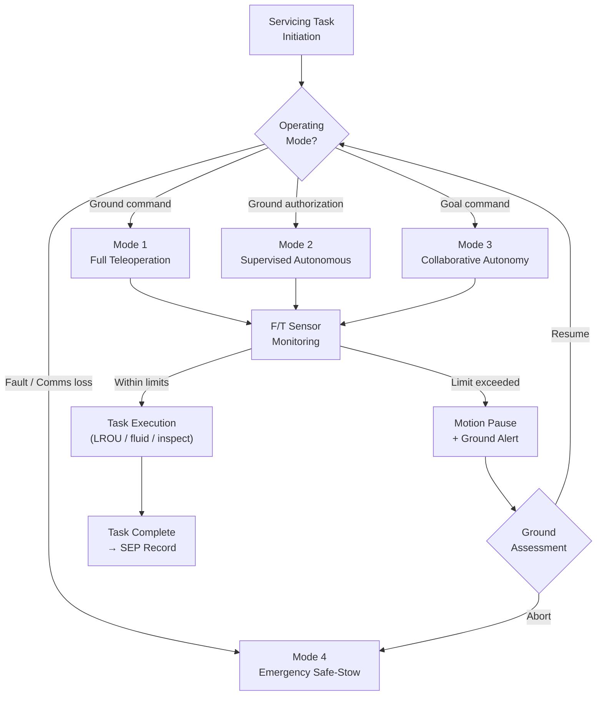

# STA 170-179 · Section 07 · Subsection 170 · Subsubject 005 — Robotic Servicing and Manipulation Functions

## 1. Purpose

Specifies the robotic servicing architecture, manipulator system requirements, end-effector taxonomy, autonomous and teleoperated mode boundaries, payload handling constraints, and fault management requirements for on-orbit robotic servicing operations within the Q+ATLANTIDE STA-band[^baseline].

## 2. Scope

- **Robotic servicing architecture** — Manipulator arm configuration: serial-chain 6-DOF minimum (required), 7-DOF preferred for dexterous servicing tasks requiring singularity avoidance; base mounting: fixed servicer spacecraft structural interface (standard) or mobile transporter along external rail system (extended capability); workspace volume requirements defined by servicing task analysis against the client spacecraft geometry and LROU locations (→`007`[^oos007]); force/torque sensor integration mandatory at wrist joint: 6-axis F/T sensor, minimum range ±500 N force / ±50 N·m torque, resolution ≤0.1 N / ≤0.01 N·m; vision system integration: camera mounted on wrist (minimum 1080p, 30 fps) and on upper arm for workspace monitoring; lighting system for shadow-free illumination of work zone.

- **End-effector taxonomy** — Four canonical end-effector types are defined: *Standard grapple end-effector*: for initial capture and large payload handling; compatible with heritage grapple fixture per `004`[^oos004]; jaw force range 0–1000 N; *Precision manipulation end-effector*: for LROU replacement, connector mating, and fastener operations; fingertip force control ≤5 N; position accuracy ≤0.5 mm; *Tool-change interface end-effector*: standardized quick-connect mechanism for mission-specific tools; tool-change time ≤60 s; tool recognition via RFID and visual fiducial; *Fluid coupling end-effector*: for propellant transfer and consumables replenishment operations (→`006`[^oos006]); alignment tolerance per fluid coupling interface ICD; *Inspection end-effector*: camera/LIDAR payload for close-range inspection support operations. End-effector selection per task is defined in the servicing procedure document.

- **Manipulator kinematics and workspace** — Joint angle ranges per joint: ±180° minimum (design goal); joint velocity: ≤10°/s for precision operations, ≤30°/s for transit; joint acceleration limit: ≤5°/s² to limit base disturbance; workspace reachability analysis required as part of mission servicing task analysis: every LROU interface and consumable connection point shall be within the reachable workspace with positive margin; singularity avoidance algorithm mandatory in joint space path planner; collision avoidance: geometric model of servicer and client structures used in real-time collision check with ≥50 ms look-ahead; dynamic disturbance budget: manipulator motion-induced torques on servicer attitude shall be within attitude control system authority at maximum joint velocity.

- **Autonomous and teleoperated mode boundaries** — Four operating modes are defined with explicit authority and authorization requirements: *Mode 1 — Full Teleoperation*: ground operator commands each joint or Cartesian move in real-time; video feedback required with maximum acceptable round-trip latency 2 s; all ground-commanded motions; *Mode 2 — Supervised Autonomous*: onboard pre-programmed task sequence executes with ground monitoring and abort authority; ground operator can pause or abort at any time; used for repetitive tasks (connector mating, fastener tightening) where latency makes real-time teleoperation impractical; *Mode 3 — Collaborative Autonomy*: operator sets task goal (e.g., "move LROU to stowage port"); robot executes with continuous onboard monitoring and automatic pause on anomaly; ground receives telemetry with ≥1 Hz update; *Mode 4 — Full Autonomy*: reserved for emergency safe-stow execution only; triggered automatically on communication loss or fault detection; executes pre-computed safe-stow trajectory. Mode transitions: Mode 1↔2↔3 require ground command; Mode 4 triggered automatically; return from Mode 4 requires explicit ground re-authorization.

- **Payload handling constraints** — Mass and inertia limits per end-effector type: standard grapple: ≤500 kg, ≤300 kg·m²; precision: ≤20 kg, ≤5 kg·m²; maximum tip velocity during payload transport: ≤0.05 m/s; maximum tip acceleration: ≤0.01 m/s²; fragile payload handling (Class 1 and Class 4 LROUs): contact force/torque limits active at wrist F/T sensor: maximum 20 N contact force, 5 N·m torque; thermal constraints: handling time limits for temperature-sensitive components (avionics: maximum 15 min outside thermal envelope); electrical grounding: ESD protection wristband equivalent via F/T sensor housing ground path; contamination control: optical payload handling in contamination-controlled operations zone with outgassing limits monitored.

- **Fault management and safe-stow** — Joint fault taxonomy: encoder failure (position unknown), motor driver fault (torque commanded but unverified), torque sensor fault (load unknown), structural limit exceedance (torque limit reached); automatic safe-stow triggered on any joint fault: arms moves to pre-computed safe-stow position at ≤2°/s using available healthy joints; if multiple joint faults, arm holds current position and ground is alerted; safe-stow position is defined per mission phase (proximity operations, docked, post-capture) and verified to provide positive structural clearance from all client surfaces; manual override: ground can command individual joint motions during fault recovery; manipulator failure mode effects analysis (FMEA) is required in the mission safety analysis and reviewed at CDR.

## 3. Diagram

## 4. Footprint

| Metric | Value |
|---|---|
| Architecture | `STA` — Space Technology Architecture |
| Master range | `100–199` |
| Code range | `170-179` |
| Section | `07` — Operaciones y Mantenimiento en Órbita |
| Subsection | `170` — Servicing Orbital |
| Subsubject | `005` — Robotic Servicing and Manipulation Functions |
| Primary Q-Division | Q-SPACE[^qdiv] |
| ORB support | ORB-LEG |
| Governance class | `baseline`[^gov] |
| Document | `005_Robotic-Servicing-and-Manipulation-Functions.md` (this file) |
| Parent subsection | [`README.md`](./README.md) · [`000_Overview.md`](./000_Overview.md) |

## 5. References & Citations

[^baseline]: **Q+ATLANTIDE controlled baseline (v1.0.0)** — [`organization/Q+ATLANTIDE.md`](../../../../organization/Q+ATLANTIDE.md).

[^oos004]: **STA 170.004** — Docking, Berthing and Capture Interfaces — [`004_Docking-Berthing-and-Capture-Interfaces.md`](./004_Docking-Berthing-and-Capture-Interfaces.md).

[^oos006]: **STA 170.006** — Refueling, Recharging and Consumables Replenishment — [`006_Refueling-Recharging-and-Consumables-Replenishment.md`](./006_Refueling-Recharging-and-Consumables-Replenishment.md).

[^oos007]: **STA 170.007** — Modular Replacement and Line-Replaceable Orbital Units — [`007_Modular-Replacement-and-Line-Replaceable-Orbital-Units.md`](./007_Modular-Replacement-and-Line-Replaceable-Orbital-Units.md).

[^ecss7011]: **ECSS-E-ST-70-11C** — *Space Engineering: Space segment operability* (ECSS, 2008).

[^ecss1003]: **ECSS-E-ST-10-03C** — *Space Engineering: Testing* (ECSS, 2012).

[^nasastd3000]: **NASA-STD-3000** — *Human Integration Design Requirements* (NASA).

[^ccsds5202]: **CCSDS 520.2-G-3** — *Rendezvous and Proximity Operations* (CCSDS, 2014).

[^qdiv]: **Q-Division authority** — [`organization/Q-Divisions/`](../../../../organization/Q-Divisions/).

[^gov]: **Governance class** — `baseline` denotes documents under controlled change management within the Q+ATLANTIDE baseline.
