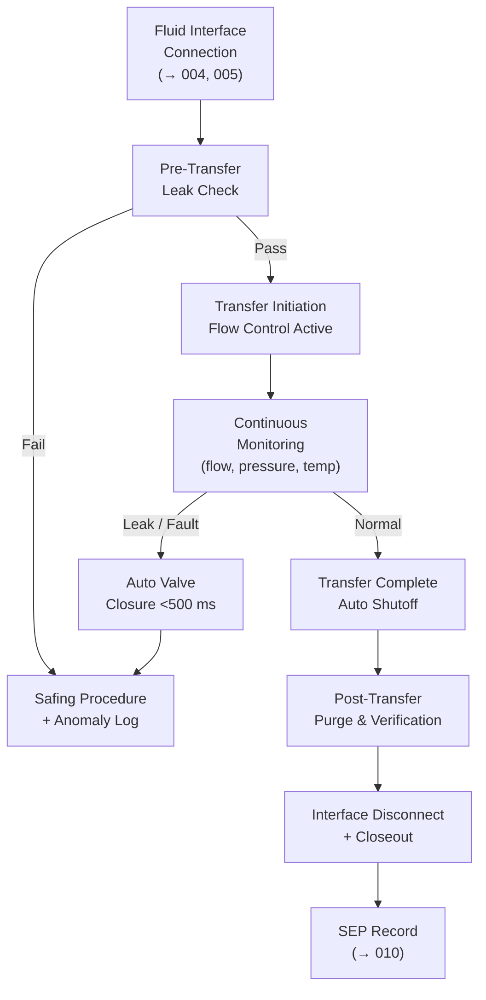

# STA 170-179 · Section 07 · Subsection 170 · Subsubject 006 — Refueling, Recharging and Consumables Replenishment

## 1. Purpose

Defines propellant transfer architectures, fluid coupling interface standards, electrical recharging interfaces, consumables replenishment procedures, safing and emergency procedures, and verification requirements for on-orbit refueling and consumables replenishment missions within the Q+ATLANTIDE STA-band[^baseline].

## 2. Scope

- **Propellant transfer architectures** — Two primary transfer architectures are defined: *Pressure-fed transfer*: servicer provides regulated pressurant (GHe or GN2) to drive propellant from servicer tank through fluid coupling into client tank; applicable for storable bipropellants (MMH/NTO, hydrazine); transfer flow rate controlled by servicer-side regulator; client tank pressure monitored continuously; *Pump-fed transfer*: motorized pump on servicer side for viscous propellants or low-pressure scenarios; variable flow rate with feedback control; applicable for green propellants with higher viscosity. For both architectures: electrostatic hazard management during propellant transfer — ground bonding between servicer and client at capture; propellant compatibility verification required before transfer initiation: chemical analysis of residual propellant sample from client if heritage propellant type uncertain; mass measurement pre- and post-transfer using pressure/volume/temperature (PVT) method with ≤1% accuracy.

- **Fluid coupling interface standards** — Three fluid coupling interface standards applicable within STA `170`: *Probe-and-drogue interface*: for storable propellants (hydrazine, MMH, NTO); probe diameter 12.7 mm (0.5 inch) standard; sealing via PTFE poppet valve on drogue side; servicer probe actuated by robotic end-effector (→`005`[^oos005]); *Quick-disconnect fluid coupling*: for low-toxicity monopropellants and green propellants; push-to-connect, pull-to-release; face-seal design; *Cryogenic fluid coupling*: for LH2/LOX applications; additional thermal insulation jacket; vent provisions for boiloff management; cryogenic-compatible seals and actuators. All interfaces: leak detection — inline flow sensors and pressure sensors on both servicer and client sides; threshold: >0.01 cc/s triggers alert; >0.1 cc/s triggers automatic valve closure within 500 ms; safing sequence on leak detection documented in mission ICD.

- **Electrical recharging interfaces** — Power cable interface standards: connector type per mission ICD — minimum 4-wire power plus ground bonding wire; current/voltage ratings: 28 VDC (nominal) or 120 VDC (high-voltage) per client spacecraft heritage; maximum current: 100 A per connector (28 V), 30 A per connector (120 V); recharging current profile: constant current phase until 80% state-of-charge, constant voltage phase until full charge, with thermal monitoring throughout; battery state-of-health assessment pre-recharge (capacity, impedance) and post-recharge (delta-SOC verification); solar array connection interfaces for array extension servicing: mechanical latch plus power and data connectors; power system isolation requirements: servicer electrical power system isolated from client during battery recharging initial phase to prevent ground loops.

- **Consumables replenishment** — Additional consumable types covered beyond propellant: *Pressurant gas transfer*: GHe or GN2 fill interface; high-pressure fill coupling (up to 350 bar); pressure regulator on servicer side; fill quantity by pressure measurement per ideal gas law; *Water for life support* (for crewed client spacecraft): food-grade water transfer coupling; bacterial filter on servicer line; quantity by mass flow meter; *Lubricant replenishment* for rotating mechanisms (reaction wheels, solar array drives): grease injection interface; quantity by volume dispense; contamination control measures; *Consumable quantity verification*: pre-transfer quantity log from both servicer and client tank measurements; post-transfer verification by mass balance and PVT measurement; discrepancy >2% triggers anomaly investigation; contamination control: propellant and consumable lines purged with compatible gas before connection to prevent contamination.

- **Safing and emergency procedures** — Automatic valve closure triggers: leak detection above threshold, loss of communication during transfer, servicer attitude exceedance, transfer completion (automatic flow shutoff); vent path design: safe release of overpressure via dedicated vent line pointed away from both spacecraft in direction of flight path least impact; emergency disconnect procedure: servicer robotic arm withdrawal from fluid interface without propellant contamination — probe retracted, drogue poppet closes automatically, servicer-side valve closes simultaneously; post-transfer purge sequence: inert gas purge of transfer lines before retraction; safing verification checklist completed and logged before approach to next proximity operations zone per `003`[^oos003].

- **Verification and evidence requirements** — Pre-transfer leak check: pressurize fluid coupling to 1.5× transfer pressure, hold for 60 s, verify zero leak rate; transfer quantity log: continuous logging of flow rate, pressure, temperature with 1 Hz minimum update rate and timestamp; post-transfer interface integrity verification: visual inspection via robotic camera, leak sensor zero check after disconnect; fuel system closeout inspection: all valves closed status verified via telemetry; all transfer events recorded in Servicing Evidence Package (SEP) per `010`[^oos010] with: transfer type, start/end times, pre/post quantities, anomaly record, operator sign-off.

## 3. Diagram

## 4. Footprint

| Metric | Value |
|---|---|
| Architecture | `STA` — Space Technology Architecture |
| Master range | `100–199` |
| Code range | `170-179` |
| Section | `07` — Operaciones y Mantenimiento en Órbita |
| Subsection | `170` — Servicing Orbital |
| Subsubject | `006` — Refueling, Recharging and Consumables Replenishment |
| Primary Q-Division | Q-SPACE[^qdiv] |
| ORB support | ORB-LEG |
| Governance class | `baseline`[^gov] |
| Document | `006_Refueling-Recharging-and-Consumables-Replenishment.md` (this file) |
| Parent subsection | [`README.md`](./README.md) · [`000_Overview.md`](./000_Overview.md) |

## 5. References & Citations

[^baseline]: **Q+ATLANTIDE controlled baseline (v1.0.0)** — [`organization/Q+ATLANTIDE.md`](../../../../organization/Q+ATLANTIDE.md).

[^oos003]: **STA 170.003** — Rendezvous, Proximity and Servicing Boundaries — [`003_Rendezvous-Proximity-and-Servicing-Boundaries.md`](./003_Rendezvous-Proximity-and-Servicing-Boundaries.md).

[^oos005]: **STA 170.005** — Robotic Servicing and Manipulation Functions — [`005_Robotic-Servicing-and-Manipulation-Functions.md`](./005_Robotic-Servicing-and-Manipulation-Functions.md).

[^oos010]: **STA 170.010** — Traceability, Evidence and Lifecycle Governance — [`010_Traceability-Evidence-and-Lifecycle-Governance.md`](./010_Traceability-Evidence-and-Lifecycle-Governance.md).

[^ecss7011]: **ECSS-E-ST-70-11C** — *Space Engineering: Space segment operability* (ECSS, 2008).

[^iso17770]: **ISO 17770:2019** — *Space systems — Space docking interfaces* (ISO).

[^ecss1003]: **ECSS-E-ST-10-03C** — *Space Engineering: Testing* (ECSS, 2012).

[^nasastd3000]: **NASA-STD-3000** — *Human Integration Design Requirements* (NASA).

[^qdiv]: **Q-Division authority** — [`organization/Q-Divisions/`](../../../../organization/Q-Divisions/).

[^gov]: **Governance class** — `baseline` denotes documents under controlled change management within the Q+ATLANTIDE baseline.
