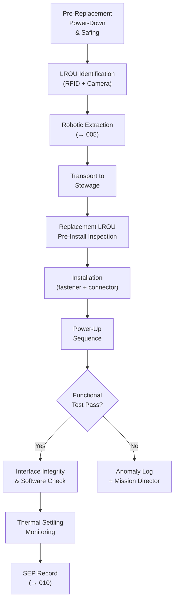

# STA 170-179 · Section 07 · Subsection 170 · Subsubject 007 — Modular Replacement and Line-Replaceable Orbital Units

## 1. Purpose

Establishes LROU taxonomy and design requirements, modular interface standards, replacement sequence control, stowage and waste management, post-replacement verification requirements, and heritage and reliability requirements for on-orbit modular replacement operations within the Q+ATLANTIDE STA-band[^baseline].

## 2. Scope

- **LROU taxonomy and design requirements** — Four LROU classes are defined based on interface type and handling requirements: *Class 1 — Electronic/Avionics Units*: connector-based mechanical interfaces (D-sub, SpaceWire, MIL-STD-1553 connectors); ESD-sensitive handling required; mass range typically 0.5–20 kg; replacement time goal ≤30 min by robotic arm; design requirement: tool-free connector interface preferred; keyed connectors to prevent mis-mating; positive retention mechanism; *Class 2 — Structural Panels and Thermal Radiators*: mechanical fastener interfaces (4-bolt minimum, standardized pattern); torque-limited fastener design for robotic installation (target torque ≤5 N·m); mass range typically 5–100 kg; thermal interface material (TIM) co-installed with LROU; *Class 3 — Propulsion Components*: fluid and electrical interfaces per `006`[^oos006]; hazardous materials handling protocol (propellant residuals); launch lock required; mass range 1–50 kg; replacement requires safing of affected propulsion branch before extraction; *Class 4 — Payload Instruments*: precision alignment requirements (mounting interface ±0.1 mm, ±0.01°); optical cleanliness Class 100 handling environment; post-installation alignment verification required; mass range 1–200 kg. Each LROU class has a design requirements document (DRD) with mass, dimensions, interface drawings, handling requirements, and replacement time budget.

- **Modular interface standards** — Mechanical interface: standardized bolt pattern and torque specification per LROU class (Class 1: M4 fasteners; Class 2: M8 fasteners; Class 3: AN fittings + M6 structural; Class 4: mission-specific precision mount); electrical interface: standardized connector pinout (Class 1: 9-pin D-sub standard + SpaceWire as required); keying and strain relief per connector standard; retention force per connector rated for launch vibration and on-orbit thermal cycling; data interface: MIL-STD-1553B (heritage avionics) or SpaceWire ECSS-E-ST-50-12C (new design) as specified in spacecraft data system ICD; thermal interface: thermal pad contact area, compression force range, and thermal resistance per thermal analysis; interface control drawing (ICD drawing) required for each LROU type and version-controlled under spacecraft CCB.

- **Replacement sequence control** — Formal replacement procedure steps: (1) *Pre-replacement*: identify LROU by barcode/RFID scan; verify replacement LROU compatibility by software check against manifest; client spacecraft power-down sequence for affected LROU branch (avionics: power off and isolate; propulsion: close isolation valve and vent); (2) *LROU extraction*: robotic arm (→`005`[^oos005]) approach to LROU; connector disconnect sequence (data first, then power, then fluid if applicable); fastener removal in reverse cross-tightening sequence; LROU extraction at ≤0.01 m/s tip speed; (3) *LROU transport*: from client interface to servicer stowage via pre-planned collision-free path at ≤0.05 m/s; F/T monitoring throughout transport; (4) *Replacement LROU installation*: pre-installation inspection via robotic camera; fastener engagement and torque to specification in cross-tightening sequence; connector mating in sequence (fluid first, then power, then data); retention verification for each connector; (5) *Post-replacement*: power-up sequence and functional verification within 30 min. Sequence deviations require mission director approval and are logged in the SEP.

- **Stowage and waste management** — Extracted (old) LROU stowage: dedicated servicer stowage interface with latch and RFID identification; stowage configuration verified post-stowage before next operation; mass balance update: servicer mass properties updated after LROU extraction and replacement LROU installation; mass property error ≤0.5% requirement for proximity operations safety; waste LROU disposal options: (a) retained on servicer for atmospheric reentry at servicer end-of-life; (b) transferred to dedicated deorbit vehicle if available; (c) for hazardous LROUs (Class 3): retained on servicer — no venting; stowage constraint: LROU stowage mass and volume budget is a mission design constraint; budget defined in mission class planning (→`002`[^oos002]).

- **Post-replacement verification** — Verification sequence: (1) *Functional test*: LROU basic function verification within 30 min of power-up; test stimuli per LROU class test procedure; pass/fail criteria pre-defined; (2) *Interface integrity*: mechanical retention verified by torque check or positive pull test; electrical continuity by automated connector test; fluid leak check for Class 3 LROUs per `006`[^oos006]; (3) *Software compatibility*: for Class 1 avionics LROUs — software version compatibility check; ground patch upload if required; software acceptance test execution; (4) *Thermal settling monitoring*: for thermal interface LROUs — temperature telemetry monitored for 30 min post-installation for evidence of proper thermal contact; (5) *System-level check*: client spacecraft subsystem checkout to verify no unexpected interactions from replacement. All verification results recorded in the Servicing Evidence Package (SEP) per `010`[^oos010].

- **Heritage and reliability** — LROU failure mode effects analysis (FMEA): required for each LROU class at design phase; criticality classification: criticality 1 (loss of mission), criticality 2 (loss of redundancy), criticality 3 (minor degradation); replacement frequency prediction from heritage database and manufacturer life data; design for replaceability requirements: minimum replacement time by robotic arm, no-tools interface preferred for Class 1, self-guiding interface features preferred; replacement training requirements: all robotic servicing crew certified on LROU replacement procedure; rehearsal in representative ground hardware before mission; heritage data contribution: each replacement event contributes data to heritage database including: installation torque values, alignment measurements, functional test results, time-on-orbit before removal.

## 3. Diagram

## 4. Footprint

| Metric | Value |
|---|---|
| Architecture | `STA` — Space Technology Architecture |
| Master range | `100–199` |
| Code range | `170-179` |
| Section | `07` — Operaciones y Mantenimiento en Órbita |
| Subsection | `170` — Servicing Orbital |
| Subsubject | `007` — Modular Replacement and Line-Replaceable Orbital Units |
| Primary Q-Division | Q-SPACE[^qdiv] |
| ORB support | ORB-LEG |
| Governance class | `baseline`[^gov] |
| Document | `007_Modular-Replacement-and-Line-Replaceable-Orbital-Units.md` (this file) |
| Parent subsection | [`README.md`](./README.md) · [`000_Overview.md`](./000_Overview.md) |

## 5. References & Citations

[^baseline]: **Q+ATLANTIDE controlled baseline (v1.0.0)** — [`organization/Q+ATLANTIDE.md`](../../../../organization/Q+ATLANTIDE.md).

[^oos002]: **STA 170.002** — Servicing Mission Classes and Objectives — [`002_Servicing-Mission-Classes-and-Objectives.md`](./002_Servicing-Mission-Classes-and-Objectives.md).

[^oos005]: **STA 170.005** — Robotic Servicing and Manipulation Functions — [`005_Robotic-Servicing-and-Manipulation-Functions.md`](./005_Robotic-Servicing-and-Manipulation-Functions.md).

[^oos006]: **STA 170.006** — Refueling, Recharging and Consumables Replenishment — [`006_Refueling-Recharging-and-Consumables-Replenishment.md`](./006_Refueling-Recharging-and-Consumables-Replenishment.md).

[^oos010]: **STA 170.010** — Traceability, Evidence and Lifecycle Governance — [`010_Traceability-Evidence-and-Lifecycle-Governance.md`](./010_Traceability-Evidence-and-Lifecycle-Governance.md).

[^ecss7011]: **ECSS-E-ST-70-11C** — *Space Engineering: Space segment operability* (ECSS, 2008).

[^ecss1003]: **ECSS-E-ST-10-03C** — *Space Engineering: Testing* (ECSS, 2012).

[^iso17770]: **ISO 17770:2019** — *Space systems — Space docking interfaces* (ISO).

[^nasastd3000]: **NASA-STD-3000** — *Human Integration Design Requirements* (NASA).

[^qdiv]: **Q-Division authority** — [`organization/Q-Divisions/`](../../../../organization/Q-Divisions/).

[^gov]: **Governance class** — `baseline` denotes documents under controlled change management within the Q+ATLANTIDE baseline.
