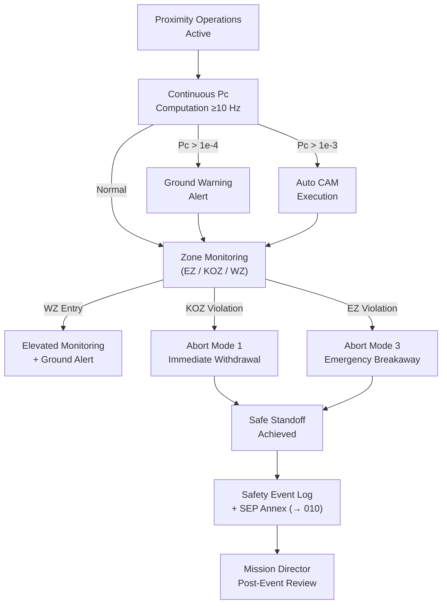

# STA 170-179 · Section 07 · Subsection 170 · Subsubject 008 — Servicing Safety Zones and Fault Containment

## 1. Purpose

Defines operational safety zones, collision avoidance architecture, fault containment requirements, abort modes, residual risk management, and safety record requirements for on-orbit servicing operations within the Q+ATLANTIDE STA-band[^baseline]. This subsubject is the primary safety governance document for proximity operations within subsection `170`.

## 2. Scope

- **Operational safety zone definitions** — Three hierarchical safety zones are defined around the client spacecraft: *Exclusion Zone (EZ)*: volume where servicer shall never enter without explicit mission director authorization — defined by the client spacecraft structural envelope (worst-case deployed configuration including solar arrays, antennas) plus a safety margin of 2× maximum navigation uncertainty at the applicable zone; EZ dimensions specified in client spacecraft ICD; entry without authorization is a Category 1 safety violation; *Keep-Out Zone (KOZ)*: operational buffer zone surrounding the EZ where unplanned entry triggers automatic abort — KOZ outer boundary = EZ boundary plus additional margin driven by worst-case maneuver excursion on fault detection; KOZ violation during nominal operations triggers Abort Mode 1; *Warning Zone (WZ)*: outer monitoring boundary — servicer entry into WZ triggers elevated monitoring cadence (telemetry rate doubled), ground alert, and readiness confirmation for abort modes; WZ outer boundary typically 200 m from client center of mass (adjusted per mission geometry). All zone dimensions are derived from worst-case navigation error budget, maximum attitude excursion on attitude control fault, and structural clearance analysis per ECSS-E-ST-10-04C[^ecss1004].

- **Collision avoidance architecture** — Continuous collision probability (Pc) computation during all proximity operations phases: Pc computed onboard at ≥10 Hz using current relative state and covariance; collision avoidance maneuver (CAM) triggers: Pc > 1×10⁻⁴ — automatic warning to ground, no maneuver; Pc > 1×10⁻³ — automatic CAM execution; conjunction analysis: continuous monitoring of relative state extrapolated ≥60 s ahead; CAM authority: independent collision avoidance function resides in servicer flight computer (→STA `142`) with dedicated processor and independent sensor input; ground inhibit of CAM: ground can inhibit CAM only with positive confirmation of false alarm via alternative sensor data and mission director sign-off; CAM design: pre-computed CAMs for each proximity zone are stored onboard and selected based on current zone and geometry.

- **Fault containment requirements** — Single-fault tolerance (SFT) requirement applies to all safety-critical servicing systems: (a) proximity operations navigation sensors: primary/backup sensor with cross-check; (b) capture mechanisms and retention systems; (c) attitude control system during proximity operations; (d) communication system for ground monitoring. Fault containment zone definition: each identified fault shall not propagate beyond its defined functional boundary — a fault in the capture mechanism shall not affect the attitude control system; isolation valves prevent fault propagation in fluid systems; circuit breakers prevent electrical fault propagation. Common-cause failure (CCF) analysis: required for all redundant safety systems — CCF analysis shall demonstrate independence of redundant channels; CCF mitigations: diverse sensors, independent power supplies, physical separation. Hazard analysis per ECSS-E-ST-10-04C covering all servicing phases (approach, proximity, capture, servicing, separation) is mandatory and reviewed at CDR.

- **Abort modes** — Four abort modes are formally defined and pre-computed before each proximity operations phase: *Abort Mode 1 — Immediate Withdrawal*: servicer executes pre-computed withdrawal trajectory to safe standoff distance (>200 m); triggered by: KOZ violation, navigation solution loss, attitude control fault, mission director command; execution: thrust-optimized trajectory computed for current position; maneuver execution within 10 s of trigger; *Abort Mode 2 — Hold and Assess*: servicer halts at current position, attitude hold, pending ground assessment; triggered by: discretionary ground command, minor anomaly not warranting withdrawal; duration: maximum 30 min hold before fuel budget requires action; *Abort Mode 3 — Emergency Breakaway*: maximum thrust withdrawal along pre-computed emergency trajectory on detection of imminent collision or major system failure; triggered by: Pc > 1×10⁻², multiple simultaneous faults, loss of attitude control; *Abort Mode 4 — Safe Mode Hold at Standoff*: servicer transitions to safe mode at far standoff (>500 m) pending full system health recovery; triggered by: major onboard computer fault, multiple subsystem faults. Abort mode selection authority: Modes 1 and 3 executed automatically on trigger conditions; Mode 2 ground-commanded; Mode 4 automatic on safe mode entry. All abort modes are verified in rendezvous simulation and hardware-in-the-loop (HIL) testing before mission operations.

- **Residual risk management** — Residual collision probability after abort execution: design target ≤1×10⁻⁵ per abort event; residual risk register: maintained throughout mission lifecycle; risk entries include: scenario description, Pc estimate, controls in place, residual risk rating, acceptance authority; formal risk acceptance: written acceptance by mission director required before each proximity phase; risk register updated after each servicing event and after any anomaly; long-duration proximity operations (>4 hours): mandatory risk register review before continuation; residual risk delta: change in risk level from pre-mission estimate to as-flown shall be formally assessed and reported in post-mission report.

- **Safety record and evidence** — Servicing Safety Log: maintained in real time during all proximity operations; entries include: all proximity zone transitions (with timestamp, operator, navigation state), all fault detections and fault responses, all KOZ and EZ events, all abort mode activations, all CAM executions; post-mission safety review: conducted within 7 days of servicing mission completion; any safety zone exceedance or fault event is reviewed against hazard analysis predictions; safety evidence package (SEP Safety Annex): compiled as part of the Servicing Evidence Package per `010`[^oos010]; non-conformances (safety zone violations, untriggered CAM failure, single-fault tolerance failure) are formally dispositioned (waiver or corrective action) before next servicing event.

## 3. Diagram

## 4. Footprint

| Metric | Value |
|---|---|
| Architecture | `STA` — Space Technology Architecture |
| Master range | `100–199` |
| Code range | `170-179` |
| Section | `07` — Operaciones y Mantenimiento en Órbita |
| Subsection | `170` — Servicing Orbital |
| Subsubject | `008` — Servicing Safety Zones and Fault Containment |
| Primary Q-Division | Q-SPACE[^qdiv] |
| ORB support | ORB-LEG |
| Governance class | `baseline`[^gov] |
| Document | `008_Servicing-Safety-Zones-and-Fault-Containment.md` (this file) |
| Parent subsection | [`README.md`](./README.md) · [`000_Overview.md`](./000_Overview.md) |

## 5. References & Citations

[^baseline]: **Q+ATLANTIDE controlled baseline (v1.0.0)** — [`organization/Q+ATLANTIDE.md`](../../../../organization/Q+ATLANTIDE.md).

[^oos010]: **STA 170.010** — Traceability, Evidence and Lifecycle Governance — [`010_Traceability-Evidence-and-Lifecycle-Governance.md`](./010_Traceability-Evidence-and-Lifecycle-Governance.md).

[^ecss7011]: **ECSS-E-ST-70-11C** — *Space Engineering: Space segment operability* (ECSS, 2008).

[^ecss1004]: **ECSS-E-ST-10-04C** — *Space Engineering: Hazard analysis* (ECSS, 2019).

[^ccsds5202]: **CCSDS 520.2-G-3** — *Rendezvous and Proximity Operations* (CCSDS, 2014).

[^iso17770]: **ISO 17770:2019** — *Space systems — Space docking interfaces* (ISO).

[^nasastd3000]: **NASA-STD-3000** — *Human Integration Design Requirements* (NASA).

[^qdiv]: **Q-Division authority** — [`organization/Q-Divisions/`](../../../../organization/Q-Divisions/).

[^gov]: **Governance class** — `baseline` denotes documents under controlled change management within the Q+ATLANTIDE baseline.
