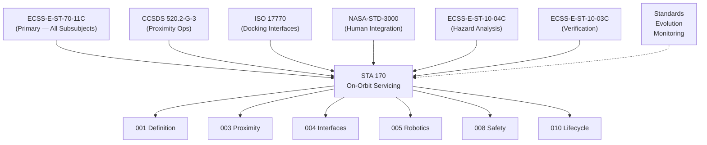

# STA 170-179 · Section 07 · Subsection 170 · Subsubject 009 — ECSS-NASA-CCSDS On-Orbit Servicing Standards Mapping

## 1. Purpose

Maps the applicable ECSS, NASA, CCSDS, and ISO standards to the on-orbit servicing functional areas within STA `170`, establishing the normative standards hierarchy for Q+ATLANTIDE STA-band on-orbit servicing[^baseline]. This subsubject is the authoritative standards traceability document for subsection `170` and governs standards applicability across all subsubjects `001`–`010`.

## 2. Scope

- **ECSS applicable standards** — Primary and supporting ECSS standards applicable to STA `170`: *ECSS-E-ST-70-11C Space segment operability* (2008): primary standard for on-orbit servicing operability requirements — applicable to all STA `170` subsubjects; governs servicing mission definition (`001`), mission classes (`002`), proximity operations (`003`), interfaces (`004`), robotics (`005`), consumables (`006`), LROU (`007`), safety (`008`), and lifecycle (`010`); *ECSS-E-ST-10-03C Verification by test* (2012): V&V methodology for all servicing hardware and software systems — applicable to `004`, `005`, `006`, `007`, `008`; *ECSS-E-ST-10-04C Hazard analysis* (2019): safety analysis methodology for proximity operations and all physical contact phases — applicable to `003`, `004`, `008`; *ECSS-Q-ST-70C Materials and processes* (2008): materials compatibility for servicing interfaces and fluid handling — applicable to `006`, `007`; *ECSS-E-ST-10-02C Verification* (2009): general verification methodology and verification matrix structure — applicable to `010`; *ECSS-Q-ST-80C Software product assurance* (2021): software quality and assurance for robotic servicing onboard software — applicable to `005`.

- **NASA applicable standards** — *NASA-STD-3000 Human Integration Design Requirements* (current edition): applicable for all crewed servicing missions (Class A/B/C/D where crew is involved) — covers EVA interfaces, crew workstation design, habitability, crew equipment handling; applicable to `004`, `005`, `007`; *NASA-NPR-7120.5 Space Systems Development* (current edition): servicing mission development lifecycle requirements — applicable to `002`, `010`; *NASA-HDBK-7121 Spacecraft Design and Test Requirements Handbook*: design requirements applicable to servicer spacecraft structural and mechanism design — applicable to `004`, `007`; *NASA-STD-5009 Fracture Control Requirements for Spaceflight Hardware*: structural fracture control for all servicing hardware subject to crew proximity or pressure boundary — applicable to `004`, `006`; *NASA-STD-8739 Workmanship Standards Series*: applicable to LROU assembly, connector mating, and fluid coupling installation — applicable to `006`, `007`.

- **CCSDS applicable standards** — *CCSDS 520.2-G-3 Rendezvous and Proximity Operations* (2014): normative standard for proximity operations data exchange and communication protocols — primary applicability to `003`, `004`; *CCSDS 508.0-B-1 Spacecraft Onboard Interface Services* (2010): onboard interface architecture for servicing data exchange between servicer and client — applicable to `004`, `005`; *CCSDS 131.0-B-3 TM Space Data Link Protocol* (2015): telemetry downlink protocol for servicing operations data — applicable to `005`, `010`; *CCSDS 232.0-B-4 TC Space Data Link Protocol* (2010): uplink command protocol for robotic servicing commands — applicable to `005`.

- **Standards applicability matrix** — Mapping of key standards to applicable STA `170` subsubjects:

  | Standard | 001 | 002 | 003 | 004 | 005 | 006 | 007 | 008 | 009 | 010 |
  |---|:---:|:---:|:---:|:---:|:---:|:---:|:---:|:---:|:---:|:---:|
  | ECSS-E-ST-70-11C | ● | ● | ● | ● | ● | ● | ● | ● | ● | ● |
  | ECSS-E-ST-10-03C | ○ | ○ | ○ | ● | ● | ● | ● | ● | ○ | ● |
  | ECSS-E-ST-10-04C | ● | ○ | ● | ● | ○ | ○ | ○ | ● | ○ | ● |
  | ECSS-E-ST-10-02C | ○ | ○ | ○ | ○ | ○ | ○ | ○ | ○ | ○ | ● |
  | ECSS-Q-ST-80C | ○ | ○ | ○ | ○ | ● | ○ | ○ | ○ | ○ | ● |
  | CCSDS 520.2-G-3 | ● | ● | ● | ● | ○ | ○ | ○ | ● | ○ | ○ |
  | ISO 17770 | ● | ○ | ● | ● | ○ | ● | ○ | ○ | ○ | ○ |
  | NASA-STD-3000 | ○ | ● | ● | ● | ● | ● | ● | ● | ○ | ● |
  | NASA-STD-5009 | ○ | ○ | ○ | ● | ○ | ● | ○ | ○ | ○ | ○ |

  ● = primary applicability; ○ = secondary/tailored applicability. Deviations and waivers from any standard clause are documented in the Standards Deviations Register, version-controlled under the project CCB.

- **Standards evolution monitoring** — On-orbit servicing is an actively developing standards domain. Monitoring responsibilities within Q+ATLANTIDE: *ECSS working groups*: ECSS/WG-70 (Space segment operability) update monitoring — Q-DATAGOV responsibility; new editions trigger formal baseline impact assessment; *ISO TC20/SC14*: ISO 17770 (space docking) evolution and new OOS-related standards — Q-SPACE primary responsibility; *CCSDS working groups*: proximity operations and onboard interface services evolution — Q-HPC responsibility; *Emerging standards*: NASA on-orbit servicing standards development (OSAM-1 program lessons learned capture); commercial on-orbit servicing standards (AIT, Astroscale, Northrop Grumman heritage documentation); Q+ATLANTIDE baseline update process is triggered on issuance of new standards directly applicable to STA `170` — formal change request required, reviewed at next baseline update board.

## 3. Diagram

## 4. Footprint

| Metric | Value |
|---|---|
| Architecture | `STA` — Space Technology Architecture |
| Master range | `100–199` |
| Code range | `170-179` |
| Section | `07` — Operaciones y Mantenimiento en Órbita |
| Subsection | `170` — Servicing Orbital |
| Subsubject | `009` — ECSS-NASA-CCSDS On-Orbit Servicing Standards Mapping |
| Primary Q-Division | Q-SPACE[^qdiv] |
| ORB support | ORB-LEG |
| Governance class | `baseline`[^gov] |
| Document | `009_ECSS-NASA-CCSDS-On-Orbit-Servicing-Standards-Mapping.md` (this file) |
| Parent subsection | [`README.md`](./README.md) · [`000_Overview.md`](./000_Overview.md) |

## 5. References & Citations

[^baseline]: **Q+ATLANTIDE controlled baseline (v1.0.0)** — [`organization/Q+ATLANTIDE.md`](../../../../organization/Q+ATLANTIDE.md).

[^ecss7011]: **ECSS-E-ST-70-11C** — *Space Engineering: Space segment operability* (ECSS, 2008).

[^ecss1003]: **ECSS-E-ST-10-03C** — *Space Engineering: Testing* (ECSS, 2012).

[^ecss1004]: **ECSS-E-ST-10-04C** — *Space Engineering: Hazard analysis* (ECSS, 2019).

[^ecss1002]: **ECSS-E-ST-10-02C** — *Space Engineering: Verification* (ECSS, 2009).

[^ecssq70]: **ECSS-Q-ST-70C** — *Space product assurance: Materials, mechanical parts and processes* (ECSS, 2008).

[^ecssq80]: **ECSS-Q-ST-80C** — *Space product assurance: Software product assurance* (ECSS, 2021).

[^ccsds5202]: **CCSDS 520.2-G-3** — *Rendezvous and Proximity Operations* (CCSDS, 2014).

[^ccsds5080]: **CCSDS 508.0-B-1** — *Spacecraft Onboard Interface Services* (CCSDS, 2010).

[^ccsds1310]: **CCSDS 131.0-B-3** — *TM Space Data Link Protocol* (CCSDS, 2015).

[^iso17770]: **ISO 17770:2019** — *Space systems — Space docking interfaces* (ISO).

[^nasastd3000]: **NASA-STD-3000** — *Human Integration Design Requirements* (NASA).

[^nasastd5009]: **NASA-STD-5009** — *Fracture Control Requirements for Spaceflight Hardware* (NASA).

[^qdiv]: **Q-Division authority** — [`organization/Q-Divisions/`](../../../../organization/Q-Divisions/).

[^gov]: **Governance class** — `baseline` denotes documents under controlled change management within the Q+ATLANTIDE baseline.
