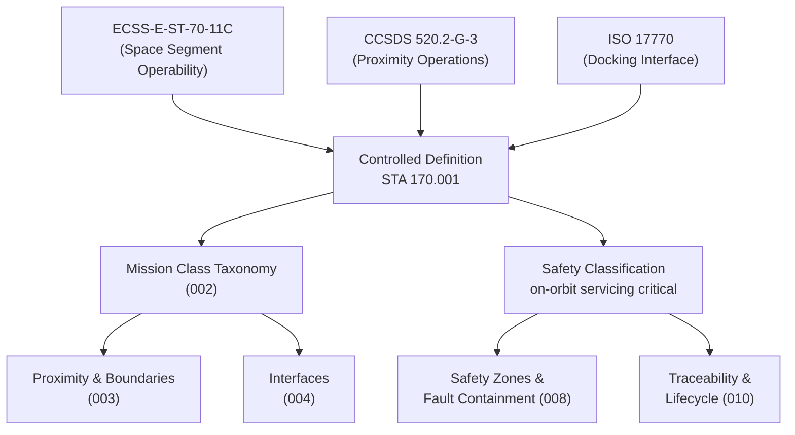

# STA 170-179 · 170-010 — On Orbit Servicing Controlled Definition

## 1. Purpose

Establishes the normative definition and controlled scope of On-Orbit Servicing (OOS) within the Q+ATLANTIDE STA band[^baseline], per ECSS-E-ST-70-11C[^ecss7011] and CCSDS 520.2-G-3[^ccsds5202]. This subsubject defines the authoritative vocabulary, safety classification taxonomy, and applicability limits that govern all subsequent subsubjects `002`–`010` in subsection `170`.

## 2. Scope

- **Controlled definition** — On-Orbit Servicing (OOS) is defined within Q+ATLANTIDE STA `170` as all spacecraft operations that enable or execute physical interaction with an orbital asset after launch, including: in-orbit inspection, servicing, repair, refueling, capability upgrade, modular assembly, and disposal/deorbit assistance. The definition aligns with ECSS-E-ST-70-11C §4 and CCSDS 520.2-G-3 §2 terminology. Remote monitoring, telemetry, and command operations without physical contact are explicitly excluded from the OOS definition and governed under STA `143` (Control de Misión).

- **Applicability boundary** — STA `170` covers servicing mission architecture: proximity operations governance, physical interface design, robotic servicing, consumables replenishment, modular replacement, safety zones, standards mapping, and lifecycle governance. The following topics are explicitly out-of-scope for STA `170` and governed by dedicated STA nodes: GNC algorithms and navigation filters → STA `140`; avionics hardware → STA `141`; flight software design → STA `142`; ground mission control systems and procedures → STA `143`; autonomous onboard decision systems → STA `144`; in-orbit inspection techniques → STA `171`; on-orbit repair → STA `172`; on-orbit assembly → STA `173`.

- **Servicing mission taxonomy** — Five canonical servicing mission classes are defined within this controlled definition: (A) Scheduled Preventive Servicing — planned periodic refueling, consumables replenishment, and LRU exchange per maintenance plan; (B) Contingency Servicing — unplanned response to in-orbit anomaly or subsystem failure; (C) Life-Extension Servicing — propellant top-up and component replacement to extend operational life beyond original design life; (D) Capability Upgrade Servicing — replacement or addition of payload modules, avionics, or instruments; (E) Disposal Assistance — controlled deorbit support or graveyard orbit relocation. Each class has distinct mission authorization requirements, proximity operations profiles, and evidence requirements as defined in `002`.

- **Controlled vocabulary** — The following terms are formally controlled within STA `170`: *Servicer Spacecraft* (the spacecraft performing the servicing function); *Client Spacecraft* (the orbital asset receiving servicing); *Proximity Operations Zone* (defined spatial volume around the client spacecraft with specific operational constraints); *Capture Interface* (the mechanical interface enabling physical connection between servicer and client); *Line-Replaceable Orbital Unit* (LROU — a modular hardware unit designed for on-orbit replacement); *Servicing Evidence Package* (SEP — the complete documentation record of a servicing event); *Mission Authorization Record* (MAR — the formal authorization document for a proximity operations phase). All terms derive from ECSS-E-ST-70-11C and ISO 17770[^iso17770] where applicable.

- **Safety classification** — On-orbit servicing is classified as *on-orbit servicing critical* within the Q+ATLANTIDE safety framework. This classification requires: (1) explicit proximity-operations governance plan before operations begin; (2) capture/docking interface control documents at CDR; (3) robotics safety boundary analysis per ECSS-E-ST-10-04C[^ecss1004]; (4) fault containment design for all safety-critical systems; (5) formal Mission Authorization Record signed before each proximity phase; (6) Servicing Evidence Package compiled within 72 hours of servicing completion; (7) lifecycle traceability matrix maintained from requirements through end of life. Safety classification is inherited by all subsubjects `002`–`010`.

- **Standards normative hierarchy** — The normative standards hierarchy for STA `170` controlled definition is: ECSS-E-ST-70-11C (primary — space segment operability); CCSDS 520.2-G-3 (rendezvous and proximity operations); ISO 17770 (docking interface); ECSS-E-ST-10-03C[^ecss1003] (verification by test). Full standards mapping is elaborated in `009`.

## 3. Diagram

## 4. Footprint

| Metric | Value |
|---|---|
| Architecture | `STA` — Space Technology Architecture |
| Master range | `100–199` |
| Code range | `170-179` |
| Section | `07` — Operaciones y Mantenimiento en Órbita |
| Subsection | `170` — Servicing Orbital |
| Subsubject | `001` — On-Orbit Servicing Controlled Definition |
| Primary Q-Division | Q-SPACE[^qdiv] |
| ORB support | ORB-LEG |
| Governance class | `baseline`[^gov] |
| Document | `170-010-On-Orbit-Servicing-Controlled-Definition.md` (this file) |
| Parent subsection | [`README.md`](./README.md) · [`170-000-General.md`](./170-000-General.md) |

## 5. References & Citations

[^baseline]: **Q+ATLANTIDE controlled baseline (v1.0.0)** — [`organization/Q+ATLANTIDE.md`](../../../../organization/Q+ATLANTIDE.md).

[^ecss7011]: **ECSS-E-ST-70-11C** — *Space Engineering: Space segment operability* (European Cooperation for Space Standardization, 2008). Primary standard for on-orbit servicing operability requirements.

[^ccsds5202]: **CCSDS 520.2-G-3** — *Rendezvous and Proximity Operations* (CCSDS, 2014). Normative standard for proximity operations communication and data exchange.

[^iso17770]: **ISO 17770:2019** — *Space systems — Space docking interfaces* (International Organization for Standardization). Normative standard for docking interface geometry and loads.

[^ecss1004]: **ECSS-E-ST-10-04C** — *Space Engineering: Hazard analysis* (ECSS, 2019). Methodology for safety analysis of proximity operations and physical contact.

[^ecss1003]: **ECSS-E-ST-10-03C** — *Space Engineering: Testing* (ECSS, 2012). Verification by test methodology for servicing systems.

[^qdiv]: **Q-Division authority** — [`organization/Q-Divisions/`](../../../../organization/Q-Divisions/).

[^gov]: **Governance class** — `baseline` denotes documents under controlled change management within the Q+ATLANTIDE baseline.
