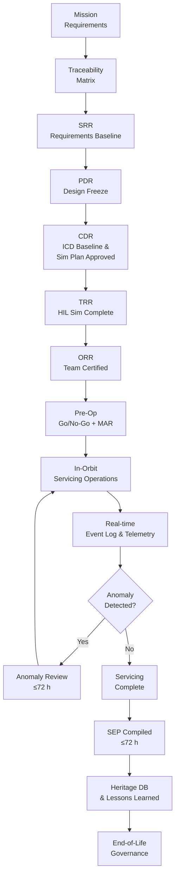

# STA 170-179 · 170-090 — Traceability Evidence and Lifecycle Governance

## 1. Purpose

Establishes servicing requirements traceability, evidence gates at lifecycle milestones, in-orbit servicing monitoring, and lifecycle configuration control for on-orbit servicing missions within the Q+ATLANTIDE STA-band[^baseline]. This subsubject is the lifecycle governance anchor for subsection `170` and governs the traceability chain from mission requirements through end-of-life for all STA `170` servicing activities.

## 2. Scope

- **Requirements traceability** — All servicing requirements shall be traced from four source categories: (1) mission requirements (derived from customer needs and mission objectives); (2) spacecraft system requirements (from servicer and client spacecraft system requirements documents); (3) safety requirements (from hazard analysis per ECSS-E-ST-10-04C[^ecss1004] and mission safety plan); (4) regulatory requirements (from applicable national and international space law, debris mitigation guidelines, frequency coordination). Traceability matrix structure: `requirement_ID → servicing_function_ID (001–010) → design_element_ID → test_case_ID → evidence_artefact_ID`; bidirectional traceability maintained throughout development (design-to-requirement and requirement-to-verification); traceability tool: requirements management tool under configuration control; deviations from requirements: formally registered as Deviations/Waivers in the requirements management tool with engineering justification, safety assessment, and approval authority; Mission Authorization Record (MAR) is linked to the traceability matrix as evidence that all pre-operation requirements have been verified.

- **Evidence gates** — Six formal evidence gates are defined for the on-orbit servicing mission lifecycle: *SRR (System Requirements Review)*: servicing requirements baselined and reviewed; servicing mission class determined per `002`[^oos002]; approach corridor preliminary design reviewed; safety classification confirmed as *on-orbit servicing critical*; *PDR (Preliminary Design Review)*: proximity operations zone design frozen per `003`[^oos003]; interface control documents (ICDs) at preliminary baseline; safety zone definitions approved per `008`[^oos008]; fault containment architecture verified at concept level; *CDR (Critical Design Review)*: all interface ICDs at final baseline; servicing sequence procedures approved and version-controlled; collision avoidance algorithm verification complete (analysis + simulation); HIL rendezvous simulation campaign plan reviewed; robotic servicing system qualification plan approved; *TRR (Test Readiness Review)*: HIL rendezvous simulation campaign complete with all abort modes demonstrated; all servicing hardware qualification tests complete; servicing evidence package (SEP) structure approved; pre-mission rehearsal simulation plan approved; *ORR (Operational Readiness Review)*: operational readiness verified through end-to-end rehearsal simulation; servicing team certification complete with all operators trained and qualified; Mission Authorization Record (MAR) at draft baseline pending pre-mission go/no-go; *Pre-Operation Go/No-Go*: final conjunction analysis clearance from Space Surveillance Network; servicer spacecraft all-system health check; client spacecraft operator final consent confirmation; Mission Director MAR sign-off; go/no-go poll documented in Servicing Event Record.

- **In-orbit servicing monitoring** — Real-time monitoring during servicing operations: *Servicing activity telemetry*: continuous reporting at ≥1 Hz of servicer state (position, velocity, attitude), proximity zone, manipulator state and F/T readings, interface states (docked/undocked, fluid valves, power connections); telemetry archived in mission data archive with ≤1 s timestamp resolution; *Servicing event log*: all discrete servicing events recorded with ISO 8601 timestamp, event type, operator ID, system state: proximity zone transitions, capture events, fluid transfer start/end, LROU extraction/installation events, abort mode activations; event log under configuration control; *Anomaly-triggered review*: any of the following triggers a formal review of servicing operations before continuation: safety zone exceedance, fault detection in safety-critical system, abort mode activation, MAR deviation; review timeline: minor anomaly review ≤24 h; major anomaly review ≤72 h; *Post-servicing evidence package*: SEP compiled within 72 h of servicing completion; SEP contents: mission summary, event log, telemetry summary, verification records, anomaly reports, lessons learned, safety annex (per `008`[^oos008]); SEP archived in heritage database.

- **Lifecycle configuration control** — Controlled configuration items (CCIs) for STA `170` servicing missions: (1) servicing procedures documents (all phases); (2) interface control documents (per interface); (3) proximity operations trajectory designs and approach corridor definitions; (4) fault containment logic and CAM parameters in flight software; (5) Mission Authorization Records; (6) Servicing Evidence Packages. Change control process: all CCIs managed under project CCB; change request → impact assessment → CCB review → approval/rejection → implementation → verification → closeout; in-orbit procedure update process for flight software patches: (a) ground simulation validation of updated procedure; (b) uplink file validation via checksums; (c) ground CCB approval; (d) in-orbit software upload during communication window; (e) on-orbit activation and confirmation; end-of-life governance: servicer spacecraft decommissioning review — controlled deorbit procedure review; interface heritage database contribution — final SEP with heritage data contributed to heritage database; lessons-learned capture via formal lessons-learned session — output feeds future mission PDR inputs; configuration baseline frozen at end-of-life for archival.

## 3. Diagram

## 4. Footprint

| Metric | Value |
|---|---|
| Architecture | `STA` — Space Technology Architecture |
| Master range | `100–199` |
| Code range | `170-179` |
| Section | `07` — Operaciones y Mantenimiento en Órbita |
| Subsection | `170` — Servicing Orbital |
| Subsubject | `010` — Traceability, Evidence and Lifecycle Governance |
| Primary Q-Division | Q-SPACE[^qdiv] |
| ORB support | ORB-LEG |
| Governance class | `baseline`[^gov] |
| Document | `170-090-Traceability-Evidence-and-Lifecycle-Governance.md` (this file) |
| Parent subsection | [`README.md`](./README.md) · [`170-000-General.md`](./170-000-General.md) |

## 5. References & Citations

[^baseline]: **Q+ATLANTIDE controlled baseline (v1.0.0)** — [`organization/Q+ATLANTIDE.md`](../../../../organization/Q+ATLANTIDE.md).

[^oos002]: **STA 170.002** — Servicing Mission Classes and Objectives — [`170-020-Servicing-Mission-Classes-and-Objectives.md`](./170-020-Servicing-Mission-Classes-and-Objectives.md).

[^oos003]: **STA 170.003** — Rendezvous, Proximity and Servicing Boundaries — [`170-030-Rendezvous-Proximity-and-Servicing-Boundaries.md`](./170-030-Rendezvous-Proximity-and-Servicing-Boundaries.md).

[^oos008]: **STA 170.008** — Servicing Safety Zones and Fault Containment — [`170-080-Servicing-Safety-Zones-and-Fault-Containment.md`](./170-080-Servicing-Safety-Zones-and-Fault-Containment.md).

[^ecss7011]: **ECSS-E-ST-70-11C** — *Space Engineering: Space segment operability* (ECSS, 2008).

[^ecss1002]: **ECSS-E-ST-10-02C** — *Space Engineering: Verification* (ECSS, 2009).

[^ecss1003]: **ECSS-E-ST-10-03C** — *Space Engineering: Testing* (ECSS, 2012).

[^ecss1004]: **ECSS-E-ST-10-04C** — *Space Engineering: Hazard analysis* (ECSS, 2019).

[^ecssq80]: **ECSS-Q-ST-80C** — *Space product assurance: Software product assurance* (ECSS, 2021).

[^ccsds5202]: **CCSDS 520.2-G-3** — *Rendezvous and Proximity Operations* (CCSDS, 2014).

[^qdiv]: **Q-Division authority** — [`organization/Q-Divisions/`](../../../../organization/Q-Divisions/).

[^gov]: **Governance class** — `baseline` denotes documents under controlled change management within the Q+ATLANTIDE baseline.
