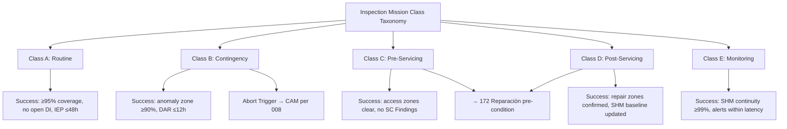

# STA 170-179 · Section 07 · Subsection 171.002 — Inspection Mission Classes and Objectives

## 1. Purpose

Defines the taxonomy of on-orbit inspection mission classes and their objectives, mission planning constraints, success criteria, and abort criteria within the Q+ATLANTIDE STA band[^baseline]. This document establishes the normative classification from which inspection campaigns are planned, authorised, and evaluated per ECSS-E-ST-10-09C[^ecss1009c], ECSS-E-ST-32C[^ecss32c], CCSDS 520.2-G-3[^ccsds5202], and NASA-HDBK-1001[^nasahdbk1001].

## 2. Scope

- **Class A — Routine Inspection:** Scheduled periodic assessment performed at defined mission lifecycle intervals (e.g., annually or following defined operational hours). Objectives: verify continued structural integrity, surface condition within acceptance limits, sensor calibration validity, and absence of cumulative degradation exceeding trend thresholds. Planning constraints: scheduled within standard operations windows; low approach priority relative to contingency missions; full fly-around coverage required. Success criteria: ≥95% target surface coverage at required resolution; no unresolved Damage Indications; calibrated data quality confirmed; Inspection Evidence Package compiled within 48 hours post-campaign.

- **Class B — Contingency Inspection:** Triggered by anomaly, impact event detection, telemetry-indicated performance degradation, or external hazard warning. Objectives: characterise and localise the anomaly, assess structural and functional integrity, determine safe operational envelope, and provide data to support repair admissibility decision (→`172`). Planning constraints: expedited execution within defined response time (≤24 hours for Safety-Critical triggers); partial coverage acceptable if focused on anomaly zone; communication window priority required. Success criteria: anomaly zone coverage ≥90% at maximum available resolution; Damage Assessment Record issued within 12 hours of data downlink; abort triggers defined per zone.

- **Class C — Pre-Servicing Inspection:** Performed immediately prior to a servicing, repair, or assembly campaign to characterise the current state of the target spacecraft and confirm servicing conditions. Objectives: verify target attitude and structural state compatible with approach; identify unexpected damage or protuberance changes; confirm docking/berthing interface integrity (if applicable). Planning constraints: must precede all STA 172 or STA 173 operations; coordination with servicing mission schedule; access corridor must be clear of debris. Success criteria: full surface coverage of servicing access zones; docking interface confirmed clear; no Safety-Critical Findings unresolved before servicing authorisation.

- **Class D — Post-Servicing/Repair Inspection:** Verification inspection performed following completion of a repair (→`172`) or servicing campaign to confirm outcome conformance. Objectives: confirm repair or servicing outcome against pre-defined acceptance criteria; verify no collateral damage introduced during servicing; validate structural health monitoring sensor network integrity after operations. Planning constraints: performed before departure of servicer; full coverage of repaired/serviced zones; Inspection Evidence Package must be compiled before mission close-out. Success criteria: all repaired zones inspected at required resolution; Damage Assessment Record confirms repair outcome; structural health monitoring baseline updated.

- **Class E — Monitoring:** Continuous or periodic health monitoring via embedded structural health monitoring sensors and/or remote inspection without full fly-around. Objectives: track structural, thermal, and radiation condition trends; detect early anomaly precursors; maintain a current health-state baseline. Planning constraints: continuous SHM data stream processed onboard; periodic remote sensing check-ins at defined intervals; no proximity manoeuvre required for sensor-only monitoring. Success criteria: SHM data continuity ≥99% per monitoring period; automated anomaly-triggered alerts within defined latency; trend data archived for Class A review.

- **Mission planning constraints, success criteria, abort criteria, and heritage:** All inspection mission planning shall account for: orbital lighting conditions (solar angle ≥15° for visual inspection); communication window alignment for supervisory mode operations; fuel budget for fly-around manoeuvres; inspection arc sequencing optimised for sensor coverage. Abort criteria common to all classes include: loss of relative navigation solution, target spacecraft unexpected attitude excursion >5°, inspector GNC anomaly, collision probability exceeding threshold per `008`. Lessons-learned from heritage inspection missions (e.g., HST servicing missions, ISS external inspection, XMM and Envisat ground-track-based external assessment) shall be maintained in the inspection heritage database accessible to inspection mission planners.

## 3. Diagram

## 4. Footprint

| Metric | Value |
|---|---|
| Architecture | `STA` — Space Technology Architecture |
| Master range | `100–199` |
| Code range | `170-179` |
| Section | `07` — Operaciones y Mantenimiento en Órbita |
| Subsection | `171` — Inspección en Órbita |
| Subsubject | `002` — Inspection Mission Classes and Objectives |
| Primary Q-Division | Q-SPACE[^qdiv] |
| Support Q-Divisions | Q-DATAGOV, Q-HPC, Q-HORIZON, Q-STRUCTURES, Q-INDUSTRY |
| ORB support | ORB-LEG |
| Governance class | `baseline`[^gov] |
| Safety boundary | on-orbit inspection critical |
| Document | `002_Inspection-Mission-Classes-and-Objectives.md` (this file) |
| Parent subsection | [`README.md`](./README.md) · [`000_Overview.md`](./000_Overview.md) |

## 5. References & Citations

[^baseline]: **Q+ATLANTIDE controlled baseline (v1.0.0)** — [`organization/Q+ATLANTIDE.md`](../../../../organization/Q+ATLANTIDE.md).

[^ecss1009c]: **ECSS-E-ST-10-09C** — *Structural and thermal models* (ESA/ECSS, 2011).

[^ecss32c]: **ECSS-E-ST-32C** — *Structural general requirements* (ESA/ECSS, 2008).

[^ccsds5202]: **CCSDS 520.2-G-3** — *Proximity-1 Space Link Protocol* (CCSDS, 2020).

[^nasahdbk1001]: **NASA-HDBK-1001** — *Structural design and test factors of safety for spaceflight hardware* (NASA, 2014).

[^qdiv]: **Q-Division authority** — [`organization/Q-Divisions/`](../../../../organization/Q-Divisions/).

[^gov]: **Governance class** — `baseline` denotes documents under controlled change management within the Q+ATLANTIDE baseline.
